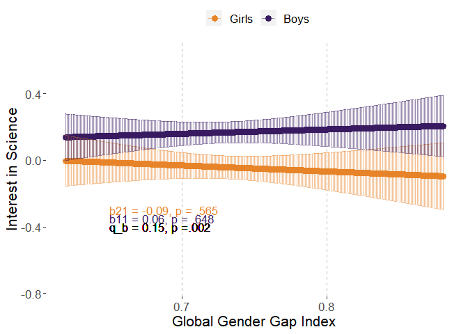
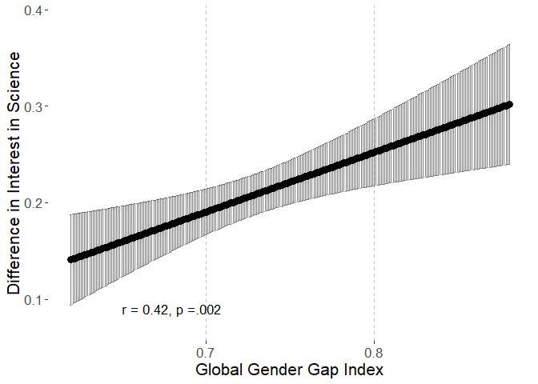
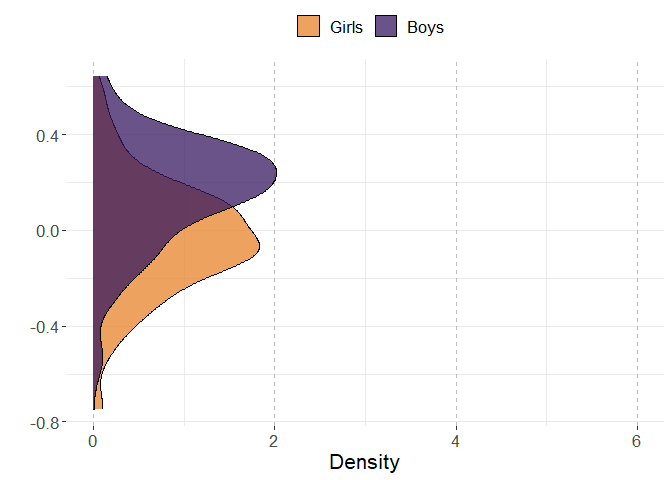
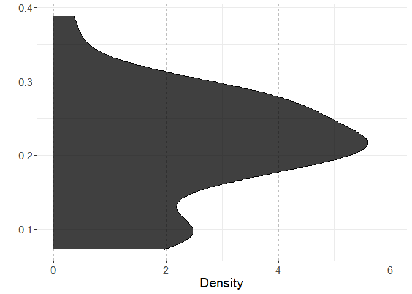
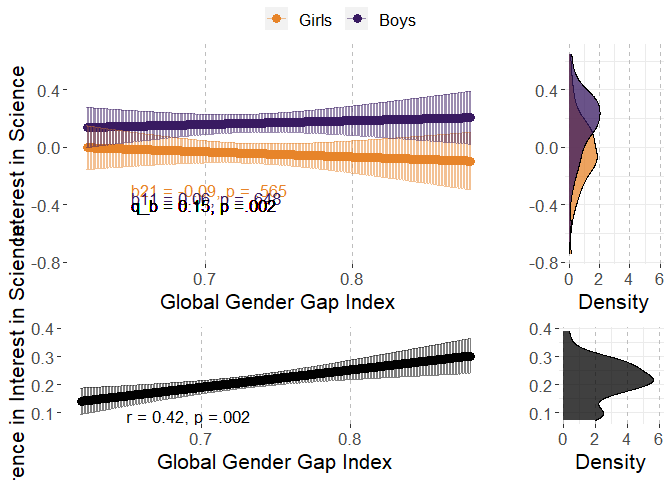

# Preparations

## Packages


```r
library(multid)
library(lmerTest)
library(rio)
library(dplyr)
library(tibble)
library(ggpubr)
library(ggplot2)
library(MetBrewer)
library(emmeans)
library(finalfit)
source("../../custom_functions.R")
```

## Data


```r
coltypes<-c("text","numeric","numeric","numeric","numeric",
            "text","numeric","numeric","numeric","text",
            "text","text","text","numeric","text",
            "text","text","text")

# individual-level data
fdat<-import("../data/processed/fdat.xlsx",
             col_types=coltypes)
# country-level data
cdat<-import("../data/processed/cdat_processed.xlsx")
```

## Data exclusions and transformations


```r
fdat<-fdat %>%
  dplyr::select(CNT,Sex,INTBRSCI,GGGI_2015) %>%
  na.omit() %>%
  mutate(sex.c=ifelse(Sex==1,-0.5,0.5))

# standardize predictor

GGGI_2015 <- tapply(fdat$GGGI_2015,
                         fdat$CNT,
                         mean,
                         na.rm = TRUE
  )

fdat$GGGI_2015.z<-
  (fdat$GGGI_2015-mean(GGGI_2015))/
  sd(GGGI_2015)
```


# Analysis

## Reliability of the difference score


```r
reliab.INTBRSCI<-
  reliability_dms(
    data=fdat,
    diff_var="sex.c",var = "INTBRSCI",
    diff_var_values = c(0.5,-0.5),
    group_var = "CNT")


export(t(data.frame(reliab.INTBRSCI)),
       "../results/reliab.INTBRSCI.xlsx",
       overwrite=T)
reliab.INTBRSCI
```

```
##              r11              r22              r12              sd1 
##       0.99316273       0.99589211       0.93994304       0.21982616 
##              sd2           sd_d12               m1               m2 
##       0.23937627       0.08187027       0.16642690      -0.04182115 
##            m_d12 reliability_dmsa 
##       0.20824805       0.91558863
```

## Multi-level model

### Fit model


```r
fit_INTBRSCI<-
  ddsc_ml(data = fdat,predictor = "GGGI_2015",
          moderator = "sex.c",moderator_values=c(0.5,-0.5),
          DV = "INTBRSCI",lvl2_unit = "CNT",re_cov_test = T,
          scaling_sd = "observed")
```

### Descriptive statistics


```r
export(rownames_to_column(data.frame(fit_INTBRSCI$descriptives)),
       "../results/INTBRSCI_ml_desc.xlsx",
       overwrite=T)
round(fit_INTBRSCI$descriptives,2)
```

```
##                       M   SD means_y1 means_y1_scaled means_y2 means_y2_scaled
## means_y1           0.17 0.22     1.00            1.00     0.94            0.94
## means_y1_scaled    0.72 0.96     1.00            1.00     0.94            0.94
## means_y2          -0.04 0.24     0.94            0.94     1.00            1.00
## means_y2_scaled   -0.18 1.04     0.94            0.94     1.00            1.00
## GGGI_2015          0.73 0.06     0.07            0.07    -0.08           -0.08
## GGGI_2015_scaled   0.00 1.00     0.07            0.07    -0.08           -0.08
## diff_score         0.21 0.08    -0.06           -0.06    -0.40           -0.40
## diff_score_scaled  0.91 0.36    -0.06           -0.06    -0.40           -0.40
##                   GGGI_2015 GGGI_2015_scaled diff_score diff_score_scaled
## means_y1               0.07             0.07      -0.06             -0.06
## means_y1_scaled        0.07             0.07      -0.06             -0.06
## means_y2              -0.08            -0.08      -0.40             -0.40
## means_y2_scaled       -0.08            -0.08      -0.40             -0.40
## GGGI_2015              1.00             1.00       0.43              0.43
## GGGI_2015_scaled       1.00             1.00       0.43              0.43
## diff_score             0.43             0.43       1.00              1.00
## diff_score_scaled      0.43             0.43       1.00              1.00
```

```r
round(fit_INTBRSCI$SDs,2)
```

```
##         SD_y1         SD_y2     SD_pooled SD_diff_score            VR 
##          0.22          0.24          0.23          0.08          0.84
```

### Variance heterogeneity test


```r
export(t(data.frame(fit_INTBRSCI$re_cov_test)),
       "../results/INTBRSCI_ml_var_test.xlsx",
       overwrite=T)
round(fit_INTBRSCI$re_cov_test,3)
```

```
## RE_cov RE_cor  Chisq     Df      p 
## -0.005 -0.265  3.269  1.000  0.071
```

### Component correlation


```r
export(rownames_to_column(data.frame(fit_INTBRSCI$ddsc_sem_fit$variance_test)),
       "../results/INTBRSCI_ml_comp_cor.xlsx",
       overwrite=T)
round(fit_INTBRSCI$ddsc_sem_fit$variance_test,3)
```

```
##              est    se      z pvalue ci.lower ci.upper
## cov_y1y2   0.918 0.190  4.843  0.000    0.546    1.289
## var_y1     0.897 0.179  5.000  0.000    0.545    1.248
## var_y2     1.063 0.213  5.000  0.000    0.646    1.480
## var_diff  -0.167 0.100 -1.666  0.096   -0.363    0.029
## var_ratio  0.843 0.081 10.358  0.000    0.684    1.003
## cor_y1y2   0.940 0.016 57.047  0.000    0.908    0.972
```

### Deconstructing results


```r
export(rownames_to_column(data.frame(fit_INTBRSCI$results)),
       "../results/INTBRSCI_ml_results.xlsx",
       overwrite=T)
round(fit_INTBRSCI$results,3)
```

```
##                            estimate    SE     df t.ratio p.value ci.lower
## r_xy1y2                       0.421 0.131 49.342   3.220   0.002    0.158
## w_11                          0.015 0.032 48.143   0.459   0.648   -0.049
## w_21                         -0.020 0.034 48.114  -0.579   0.565   -0.089
## r_xy1                         0.066 0.144 48.143   0.459   0.648   -0.223
## r_xy2                        -0.083 0.144 48.114  -0.579   0.565   -0.373
## b_11                          0.063 0.138 48.143   0.459   0.648   -0.214
## b_21                         -0.087 0.150 48.114  -0.579   0.565   -0.389
## main_effect                  -0.003 0.033 48.067  -0.083   0.934   -0.068
## moderator_effect              0.208 0.010 47.386  19.862   0.000    0.187
## interaction                   0.034 0.011 49.342   3.220   0.002    0.013
## q_b11_b21                     0.150    NA     NA      NA      NA       NA
## q_rxy1_rxy2                   0.150    NA     NA      NA      NA       NA
## cross_over_point             -6.043    NA     NA      NA      NA       NA
## interaction_vs_main           0.032 0.032 48.323   1.007   0.319   -0.032
## interaction_vs_main_bscale    0.138 0.137 48.323   1.007   0.319   -0.138
## interaction_vs_main_rscale    0.141 0.149 48.298   0.944   0.350   -0.159
## dadas                         0.029 0.063 48.143   0.459   0.324   -0.098
## dadas_bscale                  0.127 0.276 48.143   0.459   0.324   -0.428
## dadas_rscale                  0.132 0.288 48.143   0.459   0.324   -0.447
## abs_diff                      0.034 0.011 49.342   3.220   0.001    0.013
## abs_sum                       0.005 0.065 48.067   0.083   0.467   -0.126
## abs_diff_bscale               0.150 0.047 49.342   3.220   0.001    0.056
## abs_sum_bscale                0.024 0.284 48.067   0.083   0.467   -0.548
## abs_diff_rscale               0.149 0.045 49.153   3.318   0.001    0.059
## abs_sum_rscale                0.017 0.284 48.067   0.061   0.476   -0.555
##                            ci.upper
## r_xy1y2                       0.684
## w_11                          0.078
## w_21                          0.049
## r_xy1                         0.356
## r_xy2                         0.206
## b_11                          0.340
## b_21                          0.215
## main_effect                   0.063
## moderator_effect              0.229
## interaction                   0.056
## q_b11_b21                        NA
## q_rxy1_rxy2                      NA
## cross_over_point                 NA
## interaction_vs_main           0.095
## interaction_vs_main_bscale    0.415
## interaction_vs_main_rscale    0.441
## dadas                         0.156
## dadas_bscale                  0.681
## dadas_rscale                  0.711
## abs_diff                      0.056
## abs_sum                       0.137
## abs_diff_bscale               0.244
## abs_sum_bscale                0.595
## abs_diff_rscale               0.240
## abs_sum_rscale                0.589
```

### Multi-level model output


```r
# cross-level interaction model
summary(fit_INTBRSCI$model)
```

```
## Linear mixed model fit by REML. t-tests use Satterthwaite's method [
## lmerModLmerTest]
## Formula: model_formula
##    Data: data
## Control: lme4::lmerControl(optimizer = "bobyqa")
## 
## REML criterion at convergence: 906518.1
## 
## Scaled residuals: 
##     Min      1Q  Median      3Q     Max 
## -3.2991 -0.4404  0.0909  0.5660  3.3599 
## 
## Random effects:
##  Groups   Name        Variance Std.Dev. Corr 
##  CNT      (Intercept) 0.052060 0.22817       
##           sex.c       0.004885 0.06989  -0.29
##  Residual             0.906843 0.95228       
## Number of obs: 330681, groups:  CNT, 50
## 
## Fixed effects:
##                  Estimate Std. Error        df t value Pr(>|t|)    
## (Intercept)      0.062362   0.032316 48.012776   1.930  0.05956 .  
## sex.c            0.208365   0.010491 47.385705  19.862  < 2e-16 ***
## GGGI_2015       -0.002711   0.032653 48.066842  -0.083  0.93419    
## sex.c:GGGI_2015  0.034483   0.010708 49.341629   3.220  0.00227 ** 
## ---
## Signif. codes:  0 '***' 0.001 '**' 0.01 '*' 0.05 '.' 0.1 ' ' 1
## 
## Correlation of Fixed Effects:
##             (Intr) sex.c  GGGI_2
## sex.c       -0.269              
## GGGI_2015    0.000  0.000       
## s.:GGGI_201  0.000  0.010 -0.266
```

```r
# reduced model without the predictor
summary(fit_INTBRSCI$reduced_model)
```

```
## Linear mixed model fit by REML. t-tests use Satterthwaite's method [
## lmerModLmerTest]
## Formula: INTBRSCI ~ sex.c + (sex.c | CNT)
##    Data: data
## Control: lme4::lmerControl(optimizer = "bobyqa")
## 
## REML criterion at convergence: 906515.9
## 
## Scaled residuals: 
##     Min      1Q  Median      3Q     Max 
## -3.2988 -0.4406  0.0909  0.5648  3.3606 
## 
## Random effects:
##  Groups   Name        Variance Std.Dev. Corr 
##  CNT      (Intercept) 0.050996 0.22582       
##           sex.c       0.005923 0.07696  -0.26
##  Residual             0.906843 0.95228       
## Number of obs: 330681, groups:  CNT, 50
## 
## Fixed effects:
##             Estimate Std. Error       df t value Pr(>|t|)    
## (Intercept)  0.06236    0.03199 49.01706    1.95    0.057 .  
## sex.c        0.20804    0.01144 48.04427   18.19   <2e-16 ***
## ---
## Signif. codes:  0 '***' 0.001 '**' 0.01 '*' 0.05 '.' 0.1 ' ' 1
## 
## Correlation of Fixed Effects:
##       (Intr)
## sex.c -0.251
```

## Country-level path model

### Fit the model

The model is already stored within the multi-level model object. 


```r
fit_INTBRSCI_sem<-fit_INTBRSCI$ddsc_sem_fit
```

### Results

These are the same for both modeling techniques


```r
export(rownames_to_column(data.frame(fit_INTBRSCI_sem$results)),
       "../results/INTBRSCI_sem_results.xlsx",
       overwrite=T)
round(fit_INTBRSCI_sem$results,3)
```

```
##                                    est    se      z pvalue ci.lower ci.upper
## r_xy1_y2                         0.426 0.128  3.334  0.001    0.176    0.677
## r_xy1                            0.068 0.141  0.479  0.632   -0.209    0.344
## r_xy2                           -0.084 0.141 -0.595  0.552   -0.360    0.192
## b_11                             0.065 0.135  0.479  0.632   -0.200    0.329
## b_21                            -0.087 0.147 -0.595  0.552   -0.375    0.200
## b_10                             0.724 0.134  5.420  0.000    0.462    0.986
## b_20                            -0.182 0.145 -1.252  0.210   -0.467    0.103
## res_cov_y1_y2                    0.923 0.189  4.873  0.000    0.552    1.295
## diff_b10_b20                     0.906 0.045 20.087  0.000    0.818    0.995
## diff_b11_b21                     0.152 0.046  3.334  0.001    0.063    0.241
## diff_rxy1_rxy2                   0.151 0.044  3.433  0.001    0.065    0.238
## q_b11_b21                        0.152 0.046  3.312  0.001    0.062    0.242
## q_rxy1_rxy2                      0.152 0.044  3.420  0.001    0.065    0.239
## cross_over_point                -5.964 1.813 -3.289  0.001   -9.518   -2.410
## sum_b11_b21                     -0.023 0.278 -0.081  0.935   -0.568    0.523
## main_effect                     -0.011 0.139 -0.081  0.935   -0.284    0.261
## interaction_vs_main_effect       0.141 0.135  1.045  0.296   -0.123    0.404
## diff_abs_b11_abs_b21            -0.023 0.278 -0.081  0.935   -0.568    0.523
## abs_diff_b11_b21                 0.152 0.046  3.334  0.000    0.063    0.241
## abs_sum_b11_b21                  0.023 0.278  0.081  0.468   -0.523    0.568
## dadas                            0.129 0.270  0.479  0.316   -0.400    0.658
## q_r_equivalence                  0.152 0.044  3.420  1.000       NA       NA
## q_b_equivalence                  0.152 0.046  3.312  1.000       NA       NA
## cross_over_point_equivalence     5.964 1.813  3.289  0.999       NA       NA
## cross_over_point_minimal_effect  5.964 1.813  3.289  0.001       NA       NA
```

## Plot the results


```r
# start with obtaining predicted values for means and differences

# refit reduced and full models with GGGI in original scale

ml_INTBRSCI_red<-
  lmer(INTBRSCI~sex.c+(sex.c|CNT),data=fdat,
       control = lmerControl(optimizer="bobyqa",
                             optCtrl=list(maxfun=2e6)))

# refit the model with raw variable

ml_INTBRSCI<-
  lmer(INTBRSCI~sex.c*GGGI_2015+(sex.c|CNT),data=fdat,
       control = lmerControl(optimizer="bobyqa",
                             optCtrl=list(maxfun=2e6)))

# point predictions as function of GGGI for components


p<-
  emmip(
    ml_INTBRSCI, 
    sex.c ~ GGGI_2015,
    at=list(sex.c = c(-0.5,0.5),
            GGGI_2015=
              seq(from=round(range(fdat$GGGI_2015,na.rm=T)[1],2),
                  to=round(range(fdat$GGGI_2015,na.rm=T)[2],2),
                  by=0.001)),
    plotit=F,CIs=T,lmerTest.limit = 1e6,disable.pbkrtest=T)

p$sex<-p$tvar
levels(p$sex)<-c("Girls","Boys")

# obtain min and max for aligned plots
min.y.comp<-min(p$LCL)
max.y.comp<-max(p$UCL)

# Boys and Girls mean distributions

p3<-coefficients(ml_INTBRSCI_red)$CNT
p3<-cbind(rbind(p3,p3),weight=rep(c(-0.5,0.5),each=nrow(p3)))
p3$xvar<-p3$`(Intercept)`+p3$sex.c*p3$weight
p3$sex<-as.factor(p3$weight)
levels(p3$sex)<-c("Girls","Boys")

# obtain min and max for aligned plots
min.y.mean.distr<-min(p3$xvar)
max.y.mean.distr<-max(p3$xvar)

# obtain the coefs for the sex-effect (difference) as function of GGGI

p2<-data.frame(
  emtrends(ml_INTBRSCI,var="sex.c",
           specs="GGGI_2015",
           at=list(#Sex = c(-0.5,0.5),
             GGGI_2015=
               seq(from=round(range(fdat$GGGI_2015,na.rm=T)[1],2),
                   to=round(range(fdat$GGGI_2015,na.rm=T)[2],2),
                   by=0.001)),
           lmerTest.limit = 1e6,disable.pbkrtest=T))

p2$yvar<-p2$sex.c.trend
p2$xvar<-p2$GGGI_2015
p2$LCL<-p2$lower.CL
p2$UCL<-p2$upper.CL

# obtain min and max for aligned plots
min.y.diff<-min(p2$LCL)
max.y.diff<-max(p2$UCL)

# difference score distribution

p4<-coefficients(ml_INTBRSCI_red)$CNT
p4$xvar=(+1)*p4$sex.c

# obtain mix and max for aligned plots

min.y.diff.distr<-min(p4$xvar)
max.y.diff.distr<-max(p4$xvar)

# define mins and maxs

min.y.pred<-
  ifelse(min.y.comp<min.y.mean.distr,min.y.comp,min.y.mean.distr)

max.y.pred<-
  ifelse(max.y.comp>max.y.mean.distr,max.y.comp,max.y.mean.distr)

min.y.narrow<-
  ifelse(min.y.diff<min.y.diff.distr,min.y.diff,min.y.diff.distr)

max.y.narrow<-
  ifelse(max.y.diff>max.y.diff.distr,max.y.diff,max.y.diff.distr)

# Figures 

# p1

# scaled simple effects to the plot

pvals<-p_coding(c(fit_INTBRSCI$results["b_21","p.value"],
                    fit_INTBRSCI$results["b_11","p.value"]))

ests<-
  round_tidy(c(fit_INTBRSCI$results["b_21","estimate"],
               fit_INTBRSCI$results["b_11","estimate"]),2)

coef1<-paste0("b21 = ",ests[1],", p = ",pvals[1])
coef2<-paste0("b11 = ",ests[2],", p = ",pvals[2])

coef_q<-round_tidy(fit_INTBRSCI$results["q_b11_b21","estimate"],2)
coef_q<-paste0("q_b = ",coef_q,", p ",
               ifelse(fit_INTBRSCI$results["interaction","p.value"]<.001,"","="),
               p_coding(fit_INTBRSCI$results["interaction","p.value"]))

coefs<-data.frame(sex=c("Girls","Boys"),
                  coef=c(coef1,coef2))

p1.INTBRSCI<-ggplot(p,aes(y=yvar,x=xvar,color=sex))+
  geom_point(size=3)+
  geom_errorbar(aes(ymin=LCL, ymax=UCL),alpha=0.5)+
  xlab("Global Gender Gap Index")+
  #ylim=c(2.3,3.9)+
  ylim(c(min.y.pred,max.y.pred))+
  ylab("Interest in Science")+
  scale_color_manual(values=met.brewer("Archambault")[c(6,2)])+
  theme(legend.position = "top",
        legend.title=element_blank(),
        text=element_text(size=16,  family="sans"),
        panel.background = element_rect(fill = "white",
                                        #colour = "black",
                                        #size = 0.5, linetype = "solid"
        ),
        panel.grid.major.x = element_line(linewidth = 0.5, linetype = 2,
                                          colour = "gray"))+
  geom_text(data = coefs,show.legend=F,
            aes(label=coef,x=0.65,
                y=c(round(min(p$LCL),2)+0.05-0.05
                    ,round(min(p$LCL),2)-0.05),size=14,hjust="left"))+
  geom_text(inherit.aes=F,aes(x=0.65,y=round(min(p$LCL),2)-0.10,
                              label=coef_q,size=14,hjust="left"),
            show.legend=F)
p1.INTBRSCI
```

<!-- -->

```r
# prediction plot for difference score

pvals2<-p_coding(fit_INTBRSCI$results["r_xy1y2","p.value"])

ests2<-
  round_tidy(fit_INTBRSCI$results["r_xy1y2","estimate"],2)

coefs2<-paste0("r = ",ests2,
               ", p ",
               ifelse(fit_INTBRSCI$results["r_xy1y2","p.value"]<.001,"","="),
               pvals2)

p2.INTBRSCI<-ggplot(p2,aes(y=yvar,x=xvar))+
  geom_point(size=3)+
  geom_errorbar(aes(ymin=LCL, ymax=UCL),alpha=0.5)+
  xlab("Global Gender Gap Index")+
  ylim(c(min.y.narrow,max.y.narrow))+
  ylab("Difference in Interest in Science")+
  #scale_color_manual(values=met.brewer("Archambault")[c(6,2)])+
  theme(legend.position = "right",
        legend.title=element_blank(),
        text=element_text(size=16,  family="sans"),
        panel.background = element_rect(fill = "white",
                                        #colour = "black",
                                        #size = 0.5, linetype = "solid"
        ),
        panel.grid.major.x = element_line(size = 0.5, linetype = 2,
                                          colour = "gray"))+
  #geom_text(coef2,aes(x=0.63,y=min(p2$LCL)))
  geom_text(data = data.frame(coefs2),show.legend=F,
            aes(label=coefs2,x=0.65,
                y=c(round(min(p2$LCL),2)),size=14,hjust="left"))
p2.INTBRSCI
```

<!-- -->

```r
# mean-level distributions

p3.INTBRSCI<-
  ggplot(p3, aes(x=xvar, fill=sex)) + 
  geom_density(alpha=.75) + 
  scale_fill_manual(values=met.brewer("Archambault")[c(6,2)])+
  #scale_fill_manual(values=c("turquoise3","orangered2","black")) + 
  xlab("")+
  ylab("Density")+
  ylim(c(0,6))+
  xlim(c(min.y.pred,max.y.pred))+
  theme_bw()+
  theme(legend.position = "top",
        legend.title=element_blank(),
        text=element_text(size=16,  family="sans"),
        panel.border = element_blank(),
        panel.background = element_rect(fill = "white",
                                        #colour = "black",
                                        #size = 0.5, linetype = "solid"
        ),
        panel.grid.major.x = element_line(size = 0.5, linetype = 2,
                                          colour = "gray"))+
  coord_flip()
p3.INTBRSCI
```

<!-- -->

```r
# distribution for mean differences

p4.INTBRSCI<-
  ggplot(p4, aes(x=xvar,fill="black")) + 
  geom_density(alpha=.75) + 
  scale_fill_manual(values="black")+
  #scale_fill_manual(values=c("turquoise3","orangered2","black")) + 
  xlab("")+
  ylab("Density")+
  ylim(c(0,6))+
  xlim(c(min.y.narrow,max.y.narrow))+
  theme_bw()+
  theme(legend.position = "none",
        legend.title=element_blank(),
        text=element_text(size=16,  family="sans"),
        panel.border = element_blank(),
        panel.background = element_rect(fill = "white",
                                        #colour = "black",
                                        #size = 0.5, linetype = "solid"
        ),
        panel.grid.major.x = element_line(size = 0.5, linetype = 2,
                                          colour = "gray"))+
  coord_flip()
p4.INTBRSCI
```

<!-- -->

```r
# combine component-specific predictions

p13.INTBRSCI<-
  ggarrange(p1.INTBRSCI, p3.INTBRSCI,common.legend = T,
            ncol=2, nrow=1,widths=c(4,1.4)
  )

# combine difference score predictions

p24.INTBRSCI<-
  ggarrange(p2.INTBRSCI, p4.INTBRSCI,
            ncol=2, nrow=1,widths=c(4,1.4)
  )

pall.INTBRSCI<-
  ggarrange(p13.INTBRSCI,p24.INTBRSCI,align = "hv",
            ncol=1,nrow=2,heights=c(2,1))
pall.INTBRSCI
```

<!-- -->

```r
png(filename = 
      "../results/pall.INTBRSCI.png",
    units = "cm",
    width = 21.0,height=29.7*(4/5),res = 600)
pall.INTBRSCI
dev.off()
```

```
## png 
##   2
```

# Session Information


```r
s<-sessionInfo()
print(s,locale=F)
```

```
## R version 4.3.2 (2023-10-31 ucrt)
## Platform: x86_64-w64-mingw32/x64 (64-bit)
## Running under: Windows 10 x64 (build 19045)
## 
## Matrix products: default
## 
## 
## attached base packages:
## [1] stats     graphics  grDevices utils     datasets  methods   base     
## 
## other attached packages:
##  [1] finalfit_1.0.6    emmeans_1.10.0    MetBrewer_0.2.0   ggpubr_0.6.0     
##  [5] ggplot2_3.4.4     tibble_3.2.1      dplyr_1.1.4       rio_0.5.29       
##  [9] lmerTest_3.1-3    lme4_1.1-35.1     Matrix_1.6-5      multid_1.0.0.9000
## [13] knitr_1.44        rmarkdown_2.25   
## 
## loaded via a namespace (and not attached):
##  [1] tidyselect_1.2.0    farver_2.1.1        fastmap_1.1.1      
##  [4] TH.data_1.1-2       rpart_4.1.21        digest_0.6.34      
##  [7] estimability_1.4.1  lifecycle_1.0.4     survival_3.5-7     
## [10] magrittr_2.0.3      compiler_4.3.2      rlang_1.1.3        
## [13] sass_0.4.7          tools_4.3.2         utf8_1.2.4         
## [16] yaml_2.3.7          data.table_1.14.8   ggsignif_0.6.4     
## [19] labeling_0.4.3      mnormt_2.1.1        curl_5.0.2         
## [22] abind_1.4-5         multcomp_1.4-25     withr_3.0.0        
## [25] foreign_0.8-85      purrr_1.0.2         numDeriv_2016.8-1.1
## [28] stats4_4.3.2        nnet_7.3-19         grid_4.3.2         
## [31] fansi_1.0.6         lavaan_0.6-17       jomo_2.7-6         
## [34] xtable_1.8-4        colorspace_2.1-0    mice_3.16.0        
## [37] scales_1.3.0        iterators_1.0.14    MASS_7.3-60        
## [40] cli_3.6.2           mvtnorm_1.2-4       crayon_1.5.2       
## [43] generics_0.1.3      rstudioapi_0.15.0   readxl_1.4.2       
## [46] minqa_1.2.6         cachem_1.0.8        splines_4.3.2      
## [49] parallel_4.3.2      cellranger_1.1.0    vctrs_0.6.5        
## [52] boot_1.3-28.1       glmnet_4.1-8        sandwich_3.0-2     
## [55] jsonlite_1.8.8      carData_3.0-5       car_3.1-2          
## [58] hms_1.1.3           mitml_0.4-5         rstatix_0.7.2      
## [61] foreach_1.5.2       tidyr_1.3.1         jquerylib_0.1.4    
## [64] glue_1.7.0          pan_1.9             nloptr_2.0.3       
## [67] codetools_0.2-19    cowplot_1.1.3       stringi_1.8.3      
## [70] gtable_0.3.4        shape_1.4.6         quadprog_1.5-8     
## [73] munsell_0.5.0       pillar_1.9.0        htmltools_0.5.5    
## [76] R6_2.5.1            pbivnorm_0.6.0      evaluate_0.23      
## [79] lattice_0.21-9      haven_2.5.2         backports_1.4.1    
## [82] openxlsx_4.2.5.2    broom_1.0.5         bslib_0.5.1        
## [85] Rcpp_1.0.12         zip_2.3.0           gridExtra_2.3      
## [88] coda_0.19-4         nlme_3.1-163        xfun_0.39          
## [91] zoo_1.8-12          forcats_1.0.0       pkgconfig_2.0.3
```
