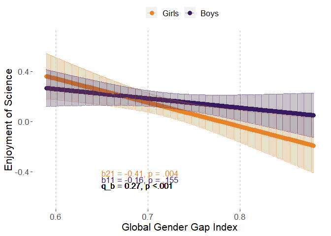
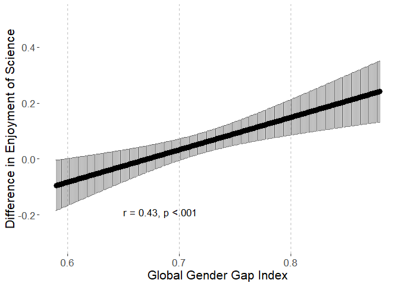
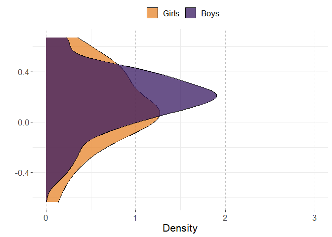
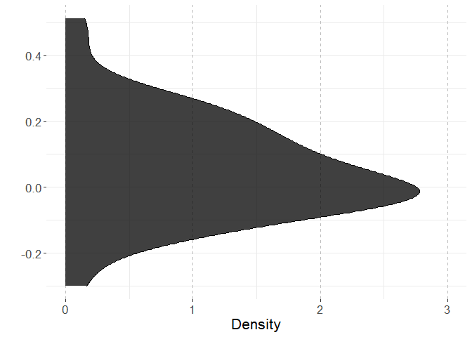
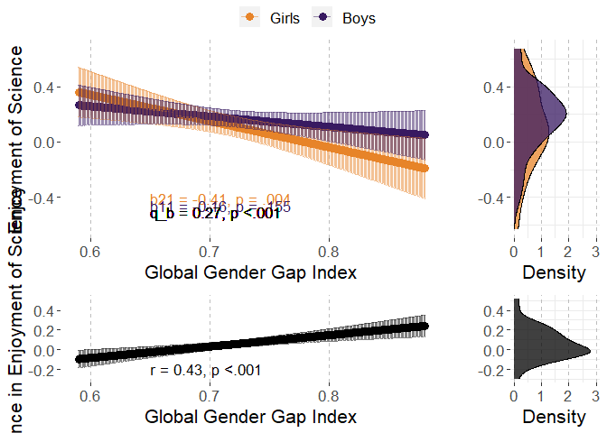

# Preparations

## Packages


```r
library(multid)
library(lmerTest)
library(rio)
library(dplyr)
library(tibble)
library(ggpubr)
library(ggplot2)
library(MetBrewer)
library(emmeans)
library(finalfit)
source("../../custom_functions.R")
```

## Data


```r
coltypes<-c("text","numeric","numeric","numeric","numeric",
            "text","numeric","numeric","numeric","text",
            "text","text","text","numeric","text",
            "text","text","text")

# individual-level data
fdat<-import("../data/processed/fdat.xlsx",
             col_types=coltypes)
# country-level data
cdat<-import("../data/processed/cdat_processed.xlsx")
```

## Data exclusions and transformations


```r
fdat<-fdat %>%
  dplyr::select(CNT,Sex,JOYSCIE,GGGI_2015) %>%
  na.omit() %>%
  mutate(sex.c=ifelse(Sex==1,-0.5,0.5))

# standardize predictor

GGGI_2015 <- tapply(fdat$GGGI_2015,
                         fdat$CNT,
                         mean,
                         na.rm = TRUE
  )

fdat$GGGI_2015.z<-
  (fdat$GGGI_2015-mean(GGGI_2015))/
  sd(GGGI_2015)
```


# Analysis

## Reliability of the difference score


```r
reliab.JOYSCIE<-
  reliability_dms(
    data=fdat,
    diff_var="sex.c",var = "JOYSCIE",
    diff_var_values = c(0.5,-0.5),
    group_var = "CNT")


export(t(data.frame(reliab.JOYSCIE)),
       "../results/reliab.JOYSCIE.xlsx",
       overwrite=T)
reliab.JOYSCIE
```

```
##              r11              r22              r12              sd1 
##       0.99329351       0.99635296       0.86164095       0.23569011 
##              sd2           sd_d12               m1               m2 
##       0.30645076       0.15809396       0.17009097       0.11569859 
##            m_d12 reliability_dmsa 
##       0.05439238       0.97139097
```

## Multi-level model

### Fit model


```r
fit_JOYSCIE<-
  ddsc_ml(data = fdat,predictor = "GGGI_2015",
          moderator = "sex.c",moderator_values=c(0.5,-0.5),
          DV = "JOYSCIE",lvl2_unit = "CNT",re_cov_test = T,
          scaling_sd = "observed")
```

```
## NOTE: Results may be misleading due to involvement in interactions
```

```
## refitting model(s) with ML (instead of REML)
```

### Descriptive statistics


```r
export(rownames_to_column(data.frame(fit_JOYSCIE$descriptives)),
       "../results/JOYSCIE_ml_desc.xlsx",
       overwrite=T)
round(fit_JOYSCIE$descriptives,2)
```

```
##                      M   SD means_y1 means_y1_scaled means_y2
## means_y1          0.17 0.24     1.00            1.00     0.86
## means_y1_scaled   0.62 0.86     1.00            1.00     0.86
## means_y2          0.12 0.31     0.86            0.86     1.00
## means_y2_scaled   0.42 1.12     0.86            0.86     1.00
## GGGI_2015         0.72 0.06    -0.18           -0.18    -0.36
## GGGI_2015_scaled  0.00 1.00    -0.18           -0.18    -0.36
## diff_score        0.05 0.16    -0.18           -0.18    -0.65
## diff_score_scaled 0.20 0.58    -0.18           -0.18    -0.65
##                   means_y2_scaled GGGI_2015 GGGI_2015_scaled diff_score
## means_y1                     0.86     -0.18            -0.18      -0.18
## means_y1_scaled              0.86     -0.18            -0.18      -0.18
## means_y2                     1.00     -0.36            -0.36      -0.65
## means_y2_scaled              1.00     -0.36            -0.36      -0.65
## GGGI_2015                   -0.36      1.00             1.00       0.43
## GGGI_2015_scaled            -0.36      1.00             1.00       0.43
## diff_score                  -0.65      0.43             0.43       1.00
## diff_score_scaled           -0.65      0.43             0.43       1.00
##                   diff_score_scaled
## means_y1                      -0.18
## means_y1_scaled               -0.18
## means_y2                      -0.65
## means_y2_scaled               -0.65
## GGGI_2015                      0.43
## GGGI_2015_scaled               0.43
## diff_score                     1.00
## diff_score_scaled              1.00
```

```r
round(fit_JOYSCIE$SDs,2)
```

```
##         SD_y1         SD_y2     SD_pooled SD_diff_score            VR 
##          0.24          0.31          0.27          0.16          0.59
```

### Variance heterogeneity test


```r
export(t(data.frame(fit_JOYSCIE$re_cov_test)),
       "../results/JOYSCIE_ml_var_test.xlsx",
       overwrite=T)
round(fit_JOYSCIE$re_cov_test,3)
```

```
## RE_cov RE_cor  Chisq     Df      p 
## -0.019 -0.472 14.805  1.000  0.000
```

### Component correlation


```r
export(rownames_to_column(data.frame(fit_JOYSCIE$ddsc_sem_fit$variance_test)),
       "../results/JOYSCIE_ml_comp_cor.xlsx",
       overwrite=T)
round(fit_JOYSCIE$ddsc_sem_fit$variance_test,3)
```

```
##              est    se      z pvalue ci.lower ci.upper
## cov_y1y2   0.819 0.161  5.098  0.000    0.504    1.134
## var_y1     0.731 0.132  5.523  0.000    0.472    0.991
## var_y2     1.236 0.224  5.523  0.000    0.797    1.675
## var_diff  -0.505 0.154 -3.285  0.001   -0.806   -0.204
## var_ratio  0.592 0.077  7.695  0.000    0.441    0.742
## cor_y1y2   0.862 0.033 26.127  0.000    0.797    0.926
```

### Deconstructing results


```r
export(rownames_to_column(data.frame(fit_JOYSCIE$results)),
       "../results/JOYSCIE_ml_results.xlsx",
       overwrite=T)
round(fit_JOYSCIE$results,3)
```

```
##                            estimate    SE     df t.ratio p.value
## r_xy1y2                       0.427 0.118 59.511   3.622   0.001
## w_11                         -0.043 0.030 59.149  -1.440   0.155
## w_21                         -0.111 0.037 59.068  -2.982   0.004
## r_xy1                        -0.184 0.128 59.149  -1.440   0.155
## r_xy2                        -0.362 0.121 59.068  -2.982   0.004
## b_11                         -0.160 0.111 59.149  -1.440   0.155
## b_21                         -0.409 0.137 59.068  -2.982   0.004
## main_effect                  -0.077 0.033 59.052  -2.370   0.021
## moderator_effect              0.055 0.018 58.827   2.961   0.004
## interaction                   0.067 0.019 59.511   3.622   0.001
## q_b11_b21                     0.273    NA     NA      NA      NA
## q_rxy1_rxy2                   0.193    NA     NA      NA      NA
## cross_over_point             -0.808    NA     NA      NA      NA
## interaction_vs_main          -0.010 0.031 59.353  -0.318   0.752
## interaction_vs_main_bscale   -0.036 0.113 59.353  -0.318   0.752
## interaction_vs_main_rscale   -0.096 0.143 59.286  -0.670   0.506
## dadas                        -0.087 0.060 59.149  -1.440   0.922
## dadas_bscale                 -0.321 0.223 59.149  -1.440   0.922
## dadas_rscale                 -0.369 0.256 59.149  -1.440   0.922
## abs_diff                      0.067 0.019 59.511   3.622   0.000
## abs_sum                       0.154 0.065 59.052   2.370   0.011
## abs_diff_bscale               0.249 0.069 59.511   3.622   0.000
## abs_sum_bscale                0.569 0.240 59.052   2.370   0.011
## abs_diff_rscale               0.178 0.065 59.652   2.751   0.004
## abs_sum_rscale                0.546 0.241 59.057   2.266   0.014
```

### Multi-level model output


```r
# cross-level interaction model
summary(fit_JOYSCIE$model)
```

```
## Linear mixed model fit by REML. t-tests use Satterthwaite's method [
## lmerModLmerTest]
## Formula: model_formula
##    Data: data
## Control: lme4::lmerControl(optimizer = "bobyqa")
## 
## REML criterion at convergence: 1168520
## 
## Scaled residuals: 
##      Min       1Q   Median       3Q      Max 
## -2.63927 -0.60068  0.05122  0.55061  2.65405 
## 
## Random effects:
##  Groups   Name        Variance Std.Dev. Corr 
##  CNT      (Intercept) 0.06341  0.2518        
##           sex.c       0.01993  0.1412   -0.40
##  Residual             1.11404  1.0555        
## Number of obs: 396470, groups:  CNT, 61
## 
## Fixed effects:
##                 Estimate Std. Error       df t value Pr(>|t|)    
## (Intercept)      0.14290    0.03229 58.99490   4.425 4.22e-05 ***
## sex.c            0.05454    0.01842 58.82717   2.961 0.004417 ** 
## GGGI_2015       -0.07719    0.03257 59.05164  -2.370 0.021070 *  
## sex.c:GGGI_2015  0.06746    0.01863 59.51136   3.622 0.000606 ***
## ---
## Signif. codes:  0 '***' 0.001 '**' 0.01 '*' 0.05 '.' 0.1 ' ' 1
## 
## Correlation of Fixed Effects:
##             (Intr) sex.c  GGGI_2
## sex.c       -0.391              
## GGGI_2015    0.000  0.000       
## s.:GGGI_201  0.000  0.002 -0.389
```

```r
# reduced model without the predictor
summary(fit_JOYSCIE$reduced_model)
```

```
## Linear mixed model fit by REML. t-tests use Satterthwaite's method [
## lmerModLmerTest]
## Formula: JOYSCIE ~ sex.c + (sex.c | CNT)
##    Data: data
## Control: lme4::lmerControl(optimizer = "bobyqa")
## 
## REML criterion at convergence: 1168521
## 
## Scaled residuals: 
##      Min       1Q   Median       3Q      Max 
## -2.63945 -0.60028  0.05083  0.55103  2.65366 
## 
## Random effects:
##  Groups   Name        Variance Std.Dev. Corr 
##  CNT      (Intercept) 0.0683   0.2613        
##           sex.c       0.0241   0.1552   -0.47
##  Residual             1.1140   1.0555        
## Number of obs: 396470, groups:  CNT, 61
## 
## Fixed effects:
##             Estimate Std. Error       df t value Pr(>|t|)    
## (Intercept)  0.14291    0.03351 60.01630   4.265  7.2e-05 ***
## sex.c        0.05445    0.02019 59.75070   2.697  0.00909 ** 
## ---
## Signif. codes:  0 '***' 0.001 '**' 0.01 '*' 0.05 '.' 0.1 ' ' 1
## 
## Correlation of Fixed Effects:
##       (Intr)
## sex.c -0.464
```

## Country-level path model

### Fit the model

The model is already stored within the multi-level model object. 


```r
fit_JOYSCIE_sem<-fit_JOYSCIE$ddsc_sem_fit
```

### Results

These are the same for both modeling techniques


```r
export(rownames_to_column(data.frame(fit_JOYSCIE_sem$results)),
       "../results/JOYSCIE_sem_results.xlsx",
       overwrite=T)
round(fit_JOYSCIE_sem$results,3)
```

```
##                                    est    se      z pvalue ci.lower
## r_xy1_y2                         0.428 0.116  3.697  0.000    0.201
## r_xy1                           -0.184 0.126 -1.459  0.144   -0.430
## r_xy2                           -0.362 0.119 -3.033  0.002   -0.596
## b_11                            -0.158 0.109 -1.459  0.144   -0.371
## b_21                            -0.406 0.134 -3.033  0.002   -0.668
## b_10                             0.622 0.108  5.782  0.000    0.411
## b_20                             0.423 0.133  3.189  0.001    0.163
## res_cov_y1_y2                    0.756 0.148  5.119  0.000    0.466
## diff_b10_b20                     0.199 0.066  2.998  0.003    0.069
## diff_b11_b21                     0.247 0.067  3.697  0.000    0.116
## diff_rxy1_rxy2                   0.178 0.063  2.814  0.005    0.054
## q_b11_b21                        0.271 0.084  3.214  0.001    0.106
## q_rxy1_rxy2                      0.193 0.069  2.797  0.005    0.058
## cross_over_point                -0.804 0.345 -2.328  0.020   -1.481
## sum_b11_b21                     -0.564 0.234 -2.408  0.016   -1.023
## main_effect                     -0.282 0.117 -2.408  0.016   -0.512
## interaction_vs_main_effect      -0.035 0.110 -0.315  0.753   -0.250
## diff_abs_b11_abs_b21            -0.247 0.067 -3.697  0.000   -0.379
## abs_diff_b11_b21                 0.247 0.067  3.697  0.000    0.116
## abs_sum_b11_b21                  0.564 0.234  2.408  0.008    0.105
## dadas                           -0.317 0.217 -1.459  0.928   -0.742
## q_r_equivalence                  0.193 0.069  2.797  0.997       NA
## q_b_equivalence                  0.271 0.084  3.214  0.999       NA
## cross_over_point_equivalence     0.804 0.345  2.328  0.990       NA
## cross_over_point_minimal_effect  0.804 0.345  2.328  0.010       NA
##                                 ci.upper
## r_xy1_y2                           0.655
## r_xy1                              0.063
## r_xy2                             -0.128
## b_11                               0.054
## b_21                              -0.144
## b_10                               0.833
## b_20                               0.683
## res_cov_y1_y2                      1.045
## diff_b10_b20                       0.329
## diff_b11_b21                       0.379
## diff_rxy1_rxy2                     0.303
## q_b11_b21                          0.436
## q_rxy1_rxy2                        0.329
## cross_over_point                  -0.127
## sum_b11_b21                       -0.105
## main_effect                       -0.053
## interaction_vs_main_effect         0.181
## diff_abs_b11_abs_b21              -0.116
## abs_diff_b11_b21                   0.379
## abs_sum_b11_b21                    1.023
## dadas                              0.109
## q_r_equivalence                       NA
## q_b_equivalence                       NA
## cross_over_point_equivalence          NA
## cross_over_point_minimal_effect       NA
```

## Plot the results


```r
# start with obtaining predicted values for means and differences

# refit reduced and full models with GGGI in original scale

ml_JOYSCIE_red<-
  lmer(JOYSCIE~sex.c+(sex.c|CNT),data=fdat,
       control = lmerControl(optimizer="bobyqa",
                             optCtrl=list(maxfun=2e6)))

# refit the model with raw variable

ml_JOYSCIE<-
  lmer(JOYSCIE~sex.c*GGGI_2015+(sex.c|CNT),data=fdat,
       control = lmerControl(optimizer="bobyqa",
                             optCtrl=list(maxfun=2e6)))

# point predictions as function of GGGI for components


p<-
  emmip(
    ml_JOYSCIE, 
    sex.c ~ GGGI_2015,
    at=list(sex.c = c(-0.5,0.5),
            GGGI_2015=
              seq(from=round(range(fdat$GGGI_2015,na.rm=T)[1],2),
                  to=round(range(fdat$GGGI_2015,na.rm=T)[2],2),
                  by=0.001)),
    plotit=F,CIs=T,lmerTest.limit = 1e6,disable.pbkrtest=T)

p$sex<-p$tvar
levels(p$sex)<-c("Girls","Boys")

# obtain min and max for aligned plots
min.y.comp<-min(p$LCL)
max.y.comp<-max(p$UCL)

# Boys and Girls mean distributions

p3<-coefficients(ml_JOYSCIE_red)$CNT
p3<-cbind(rbind(p3,p3),weight=rep(c(-0.5,0.5),each=nrow(p3)))
p3$xvar<-p3$`(Intercept)`+p3$sex.c*p3$weight
p3$sex<-as.factor(p3$weight)
levels(p3$sex)<-c("Girls","Boys")

# obtain min and max for aligned plots
min.y.mean.distr<-min(p3$xvar)
max.y.mean.distr<-max(p3$xvar)

# obtain the coefs for the sex-effect (difference) as function of GGGI

p2<-data.frame(
  emtrends(ml_JOYSCIE,var="sex.c",
           specs="GGGI_2015",
           at=list(#Sex = c(-0.5,0.5),
             GGGI_2015=
               seq(from=round(range(fdat$GGGI_2015,na.rm=T)[1],2),
                   to=round(range(fdat$GGGI_2015,na.rm=T)[2],2),
                   by=0.001)),
           lmerTest.limit = 1e6,disable.pbkrtest=T))

p2$yvar<-p2$sex.c.trend
p2$xvar<-p2$GGGI_2015
p2$LCL<-p2$lower.CL
p2$UCL<-p2$upper.CL

# obtain min and max for aligned plots
min.y.diff<-min(p2$LCL)
max.y.diff<-max(p2$UCL)

# difference score distribution

p4<-coefficients(ml_JOYSCIE_red)$CNT
p4$xvar=(+1)*p4$sex.c

# obtain mix and max for aligned plots

min.y.diff.distr<-min(p4$xvar)
max.y.diff.distr<-max(p4$xvar)

# define mins and maxs

min.y.pred<-
  ifelse(min.y.comp<min.y.mean.distr,min.y.comp,min.y.mean.distr)

max.y.pred<-
  ifelse(max.y.comp>max.y.mean.distr,max.y.comp,max.y.mean.distr)

min.y.narrow<-
  ifelse(min.y.diff<min.y.diff.distr,min.y.diff,min.y.diff.distr)

max.y.narrow<-
  ifelse(max.y.diff>max.y.diff.distr,max.y.diff,max.y.diff.distr)

# Figures 

# p1

# scaled simple effects to the plot

pvals<-p_coding(c(fit_JOYSCIE$results["b_21","p.value"],
                    fit_JOYSCIE$results["b_11","p.value"]))

ests<-
  round_tidy(c(fit_JOYSCIE$results["b_21","estimate"],
               fit_JOYSCIE$results["b_11","estimate"]),2)

coef1<-paste0("b21 = ",ests[1],", p = ",pvals[1])
coef2<-paste0("b11 = ",ests[2],", p = ",pvals[2])

coef_q<-round_tidy(fit_JOYSCIE$results["q_b11_b21","estimate"],2)
coef_q<-paste0("q_b = ",coef_q,", p ",
               ifelse(fit_JOYSCIE$results["interaction","p.value"]<.001,"","="),
               p_coding(fit_JOYSCIE$results["interaction","p.value"]))

coefs<-data.frame(sex=c("Girls","Boys"),
                  coef=c(coef1,coef2))

p1.JOYSCIE<-ggplot(p,aes(y=yvar,x=xvar,color=sex))+
  geom_point(size=3)+
  geom_errorbar(aes(ymin=LCL, ymax=UCL),alpha=0.5)+
  xlab("Global Gender Gap Index")+
  #ylim=c(2.3,3.9)+
  ylim(c(min.y.pred,max.y.pred))+
  ylab("Enjoyment of Science")+
  scale_color_manual(values=met.brewer("Archambault")[c(6,2)])+
  theme(legend.position = "top",
        legend.title=element_blank(),
        text=element_text(size=16,  family="sans"),
        panel.background = element_rect(fill = "white",
                                        #colour = "black",
                                        #size = 0.5, linetype = "solid"
        ),
        panel.grid.major.x = element_line(linewidth = 0.5, linetype = 2,
                                          colour = "gray"))+
  geom_text(data = coefs,show.legend=F,
            aes(label=coef,x=0.65,
                y=c(round(min(p$LCL),2)+0.05-0.05
                    ,round(min(p$LCL),2)-0.05),size=14,hjust="left"))+
  geom_text(inherit.aes=F,aes(x=0.65,y=round(min(p$LCL),2)-0.10,
                              label=coef_q,size=14,hjust="left"),
            show.legend=F)
p1.JOYSCIE
```

<!-- -->

```r
# prediction plot for difference score

pvals2<-p_coding(fit_JOYSCIE$results["r_xy1y2","p.value"])

ests2<-
  round_tidy(fit_JOYSCIE$results["r_xy1y2","estimate"],2)

coefs2<-paste0("r = ",ests2,
               ", p ",
               ifelse(fit_JOYSCIE$results["r_xy1y2","p.value"]<.001,"","="),
               pvals2)

p2.JOYSCIE<-ggplot(p2,aes(y=yvar,x=xvar))+
  geom_point(size=3)+
  geom_errorbar(aes(ymin=LCL, ymax=UCL),alpha=0.5)+
  xlab("Global Gender Gap Index")+
  ylim(c(min.y.narrow,max.y.narrow))+
  ylab("Difference in Enjoyment of Science")+
  #scale_color_manual(values=met.brewer("Archambault")[c(6,2)])+
  theme(legend.position = "right",
        legend.title=element_blank(),
        text=element_text(size=16,  family="sans"),
        panel.background = element_rect(fill = "white",
                                        #colour = "black",
                                        #size = 0.5, linetype = "solid"
        ),
        panel.grid.major.x = element_line(size = 0.5, linetype = 2,
                                          colour = "gray"))+
  #geom_text(coef2,aes(x=0.63,y=min(p2$LCL)))
  geom_text(data = data.frame(coefs2),show.legend=F,
            aes(label=coefs2,x=0.65,
                y=c(round(min(p2$LCL),2)),size=14,hjust="left"))
p2.JOYSCIE
```

<!-- -->

```r
# mean-level distributions

p3.JOYSCIE<-
  ggplot(p3, aes(x=xvar, fill=sex)) + 
  geom_density(alpha=.75) + 
  scale_fill_manual(values=met.brewer("Archambault")[c(6,2)])+
  #scale_fill_manual(values=c("turquoise3","orangered2","black")) + 
  xlab("")+
  ylab("Density")+
  ylim(c(0,3))+
  xlim(c(min.y.pred,max.y.pred))+
  theme_bw()+
  theme(legend.position = "top",
        legend.title=element_blank(),
        text=element_text(size=16,  family="sans"),
        panel.border = element_blank(),
        panel.background = element_rect(fill = "white",
                                        #colour = "black",
                                        #size = 0.5, linetype = "solid"
        ),
        panel.grid.major.x = element_line(size = 0.5, linetype = 2,
                                          colour = "gray"))+
  coord_flip()
p3.JOYSCIE
```

<!-- -->

```r
# distribution for mean differences

p4.JOYSCIE<-
  ggplot(p4, aes(x=xvar,fill="black")) + 
  geom_density(alpha=.75) + 
  scale_fill_manual(values="black")+
  #scale_fill_manual(values=c("turquoise3","orangered2","black")) + 
  xlab("")+
  ylab("Density")+
  ylim(c(0,3))+
  xlim(c(min.y.narrow,max.y.narrow))+
  theme_bw()+
  theme(legend.position = "none",
        legend.title=element_blank(),
        text=element_text(size=16,  family="sans"),
        panel.border = element_blank(),
        panel.background = element_rect(fill = "white",
                                        #colour = "black",
                                        #size = 0.5, linetype = "solid"
        ),
        panel.grid.major.x = element_line(size = 0.5, linetype = 2,
                                          colour = "gray"))+
  coord_flip()
p4.JOYSCIE
```

<!-- -->

```r
# combine component-specific predictions

p13.JOYSCIE<-
  ggarrange(p1.JOYSCIE, p3.JOYSCIE,common.legend = T,
            ncol=2, nrow=1,widths=c(4,1.4)
  )

# combine difference score predictions

p24.JOYSCIE<-
  ggarrange(p2.JOYSCIE, p4.JOYSCIE,
            ncol=2, nrow=1,widths=c(4,1.4)
  )

pall.JOYSCIE<-
  ggarrange(p13.JOYSCIE,p24.JOYSCIE,align = "hv",
            ncol=1,nrow=2,heights=c(2,1))
pall.JOYSCIE
```

<!-- -->

```r
png(filename = 
      "../results/pall.JOYSCIE.png",
    units = "cm",
    width = 21.0,height=29.7*(4/5),res = 600)
pall.JOYSCIE
dev.off()
```

```
## png 
##   2
```

# Session Information


```r
s<-sessionInfo()
print(s,locale=F)
```

```
## R version 4.3.0 (2023-04-21 ucrt)
## Platform: x86_64-w64-mingw32/x64 (64-bit)
## Running under: Windows 10 x64 (build 19045)
## 
## Matrix products: default
## 
## 
## attached base packages:
## [1] stats     graphics  grDevices utils     datasets  methods   base     
## 
## other attached packages:
##  [1] finalfit_1.0.6    emmeans_1.8.6     MetBrewer_0.2.0  
##  [4] ggpubr_0.6.0      ggplot2_3.4.2     tibble_3.2.1     
##  [7] dplyr_1.1.2       rio_0.5.29        lmerTest_3.1-3   
## [10] lme4_1.1-33       Matrix_1.5-4      multid_0.8.0.9000
## [13] knitr_1.42        rmarkdown_2.21   
## 
## loaded via a namespace (and not attached):
##  [1] tidyselect_1.2.0    farver_2.1.1        fastmap_1.1.1      
##  [4] digest_0.6.31       estimability_1.4.1  lifecycle_1.0.3    
##  [7] survival_3.5-5      magrittr_2.0.3      compiler_4.3.0     
## [10] rlang_1.1.1         sass_0.4.6          tools_4.3.0        
## [13] utf8_1.2.3          yaml_2.3.7          data.table_1.14.8  
## [16] ggsignif_0.6.4      labeling_0.4.2      mnormt_2.1.1       
## [19] curl_5.0.0          abind_1.4-5         withr_2.5.0        
## [22] foreign_0.8-84      purrr_1.0.1         numDeriv_2016.8-1.1
## [25] grid_4.3.0          stats4_4.3.0        fansi_1.0.4        
## [28] lavaan_0.6-15       xtable_1.8-4        colorspace_2.1-0   
## [31] mice_3.15.0         scales_1.2.1        MASS_7.3-58.4      
## [34] cli_3.6.1           mvtnorm_1.1-3       crayon_1.5.2       
## [37] generics_0.1.3      rstudioapi_0.14     readxl_1.4.2       
## [40] minqa_1.2.5         cachem_1.0.8        splines_4.3.0      
## [43] parallel_4.3.0      cellranger_1.1.0    vctrs_0.6.2        
## [46] boot_1.3-28.1       jsonlite_1.8.4      carData_3.0-5      
## [49] car_3.1-2           hms_1.1.3           rstatix_0.7.2      
## [52] tidyr_1.3.0         jquerylib_0.1.4     glue_1.6.2         
## [55] nloptr_2.0.3        cowplot_1.1.1       stringi_1.7.12     
## [58] gtable_0.3.3        quadprog_1.5-8      munsell_0.5.0      
## [61] pillar_1.9.0        htmltools_0.5.5     R6_2.5.1           
## [64] evaluate_0.21       pbivnorm_0.6.0      lattice_0.21-8     
## [67] highr_0.10          haven_2.5.2         backports_1.4.1    
## [70] openxlsx_4.2.5.2    broom_1.0.4         bslib_0.4.2        
## [73] Rcpp_1.0.10         zip_2.3.0           gridExtra_2.3      
## [76] nlme_3.1-162        xfun_0.39           forcats_1.0.0      
## [79] pkgconfig_2.0.3
```
