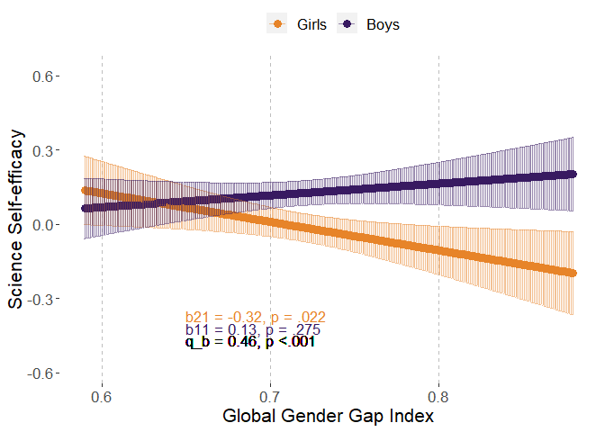
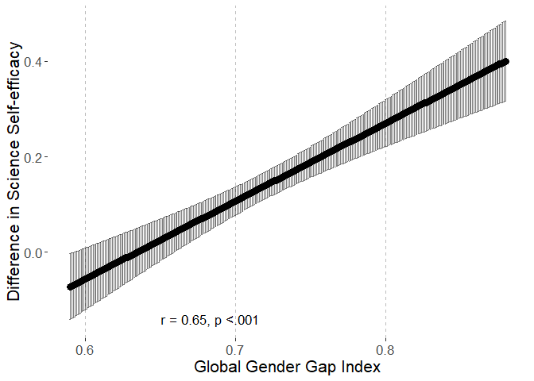
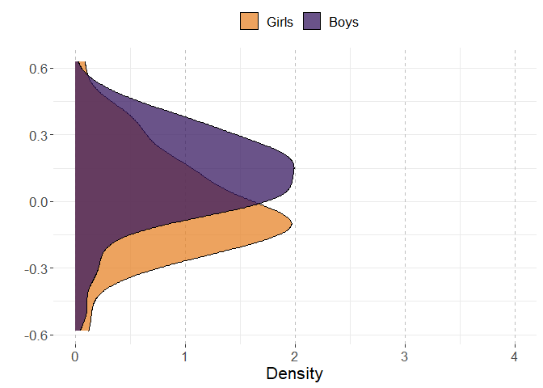
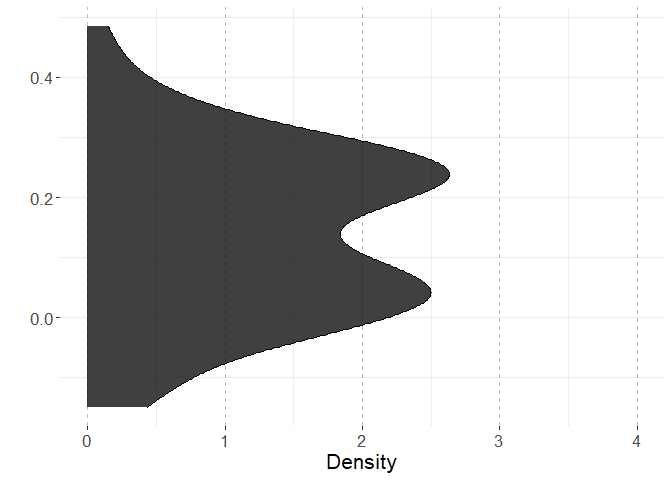
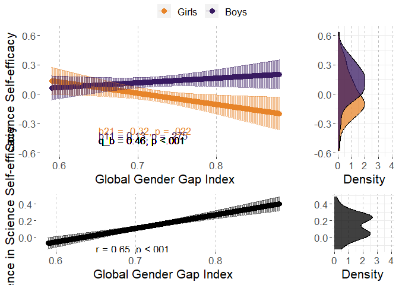

# Preparations

## Packages


```r
library(multid)
library(lmerTest)
library(rio)
library(dplyr)
library(tibble)
library(ggpubr)
library(ggplot2)
library(MetBrewer)
library(emmeans)
library(finalfit)
source("../../custom_functions.R")
```

## Data


```r
coltypes<-c("text","numeric","numeric","numeric","numeric",
            "text","numeric","numeric","numeric","text",
            "text","text","text","numeric","text",
            "text","text","text")

# individual-level data
fdat<-import("../data/processed/fdat.xlsx",
             col_types=coltypes)
# country-level data
cdat<-import("../data/processed/cdat_processed.xlsx")
```

## Data exclusions and transformations


```r
fdat<-fdat %>%
  dplyr::select(CNT,Sex,SCIEEFF,GGGI_2015) %>%
  na.omit() %>%
  mutate(sex.c=ifelse(Sex==1,-0.5,0.5))

# standardize predictor

GGGI_2015 <- tapply(fdat$GGGI_2015,
                         fdat$CNT,
                         mean,
                         na.rm = TRUE
  )

fdat$GGGI_2015.z<-
  (fdat$GGGI_2015-mean(GGGI_2015))/
  sd(GGGI_2015)
```


# Analysis

## Reliability of the difference score


```r
reliab.SCIEEFF<-
  reliability_dms(
    data=fdat,
    diff_var="sex.c",var = "SCIEEFF",
    diff_var_values = c(0.5,-0.5),
    group_var = "CNT")


export(t(data.frame(reliab.SCIEEFF)),
       "../results/reliab.SCIEEFF.xlsx",
       overwrite=T)
reliab.SCIEEFF
```

```
##              r11              r22              r12              sd1 
##       0.98677575       0.99217536       0.77703307       0.19494506 
##              sd2           sd_d12               m1               m2 
##       0.22917931       0.14524165       0.12557034      -0.01198955 
##            m_d12 reliability_dmsa 
##       0.13755988       0.95669412
```

## Multi-level model

### Fit model


```r
fit_SCIEEFF<-
  ddsc_ml(data = fdat,predictor = "GGGI_2015",
          moderator = "sex.c",moderator_values=c(0.5,-0.5),
          DV = "SCIEEFF",lvl2_unit = "CNT",re_cov_test = T,
          scaling_sd = "observed")
```

### Descriptive statistics


```r
export(rownames_to_column(data.frame(fit_SCIEEFF$descriptives)),
       "../results/SCIEEFF_ml_desc.xlsx",
       overwrite=T)
round(fit_SCIEEFF$descriptives,2)
```

```
##                       M   SD means_y1 means_y1_scaled means_y2 means_y2_scaled
## means_y1           0.13 0.19     1.00            1.00     0.78            0.78
## means_y1_scaled    0.59 0.92     1.00            1.00     0.78            0.78
## means_y2          -0.01 0.23     0.78            0.78     1.00            1.00
## means_y2_scaled   -0.06 1.08     0.78            0.78     1.00            1.00
## GGGI_2015          0.72 0.06     0.14            0.14    -0.29           -0.29
## GGGI_2015_scaled   0.00 1.00     0.14            0.14    -0.29           -0.29
## diff_score         0.14 0.15     0.12            0.12    -0.53           -0.53
## diff_score_scaled  0.65 0.68     0.12            0.12    -0.53           -0.53
##                   GGGI_2015 GGGI_2015_scaled diff_score diff_score_scaled
## means_y1               0.14             0.14       0.12              0.12
## means_y1_scaled        0.14             0.14       0.12              0.12
## means_y2              -0.29            -0.29      -0.53             -0.53
## means_y2_scaled       -0.29            -0.29      -0.53             -0.53
## GGGI_2015              1.00             1.00       0.65              0.65
## GGGI_2015_scaled       1.00             1.00       0.65              0.65
## diff_score             0.65             0.65       1.00              1.00
## diff_score_scaled      0.65             0.65       1.00              1.00
```

```r
round(fit_SCIEEFF$SDs,2)
```

```
##         SD_y1         SD_y2     SD_pooled SD_diff_score            VR 
##          0.19          0.23          0.21          0.15          0.72
```

### Variance heterogeneity test


```r
export(t(data.frame(fit_SCIEEFF$re_cov_test)),
       "../results/SCIEEFF_ml_var_test.xlsx",
       overwrite=T)
round(fit_SCIEEFF$re_cov_test,3)
```

```
## RE_cov RE_cor  Chisq     Df      p 
## -0.007 -0.261  4.049  1.000  0.044
```

### Component correlation


```r
export(rownames_to_column(data.frame(fit_SCIEEFF$ddsc_sem_fit$variance_test)),
       "../results/SCIEEFF_ml_comp_cor.xlsx",
       overwrite=T)
round(fit_SCIEEFF$ddsc_sem_fit$variance_test,3)
```

```
##              est    se      z pvalue ci.lower ci.upper
## cov_y1y2   0.754 0.157  4.792  0.000    0.446    1.063
## var_y1     0.826 0.150  5.523  0.000    0.533    1.119
## var_y2     1.141 0.207  5.523  0.000    0.736    1.546
## var_diff  -0.316 0.167 -1.894  0.058   -0.642    0.011
## var_ratio  0.724 0.117  6.204  0.000    0.495    0.952
## cor_y1y2   0.777 0.051 15.317  0.000    0.678    0.876
```

### Deconstructing results


```r
export(rownames_to_column(data.frame(fit_SCIEEFF$results)),
       "../results/SCIEEFF_ml_results.xlsx",
       overwrite=T)
round(fit_SCIEEFF$results,3)
```

```
##                            estimate    SE     df t.ratio p.value ci.lower
## r_xy1y2                       0.653 0.099 59.993   6.620   0.000    0.456
## w_11                          0.028 0.025 59.403   1.103   0.275   -0.023
## w_21                         -0.067 0.029 59.229  -2.351   0.022   -0.124
## r_xy1                         0.142 0.129 59.403   1.103   0.275   -0.116
## r_xy2                        -0.293 0.124 59.229  -2.351   0.022   -0.542
## b_11                          0.131 0.119 59.403   1.103   0.275   -0.107
## b_21                         -0.316 0.135 59.229  -2.351   0.022   -0.585
## main_effect                  -0.020 0.026 59.176  -0.758   0.451   -0.072
## moderator_effect              0.138 0.014 58.429   9.756   0.000    0.109
## interaction                   0.095 0.014 59.993   6.620   0.000    0.066
## q_b11_b21                     0.459    NA     NA      NA      NA       NA
## q_rxy1_rxy2                   0.445    NA     NA      NA      NA       NA
## cross_over_point             -1.452    NA     NA      NA      NA       NA
## interaction_vs_main           0.075 0.026 59.866   2.847   0.006    0.022
## interaction_vs_main_bscale    0.354 0.125 59.866   2.847   0.006    0.105
## interaction_vs_main_rscale    0.360 0.143 59.765   2.512   0.015    0.073
## dadas                         0.056 0.050 59.403   1.103   0.137   -0.045
## dadas_bscale                  0.262 0.237 59.403   1.103   0.137   -0.213
## dadas_rscale                  0.285 0.258 59.403   1.103   0.137   -0.232
## abs_diff                      0.095 0.014 59.993   6.620   0.000    0.066
## abs_sum                       0.039 0.052 59.176   0.758   0.226   -0.064
## abs_diff_bscale               0.447 0.068 59.993   6.620   0.000    0.312
## abs_sum_bscale                0.185 0.245 59.176   0.758   0.226   -0.304
## abs_diff_rscale               0.435 0.066 60.268   6.587   0.000    0.303
## abs_sum_rscale                0.150 0.245 59.182   0.614   0.271   -0.340
##                            ci.upper
## r_xy1y2                       0.850
## w_11                          0.078
## w_21                         -0.010
## r_xy1                         0.401
## r_xy2                        -0.044
## b_11                          0.368
## b_21                         -0.047
## main_effect                   0.032
## moderator_effect              0.166
## interaction                   0.123
## q_b11_b21                        NA
## q_rxy1_rxy2                      NA
## cross_over_point                 NA
## interaction_vs_main           0.128
## interaction_vs_main_bscale    0.603
## interaction_vs_main_rscale    0.646
## dadas                         0.156
## dadas_bscale                  0.737
## dadas_rscale                  0.801
## abs_diff                      0.123
## abs_sum                       0.143
## abs_diff_bscale               0.582
## abs_sum_bscale                0.675
## abs_diff_rscale               0.567
## abs_sum_rscale                0.640
```

### Multi-level model output


```r
# cross-level interaction model
summary(fit_SCIEEFF$model)
```

```
## Linear mixed model fit by REML. t-tests use Satterthwaite's method [
## lmerModLmerTest]
## Formula: model_formula
##    Data: data
## Control: lme4::lmerControl(optimizer = "bobyqa")
## 
## REML criterion at convergence: 1247444
## 
## Scaled residuals: 
##     Min      1Q  Median      3Q     Max 
## -3.5905 -0.5342 -0.0316  0.4630  3.1554 
## 
## Random effects:
##  Groups   Name        Variance Std.Dev. Corr 
##  CNT      (Intercept) 0.04003  0.2001        
##           sex.c       0.01108  0.1053   -0.26
##  Residual             1.49461  1.2225        
## Number of obs: 384897, groups:  CNT, 61
## 
## Fixed effects:
##                 Estimate Std. Error       df t value Pr(>|t|)    
## (Intercept)      0.05680    0.02570 59.05333   2.210    0.031 *  
## sex.c            0.13766    0.01411 58.42857   9.756 7.12e-14 ***
## GGGI_2015       -0.01966    0.02593 59.17554  -0.758    0.451    
## sex.c:GGGI_2015  0.09482    0.01432 59.99311   6.620 1.11e-08 ***
## ---
## Signif. codes:  0 '***' 0.001 '**' 0.01 '*' 0.05 '.' 0.1 ' ' 1
## 
## Correlation of Fixed Effects:
##             (Intr) sex.c  GGGI_2
## sex.c       -0.245              
## GGGI_2015    0.000  0.000       
## s.:GGGI_201  0.000  0.005 -0.243
```

```r
# reduced model without the predictor
summary(fit_SCIEEFF$reduced_model)
```

```
## Linear mixed model fit by REML. t-tests use Satterthwaite's method [
## lmerModLmerTest]
## Formula: SCIEEFF ~ sex.c + (sex.c | CNT)
##    Data: data
## Control: lme4::lmerControl(optimizer = "bobyqa")
## 
## REML criterion at convergence: 1247466
## 
## Scaled residuals: 
##     Min      1Q  Median      3Q     Max 
## -3.5878 -0.5343 -0.0292  0.4627  3.1590 
## 
## Random effects:
##  Groups   Name        Variance Std.Dev. Corr 
##  CNT      (Intercept) 0.03975  0.1994        
##           sex.c       0.01978  0.1407   -0.26
##  Residual             1.49461  1.2225        
## Number of obs: 384897, groups:  CNT, 61
## 
## Fixed effects:
##             Estimate Std. Error       df t value Pr(>|t|)    
## (Intercept)  0.05682    0.02561 60.06635   2.218   0.0303 *  
## sex.c        0.13736    0.01849 59.43404   7.430 4.86e-10 ***
## ---
## Signif. codes:  0 '***' 0.001 '**' 0.01 '*' 0.05 '.' 0.1 ' ' 1
## 
## Correlation of Fixed Effects:
##       (Intr)
## sex.c -0.253
```

## Country-level path model

### Fit the model

The model is already stored within the multi-level model object. 


```r
fit_SCIEEFF_sem<-fit_SCIEEFF$ddsc_sem_fit
```

### Results

These are the same for both modeling techniques


```r
export(rownames_to_column(data.frame(fit_SCIEEFF_sem$results)),
       "../results/SCIEEFF_sem_results.xlsx",
       overwrite=T)
round(fit_SCIEEFF_sem$results,3)
```

```
##                                    est    se      z pvalue ci.lower ci.upper
## r_xy1_y2                         0.654 0.097  6.758  0.000    0.465    0.844
## r_xy1                            0.144 0.127  1.134  0.257   -0.105    0.392
## r_xy2                           -0.292 0.122 -2.388  0.017   -0.532   -0.052
## b_11                             0.132 0.116  1.134  0.257   -0.096    0.359
## b_21                            -0.315 0.132 -2.388  0.017   -0.574   -0.057
## b_10                             0.590 0.115  5.126  0.000    0.365    0.816
## b_20                            -0.056 0.131 -0.431  0.667   -0.313    0.200
## res_cov_y1_y2                    0.795 0.156  5.111  0.000    0.490    1.100
## diff_b10_b20                     0.647 0.066  9.863  0.000    0.518    0.775
## diff_b11_b21                     0.447 0.066  6.758  0.000    0.317    0.576
## diff_rxy1_rxy2                   0.436 0.065  6.737  0.000    0.309    0.563
## q_b11_b21                        0.459 0.074  6.210  0.000    0.314    0.603
## q_rxy1_rxy2                      0.446 0.068  6.518  0.000    0.312    0.580
## cross_over_point                -1.447 0.260 -5.575  0.000   -1.956   -0.939
## sum_b11_b21                     -0.183 0.240 -0.765  0.444   -0.653    0.286
## main_effect                     -0.092 0.120 -0.765  0.444   -0.326    0.143
## interaction_vs_main_effect       0.355 0.122  2.918  0.004    0.117    0.593
## diff_abs_b11_abs_b21            -0.183 0.240 -0.765  0.444   -0.653    0.286
## abs_diff_b11_b21                 0.447 0.066  6.758  0.000    0.317    0.576
## abs_sum_b11_b21                  0.183 0.240  0.765  0.222   -0.286    0.653
## dadas                            0.263 0.232  1.134  0.128   -0.192    0.718
## q_r_equivalence                  0.446 0.068  6.518  1.000       NA       NA
## q_b_equivalence                  0.459 0.074  6.210  1.000       NA       NA
## cross_over_point_equivalence     1.447 0.260  5.575  1.000       NA       NA
## cross_over_point_minimal_effect  1.447 0.260  5.575  0.000       NA       NA
```

## Plot the results


```r
# start with obtaining predicted values for means and differences

# refit reduced and full models with GGGI in original scale

ml_SCIEEFF_red<-
  lmer(SCIEEFF~sex.c+(sex.c|CNT),data=fdat,
       control = lmerControl(optimizer="bobyqa",
                             optCtrl=list(maxfun=2e6)))

# refit the model with raw variable

ml_SCIEEFF<-
  lmer(SCIEEFF~sex.c*GGGI_2015+(sex.c|CNT),data=fdat,
       control = lmerControl(optimizer="bobyqa",
                             optCtrl=list(maxfun=2e6)))

# point predictions as function of GGGI for components


p<-
  emmip(
    ml_SCIEEFF, 
    sex.c ~ GGGI_2015,
    at=list(sex.c = c(-0.5,0.5),
            GGGI_2015=
              seq(from=round(range(fdat$GGGI_2015,na.rm=T)[1],2),
                  to=round(range(fdat$GGGI_2015,na.rm=T)[2],2),
                  by=0.001)),
    plotit=F,CIs=T,lmerTest.limit = 1e6,disable.pbkrtest=T)

p$sex<-p$tvar
levels(p$sex)<-c("Girls","Boys")

# obtain min and max for aligned plots
min.y.comp<-min(p$LCL)
max.y.comp<-max(p$UCL)

# Boys and Girls mean distributions

p3<-coefficients(ml_SCIEEFF_red)$CNT
p3<-cbind(rbind(p3,p3),weight=rep(c(-0.5,0.5),each=nrow(p3)))
p3$xvar<-p3$`(Intercept)`+p3$sex.c*p3$weight
p3$sex<-as.factor(p3$weight)
levels(p3$sex)<-c("Girls","Boys")

# obtain min and max for aligned plots
min.y.mean.distr<-min(p3$xvar)
max.y.mean.distr<-max(p3$xvar)

# obtain the coefs for the sex-effect (difference) as function of GGGI

p2<-data.frame(
  emtrends(ml_SCIEEFF,var="sex.c",
           specs="GGGI_2015",
           at=list(#Sex = c(-0.5,0.5),
             GGGI_2015=
               seq(from=round(range(fdat$GGGI_2015,na.rm=T)[1],2),
                   to=round(range(fdat$GGGI_2015,na.rm=T)[2],2),
                   by=0.001)),
           lmerTest.limit = 1e6,disable.pbkrtest=T))

p2$yvar<-p2$sex.c.trend
p2$xvar<-p2$GGGI_2015
p2$LCL<-p2$lower.CL
p2$UCL<-p2$upper.CL

# obtain min and max for aligned plots
min.y.diff<-min(p2$LCL)
max.y.diff<-max(p2$UCL)

# difference score distribution

p4<-coefficients(ml_SCIEEFF_red)$CNT
p4$xvar=(+1)*p4$sex.c

# obtain mix and max for aligned plots

min.y.diff.distr<-min(p4$xvar)
max.y.diff.distr<-max(p4$xvar)

# define mins and maxs

min.y.pred<-
  ifelse(min.y.comp<min.y.mean.distr,min.y.comp,min.y.mean.distr)

max.y.pred<-
  ifelse(max.y.comp>max.y.mean.distr,max.y.comp,max.y.mean.distr)

min.y.narrow<-
  ifelse(min.y.diff<min.y.diff.distr,min.y.diff,min.y.diff.distr)

max.y.narrow<-
  ifelse(max.y.diff>max.y.diff.distr,max.y.diff,max.y.diff.distr)

# Figures 

# p1

# scaled simple effects to the plot

pvals<-p_coding(c(fit_SCIEEFF$results["b_21","p.value"],
                    fit_SCIEEFF$results["b_11","p.value"]))

ests<-
  round_tidy(c(fit_SCIEEFF$results["b_21","estimate"],
               fit_SCIEEFF$results["b_11","estimate"]),2)

coef1<-paste0("b21 = ",ests[1],", p = ",pvals[1])
coef2<-paste0("b11 = ",ests[2],", p = ",pvals[2])

coef_q<-round_tidy(fit_SCIEEFF$results["q_b11_b21","estimate"],2)
coef_q<-paste0("q_b = ",coef_q,", p ",
               ifelse(fit_SCIEEFF$results["interaction","p.value"]<.001,"","="),
               p_coding(fit_SCIEEFF$results["interaction","p.value"]))

coefs<-data.frame(sex=c("Girls","Boys"),
                  coef=c(coef1,coef2))

p1.SCIEEFF<-ggplot(p,aes(y=yvar,x=xvar,color=sex))+
  geom_point(size=3)+
  geom_errorbar(aes(ymin=LCL, ymax=UCL),alpha=0.5)+
  xlab("Global Gender Gap Index")+
  #ylim=c(2.3,3.9)+
  ylim(c(min.y.pred,max.y.pred))+
  ylab("Science Self-efficacy")+
  scale_color_manual(values=met.brewer("Archambault")[c(6,2)])+
  theme(legend.position = "top",
        legend.title=element_blank(),
        text=element_text(size=16,  family="sans"),
        panel.background = element_rect(fill = "white",
                                        #colour = "black",
                                        #size = 0.5, linetype = "solid"
        ),
        panel.grid.major.x = element_line(linewidth = 0.5, linetype = 2,
                                          colour = "gray"))+
  geom_text(data = coefs,show.legend=F,
            aes(label=coef,x=0.65,
                y=c(round(min(p$LCL),2)+0.05-0.05
                    ,round(min(p$LCL),2)-0.05),size=14,hjust="left"))+
  geom_text(inherit.aes=F,aes(x=0.65,y=round(min(p$LCL),2)-0.10,
                              label=coef_q,size=14,hjust="left"),
            show.legend=F)
p1.SCIEEFF
```

<!-- -->

```r
# prediction plot for difference score

pvals2<-p_coding(fit_SCIEEFF$results["r_xy1y2","p.value"])

ests2<-
  round_tidy(fit_SCIEEFF$results["r_xy1y2","estimate"],2)

coefs2<-paste0("r = ",ests2,
               ", p ",
               ifelse(fit_SCIEEFF$results["r_xy1y2","p.value"]<.001,"","="),
               pvals2)

p2.SCIEEFF<-ggplot(p2,aes(y=yvar,x=xvar))+
  geom_point(size=3)+
  geom_errorbar(aes(ymin=LCL, ymax=UCL),alpha=0.5)+
  xlab("Global Gender Gap Index")+
  ylim(c(min.y.narrow,max.y.narrow))+
  ylab("Difference in Science Self-efficacy")+
  #scale_color_manual(values=met.brewer("Archambault")[c(6,2)])+
  theme(legend.position = "right",
        legend.title=element_blank(),
        text=element_text(size=16,  family="sans"),
        panel.background = element_rect(fill = "white",
                                        #colour = "black",
                                        #size = 0.5, linetype = "solid"
        ),
        panel.grid.major.x = element_line(size = 0.5, linetype = 2,
                                          colour = "gray"))+
  #geom_text(coef2,aes(x=0.63,y=min(p2$LCL)))
  geom_text(data = data.frame(coefs2),show.legend=F,
            aes(label=coefs2,x=0.65,
                y=c(round(min(p2$LCL),2)),size=14,hjust="left"))
```

```
## Warning: The `size` argument of `element_line()` is deprecated as of ggplot2 3.4.0.
## ℹ Please use the `linewidth` argument instead.
## This warning is displayed once every 8 hours.
## Call `lifecycle::last_lifecycle_warnings()` to see where this warning was
## generated.
```

```r
p2.SCIEEFF
```

<!-- -->

```r
# mean-level distributions

p3.SCIEEFF<-
  ggplot(p3, aes(x=xvar, fill=sex)) + 
  geom_density(alpha=.75) + 
  scale_fill_manual(values=met.brewer("Archambault")[c(6,2)])+
  #scale_fill_manual(values=c("turquoise3","orangered2","black")) + 
  xlab("")+
  ylab("Density")+
  ylim(c(0,4))+
  xlim(c(min.y.pred,max.y.pred))+
  theme_bw()+
  theme(legend.position = "top",
        legend.title=element_blank(),
        text=element_text(size=16,  family="sans"),
        panel.border = element_blank(),
        panel.background = element_rect(fill = "white",
                                        #colour = "black",
                                        #size = 0.5, linetype = "solid"
        ),
        panel.grid.major.x = element_line(size = 0.5, linetype = 2,
                                          colour = "gray"))+
  coord_flip()
p3.SCIEEFF
```

<!-- -->

```r
# distribution for mean differences

p4.SCIEEFF<-
  ggplot(p4, aes(x=xvar,fill="black")) + 
  geom_density(alpha=.75) + 
  scale_fill_manual(values="black")+
  #scale_fill_manual(values=c("turquoise3","orangered2","black")) + 
  xlab("")+
  ylab("Density")+
  ylim(c(0,4))+
  xlim(c(min.y.narrow,max.y.narrow))+
  theme_bw()+
  theme(legend.position = "none",
        legend.title=element_blank(),
        text=element_text(size=16,  family="sans"),
        panel.border = element_blank(),
        panel.background = element_rect(fill = "white",
                                        #colour = "black",
                                        #size = 0.5, linetype = "solid"
        ),
        panel.grid.major.x = element_line(size = 0.5, linetype = 2,
                                          colour = "gray"))+
  coord_flip()
p4.SCIEEFF
```

<!-- -->

```r
# combine component-specific predictions

p13.SCIEEFF<-
  ggarrange(p1.SCIEEFF, p3.SCIEEFF,common.legend = T,
            ncol=2, nrow=1,widths=c(4,1.4)
  )

# combine difference score predictions

p24.SCIEEFF<-
  ggarrange(p2.SCIEEFF, p4.SCIEEFF,
            ncol=2, nrow=1,widths=c(4,1.4)
  )

pall.SCIEEFF<-
  ggarrange(p13.SCIEEFF,p24.SCIEEFF,align = "hv",
            ncol=1,nrow=2,heights=c(2,1))
pall.SCIEEFF
```

<!-- -->

```r
png(filename = 
      "../results/pall.SCIEEFF.png",
    units = "cm",
    width = 21.0,height=29.7*(4/5),res = 600)
pall.SCIEEFF
dev.off()
```

```
## png 
##   2
```

# Session Information


```r
s<-sessionInfo()
print(s,locale=F)
```

```
## R version 4.3.2 (2023-10-31 ucrt)
## Platform: x86_64-w64-mingw32/x64 (64-bit)
## Running under: Windows 10 x64 (build 19045)
## 
## Matrix products: default
## 
## 
## attached base packages:
## [1] stats     graphics  grDevices utils     datasets  methods   base     
## 
## other attached packages:
##  [1] finalfit_1.0.6    emmeans_1.10.0    MetBrewer_0.2.0   ggpubr_0.6.0     
##  [5] ggplot2_3.4.4     tibble_3.2.1      dplyr_1.1.4       rio_0.5.29       
##  [9] lmerTest_3.1-3    lme4_1.1-35.1     Matrix_1.6-5      multid_1.0.0.9000
## [13] knitr_1.44        rmarkdown_2.25   
## 
## loaded via a namespace (and not attached):
##  [1] tidyselect_1.2.0    farver_2.1.1        fastmap_1.1.1      
##  [4] TH.data_1.1-2       rpart_4.1.21        digest_0.6.34      
##  [7] estimability_1.4.1  lifecycle_1.0.4     survival_3.5-7     
## [10] magrittr_2.0.3      compiler_4.3.2      rlang_1.1.3        
## [13] sass_0.4.7          tools_4.3.2         utf8_1.2.4         
## [16] yaml_2.3.7          data.table_1.14.8   ggsignif_0.6.4     
## [19] labeling_0.4.3      mnormt_2.1.1        curl_5.0.2         
## [22] abind_1.4-5         multcomp_1.4-25     withr_3.0.0        
## [25] foreign_0.8-85      purrr_1.0.2         numDeriv_2016.8-1.1
## [28] stats4_4.3.2        nnet_7.3-19         grid_4.3.2         
## [31] fansi_1.0.6         lavaan_0.6-17       jomo_2.7-6         
## [34] xtable_1.8-4        colorspace_2.1-0    mice_3.16.0        
## [37] scales_1.3.0        iterators_1.0.14    MASS_7.3-60        
## [40] cli_3.6.2           mvtnorm_1.2-4       crayon_1.5.2       
## [43] generics_0.1.3      rstudioapi_0.15.0   readxl_1.4.2       
## [46] minqa_1.2.6         cachem_1.0.8        splines_4.3.2      
## [49] parallel_4.3.2      cellranger_1.1.0    vctrs_0.6.5        
## [52] boot_1.3-28.1       glmnet_4.1-8        sandwich_3.0-2     
## [55] jsonlite_1.8.8      carData_3.0-5       car_3.1-2          
## [58] hms_1.1.3           mitml_0.4-5         rstatix_0.7.2      
## [61] foreach_1.5.2       tidyr_1.3.1         jquerylib_0.1.4    
## [64] glue_1.7.0          pan_1.9             nloptr_2.0.3       
## [67] codetools_0.2-19    cowplot_1.1.3       stringi_1.8.3      
## [70] gtable_0.3.4        shape_1.4.6         quadprog_1.5-8     
## [73] munsell_0.5.0       pillar_1.9.0        htmltools_0.5.5    
## [76] R6_2.5.1            pbivnorm_0.6.0      evaluate_0.23      
## [79] lattice_0.21-9      haven_2.5.2         backports_1.4.1    
## [82] openxlsx_4.2.5.2    broom_1.0.5         bslib_0.5.1        
## [85] Rcpp_1.0.12         zip_2.3.0           gridExtra_2.3      
## [88] coda_0.19-4         nlme_3.1-163        xfun_0.39          
## [91] zoo_1.8-12          forcats_1.0.0       pkgconfig_2.0.3
```
