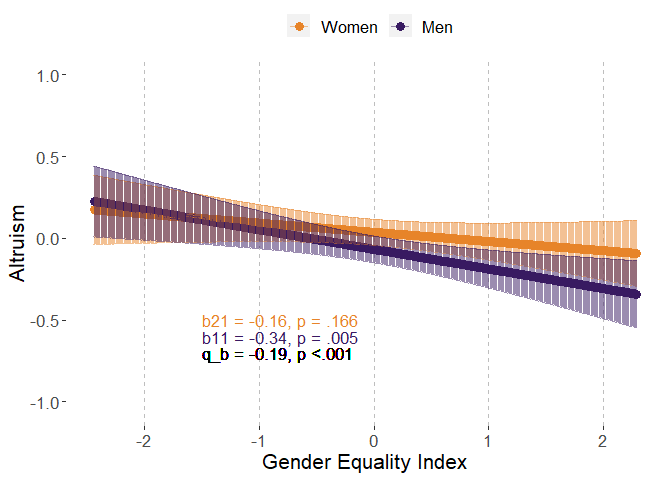
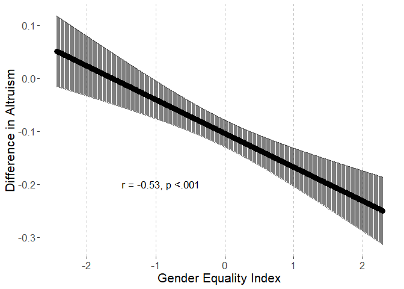
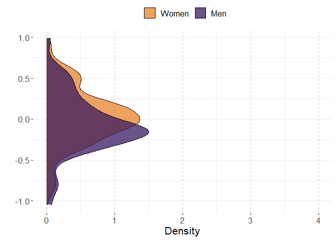
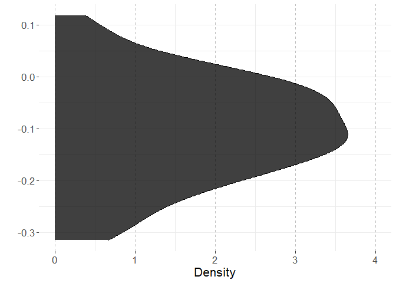
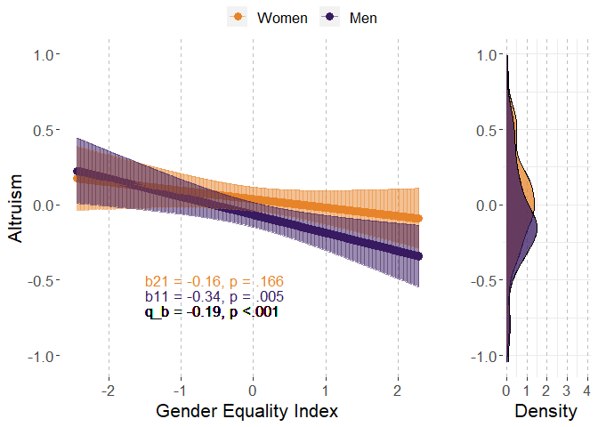
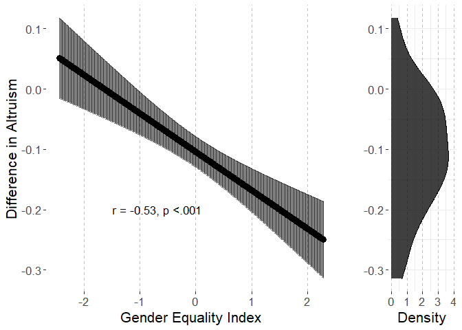
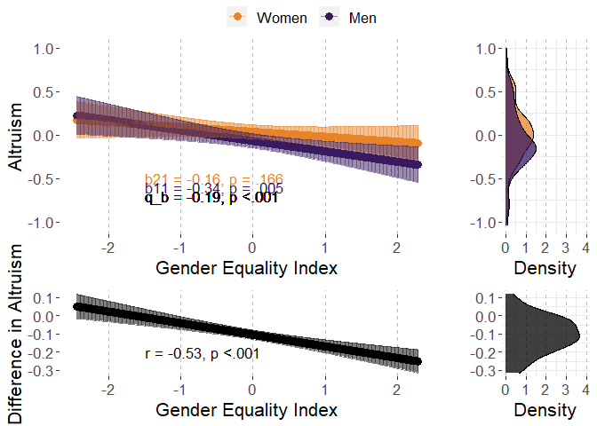

# Preparations

## Load packages


```r
library(multid)
library(lmerTest)
library(rio)
library(dplyr)
library(tibble)
library(ggpubr)
library(ggplot2)
library(MetBrewer)
library(emmeans)
library(finalfit)
source("../../custom_functions.R")
```

## Import data

Data (originally used in Falk & Hermle, 2018) is openly available at www.briq-institute.org/global-preferences/home


```r
dat.ex2 <- import("../data/Raw/individual_new.dta")
```

Import also pre-calculated indices of gender equality index (GEI)


```r
GEI <- 
  import("../data/Processed/GEI.xlsx")
```

## Compile country-level data


```r
men<-dat.ex2 %>%
  group_by(isocode) %>%
  filter(gender==0) %>%
  summarise(altruism.men.mean=mean(altruism,na.rm=T),
            altruism.men.sd=sd(altruism,na.rm=T),
            n.men=n())

women<-dat.ex2 %>%
  group_by(isocode) %>%
  filter(gender==1) %>%
  summarise(altruism.women.mean=mean(altruism,na.rm=T),
            altruism.women.sd=sd(altruism,na.rm=T),
            n.women=n())
```

Combine these with each other and with country-level GEI


```r
country.dat.ex2<-left_join(
  x=men,
  y=women,
  by="isocode")

country.dat.ex2<-
  left_join(country.dat.ex2,
            GEI,
            by=c("isocode"="ISO3"))
```

Use the regression method, process:

1. Standardize within-country

2. Run regression on the preference while controlling for age, age^2, subj_math_skills

3. Obtain the coefficients for gender as sex difference for each country


```r
countries<-unique(dat.ex2$isocode)

reg.diff.list<-list()

for (i in 1:length(countries)){
  
  temp.dat.ex2<-dat.ex2[dat.ex2$isocode==countries[i],]
  
  # standardize
  
  temp.dat.ex2$altruism<-
    (temp.dat.ex2$altruism-mean(temp.dat.ex2$altruism,na.rm=T))/
    sd(temp.dat.ex2$altruism,na.rm=T)
  
  # run the model
  
  temp.altruism.diff<-
    coefficients(lm(altruism~gender+age+I(age^2)+subj_math_skills,
                    data=temp.dat.ex2))["gender"]
  
  reg.diff.list[[i]]<-
    cbind.data.frame(
    isocode=countries[i],
    altruism.reg.diff=temp.altruism.diff)
  
}

reg.diff<-do.call(rbind,reg.diff.list)
rownames(reg.diff)<-NULL
head(reg.diff)
```

```
##   isocode altruism.reg.diff
## 1     TUR        0.04228641
## 2     FRA        0.05827099
## 3     NLD        0.18589588
## 4     ESP        0.11602833
## 5     ITA        0.13906096
## 6     POL        0.10774011
```

```r
# merge to the country data
country.dat.ex2<-
  left_join(
    x=country.dat.ex2,
    y=reg.diff,
    by="isocode")

# combine to multi-level data

dat.ex2<-
  left_join(dat.ex2,
            country.dat.ex2,
            by=c("isocode"))

# recode sex variable
dat.ex2$sex.c<-(-1)*(dat.ex2$gender-0.5)
```

## Data exclusions and transformations


```r
fdat<-dat.ex2 %>%
  dplyr::select(altruism,sex.c,country,GEI,age,subj_math_skills) %>%
  na.omit() %>%
  mutate(age_sq=age^2)
```

# Analysis

## Reliability of the difference score


```r
reliab.altruism<-
  reliability_dms(
    data=fdat,
    diff_var="sex.c",var = "altruism",
    diff_var_values = c(0.5,-0.5),
    group_var = "country")


export(t(data.frame(reliab.altruism)),
       "../results/reliab.altruism.xlsx",
       overwrite=T)
reliab.altruism
```

```
##              r11              r22              r12              sd1 
##       0.98637128       0.98722039       0.94427753       0.36241606 
##              sd2           sd_d12               m1               m2 
##       0.33914357       0.11932907      -0.05024299       0.02265987 
##            m_d12 reliability_dmsa 
##      -0.07290286       0.77106113
```

## Multi-level model

### Fit model


```r
fit_altruism<-
  ddsc_ml(data = fdat,predictor = "GEI",
          covariates=c("age","age_sq","subj_math_skills"),
          moderator = "sex.c",moderator_values=c(0.5,-0.5),
          DV = "altruism",lvl2_unit = "country",re_cov_test = T,
          scaling_sd = "observed")
```

```
## Warning: Some predictor variables are on very different scales: consider
## rescaling

## Warning: Some predictor variables are on very different scales: consider
## rescaling

## Warning: Some predictor variables are on very different scales: consider
## rescaling

## Warning: Some predictor variables are on very different scales: consider
## rescaling

## Warning: Some predictor variables are on very different scales: consider
## rescaling

## Warning: Some predictor variables are on very different scales: consider
## rescaling
```

### Descriptive statistics


```r
export(rownames_to_column(data.frame(fit_altruism$descriptives)),
       "../results/altruism_ml_desc.xlsx",
       overwrite=T)
round(fit_altruism$descriptives,2)
```

```
##                       M   SD means_y1 means_y1_scaled means_y2
## means_y1          -0.05 0.36     1.00            1.00     0.94
## means_y1_scaled   -0.14 1.03     1.00            1.00     0.94
## means_y2           0.02 0.34     0.94            0.94     1.00
## means_y2_scaled    0.06 0.97     0.94            0.94     1.00
## GEI                0.00 1.00    -0.30           -0.30    -0.14
## GEI_scaled         0.00 1.00    -0.30           -0.30    -0.14
## diff_score        -0.07 0.12     0.35            0.35     0.03
## diff_score_scaled -0.21 0.34     0.35            0.35     0.03
##                   means_y2_scaled   GEI GEI_scaled diff_score
## means_y1                     0.94 -0.30      -0.30       0.35
## means_y1_scaled              0.94 -0.30      -0.30       0.35
## means_y2                     1.00 -0.14      -0.14       0.03
## means_y2_scaled              1.00 -0.14      -0.14       0.03
## GEI                         -0.14  1.00       1.00      -0.53
## GEI_scaled                  -0.14  1.00       1.00      -0.53
## diff_score                   0.03 -0.53      -0.53       1.00
## diff_score_scaled            0.03 -0.53      -0.53       1.00
##                   diff_score_scaled
## means_y1                       0.35
## means_y1_scaled                0.35
## means_y2                       0.03
## means_y2_scaled                0.03
## GEI                           -0.53
## GEI_scaled                    -0.53
## diff_score                     1.00
## diff_score_scaled              1.00
```

```r
round(fit_altruism$SDs,2)
```

```
##         SD_y1         SD_y2     SD_pooled SD_diff_score            VR 
##          0.36          0.34          0.35          0.12          1.14
```

### Variance heterogeneity test


```r
export(t(data.frame(fit_altruism$re_cov_test)),
       "../results/altruism_ml_var_test.xlsx",
       overwrite=T)
round(fit_altruism$re_cov_test,3)
```

```
## RE_cov RE_cor  Chisq     Df      p 
##  0.008  0.222  2.769  1.000  0.096
```

### Component correlation


```r
export(rownames_to_column(data.frame(fit_altruism$ddsc_sem_fit$variance_test)),
       "../results/altruism_ml_comp_cor.xlsx",
       overwrite=T)
round(fit_altruism$ddsc_sem_fit$variance_test,3)
```

```
##             est    se      z pvalue ci.lower ci.upper
## cov_y1y2  0.929 0.161  5.785  0.000    0.614    1.244
## var_y1    1.051 0.176  5.958  0.000    0.705    1.397
## var_y2    0.921 0.155  5.958  0.000    0.618    1.223
## var_diff  0.131 0.080  1.635  0.102   -0.026    0.287
## var_ratio 1.142 0.089 12.800  0.000    0.967    1.317
## cor_y1y2  0.944 0.013 73.441  0.000    0.919    0.969
```

### Deconstructing results


```r
export(rownames_to_column(data.frame(fit_altruism$results)),
       "../results/altruism_ml_results.xlsx",
       overwrite=T)
round(fit_altruism$results,3)
```

```
##                            estimate    SE     df t.ratio p.value
## r_xy1y2                      -0.534 0.106 64.069  -5.020   0.000
## w_11                         -0.120 0.041 68.882  -2.910   0.005
## w_21                         -0.056 0.040 69.082  -1.398   0.166
## r_xy1                        -0.331 0.114 68.882  -2.910   0.005
## r_xy2                        -0.166 0.119 69.082  -1.398   0.166
## b_11                         -0.342 0.118 68.882  -2.910   0.005
## b_21                         -0.160 0.115 69.082  -1.398   0.166
## main_effect                  -0.088 0.040 69.041  -2.190   0.032
## moderator_effect             -0.104 0.013 67.924  -8.163   0.000
## interaction                  -0.064 0.013 64.069  -5.020   0.000
## q_b11_b21                    -0.195    NA     NA      NA      NA
## q_rxy1_rxy2                  -0.176    NA     NA      NA      NA
## cross_over_point             -1.636    NA     NA      NA      NA
## interaction_vs_main          -0.024 0.041 69.022  -0.593   0.555
## interaction_vs_main_bscale   -0.070 0.118 69.022  -0.593   0.555
## interaction_vs_main_rscale   -0.083 0.125 69.032  -0.667   0.507
## dadas                        -0.113 0.081 69.082  -1.398   0.917
## dadas_bscale                 -0.321 0.230 69.082  -1.398   0.917
## dadas_rscale                 -0.332 0.237 69.082  -1.398   0.917
## abs_diff                      0.064 0.013 64.069   5.020   0.000
## abs_sum                       0.176 0.080 69.041   2.190   0.016
## abs_diff_bscale               0.182 0.036 64.069   5.020   0.000
## abs_sum_bscale                0.502 0.229 69.041   2.190   0.016
## abs_diff_rscale               0.165 0.036 64.627   4.533   0.000
## abs_sum_rscale                0.497 0.230 69.044   2.164   0.017
```

### Multi-level model output


```r
# cross-level interaction model
summary(fit_altruism$model)
```

```
## Linear mixed model fit by REML. t-tests use Satterthwaite's method [
## lmerModLmerTest]
## Formula: model_formula
##    Data: data
## Control: lme4::lmerControl(optimizer = "bobyqa")
## 
## REML criterion at convergence: 200370.2
## 
## Scaled residuals: 
##     Min      1Q  Median      3Q     Max 
## -3.7674 -0.6325  0.0527  0.6783  3.6513 
## 
## Random effects:
##  Groups   Name        Variance Std.Dev. Corr
##  country  (Intercept) 0.112482 0.33538      
##           sex.c       0.008003 0.08946  0.09
##  Residual             0.865068 0.93009      
## Number of obs: 74222, groups:  country, 71
## 
## Fixed effects:
##                    Estimate Std. Error         df t value Pr(>|t|)    
## (Intercept)      -2.531e-01  4.572e-02  1.182e+02  -5.537 1.89e-07 ***
## sex.c            -1.042e-01  1.277e-02  6.792e+01  -8.163 1.12e-11 ***
## GEI              -8.813e-02  4.024e-02  6.904e+01  -2.190   0.0319 *  
## age               1.149e-04  9.966e-04  7.417e+04   0.115   0.9082    
## age_sq           -2.829e-07  1.062e-05  7.416e+04  -0.027   0.9787    
## subj_math_skills  4.500e-02  1.269e-03  7.417e+04  35.471  < 2e-16 ***
## sex.c:GEI        -6.368e-02  1.269e-02  6.407e+01  -5.020 4.37e-06 ***
## ---
## Signif. codes:  0 '***' 0.001 '**' 0.01 '*' 0.05 '.' 0.1 ' ' 1
## 
## Correlation of Fixed Effects:
##             (Intr) sex.c  GEI    age    age_sq sbj_m_
## sex.c        0.079                                   
## GEI          0.006  0.002                            
## age         -0.448  0.003 -0.004                     
## age_sq       0.412 -0.004 -0.001 -0.977              
## sbj_mth_skl -0.164 -0.068 -0.010  0.017  0.007       
## sex.c:GEI    0.001  0.010  0.078 -0.002  0.004 -0.002
## fit warnings:
## Some predictor variables are on very different scales: consider rescaling
```

```r
# reduced model without the predictor
summary(fit_altruism$reduced_model)
```

```
## Linear mixed model fit by REML. t-tests use Satterthwaite's method [
## lmerModLmerTest]
## Formula: altruism ~ sex.c + age + age_sq + subj_math_skills + (sex.c |  
##     country)
##    Data: data
## Control: lme4::lmerControl(optimizer = "bobyqa")
## 
## REML criterion at convergence: 200382.8
## 
## Scaled residuals: 
##     Min      1Q  Median      3Q     Max 
## -3.7695 -0.6334  0.0530  0.6793  3.6554 
## 
## Random effects:
##  Groups   Name        Variance Std.Dev. Corr
##  country  (Intercept) 0.11872  0.3446       
##           sex.c       0.01203  0.1097   0.22
##  Residual             0.86507  0.9301       
## Number of obs: 74222, groups:  country, 71
## 
## Fixed effects:
##                    Estimate Std. Error         df t value Pr(>|t|)    
## (Intercept)      -2.528e-01  4.667e-02  1.170e+02  -5.417 3.29e-07 ***
## sex.c            -1.037e-01  1.483e-02  6.925e+01  -6.995 1.33e-09 ***
## age               1.009e-04  9.966e-04  7.416e+04   0.101    0.919    
## age_sq           -1.221e-07  1.062e-05  7.416e+04  -0.011    0.991    
## subj_math_skills  4.501e-02  1.269e-03  7.420e+04  35.479  < 2e-16 ***
## ---
## Signif. codes:  0 '***' 0.001 '**' 0.01 '*' 0.05 '.' 0.1 ' ' 1
## 
## Correlation of Fixed Effects:
##             (Intr) sex.c  age    age_sq
## sex.c        0.183                     
## age         -0.439  0.002              
## age_sq       0.404 -0.004 -0.977       
## sbj_mth_skl -0.161 -0.059  0.017  0.007
## fit warnings:
## Some predictor variables are on very different scales: consider rescaling
```
## Country-level path model

### Fit the model

The model is already stored within the multi-level model object. 


```r
fit_altruism_sem<-fit_altruism$ddsc_sem_fit
```

### Results


```r
export(rownames_to_column(data.frame(fit_altruism_sem$results)),
       "../results/altruism_sem_results.xlsx",
       overwrite=T)
round(fit_altruism_sem$results,3)
```

```
##                                    est    se      z pvalue ci.lower
## r_xy1_y2                        -0.533 0.100 -5.304  0.000   -0.730
## r_xy1                           -0.302 0.113 -2.674  0.008   -0.524
## r_xy2                           -0.136 0.118 -1.155  0.248   -0.366
## b_11                            -0.312 0.117 -2.674  0.008   -0.541
## b_21                            -0.131 0.114 -1.155  0.248   -0.354
## b_10                            -0.143 0.116 -1.234  0.217   -0.370
## b_20                             0.065 0.113  0.572  0.567   -0.157
## res_cov_y1_y2                    0.889 0.153  5.824  0.000    0.590
## diff_b10_b20                    -0.208 0.034 -6.126  0.000   -0.274
## diff_b11_b21                    -0.181 0.034 -5.304  0.000   -0.248
## diff_rxy1_rxy2                  -0.167 0.034 -4.856  0.000   -0.234
## q_b11_b21                       -0.191 0.039 -4.945  0.000   -0.267
## q_rxy1_rxy2                     -0.176 0.036 -4.831  0.000   -0.247
## cross_over_point                -1.147 0.286 -4.010  0.000   -1.707
## sum_b11_b21                     -0.444 0.228 -1.946  0.052   -0.890
## main_effect                     -0.222 0.114 -1.946  0.052   -0.445
## interaction_vs_main_effect      -0.041 0.116 -0.351  0.726   -0.268
## diff_abs_b11_abs_b21             0.181 0.034  5.304  0.000    0.114
## abs_diff_b11_b21                 0.181 0.034  5.304  0.000    0.114
## abs_sum_b11_b21                  0.444 0.228  1.946  0.026   -0.003
## dadas                           -0.262 0.227 -1.155  0.876   -0.708
## q_r_equivalence                  0.176 0.036  4.831  1.000       NA
## q_b_equivalence                  0.191 0.039  4.945  1.000       NA
## cross_over_point_equivalence     1.147 0.286  4.010  1.000       NA
## cross_over_point_minimal_effect  1.147 0.286  4.010  0.000       NA
##                                 ci.upper
## r_xy1_y2                          -0.336
## r_xy1                             -0.081
## r_xy2                              0.095
## b_11                              -0.083
## b_21                               0.091
## b_10                               0.084
## b_20                               0.286
## res_cov_y1_y2                      1.188
## diff_b10_b20                      -0.141
## diff_b11_b21                      -0.114
## diff_rxy1_rxy2                    -0.099
## q_b11_b21                         -0.115
## q_rxy1_rxy2                       -0.104
## cross_over_point                  -0.586
## sum_b11_b21                        0.003
## main_effect                        0.002
## interaction_vs_main_effect         0.186
## diff_abs_b11_abs_b21               0.248
## abs_diff_b11_b21                   0.248
## abs_sum_b11_b21                    0.890
## dadas                              0.183
## q_r_equivalence                       NA
## q_b_equivalence                       NA
## cross_over_point_equivalence          NA
## cross_over_point_minimal_effect       NA
```


# Plotting the results


```r
# start with obtaining predicted values for means and differences

ml_altruism<-fit_altruism$model
ml_altruism_red<-fit_altruism$reduced_model
  


# point predictions as function of GEI for components

p<-
  emmip(
    ml_altruism, 
    sex.c ~ GEI,
    at=list(sex.c = c(-0.5,0.5),
            age=mean(fdat$age,na.rm=T),
            subj_math_skills=mean(fdat$subj_math_skills,na.rm=T),
            GEI=
              seq(from=round(range(fdat$GEI,na.rm=T)[1],2),
                  to=round(range(fdat$GEI,na.rm=T)[2],2),
                  by=0.01)),
    plotit=F,CIs=T,lmerTest.limit = 1e6,disable.pbkrtest=T)

p$sex<-p$tvar
levels(p$sex)<-c("Women","Men")

# obtain min and max for aligned plots
min.y.comp<-min(p$LCL)
max.y.comp<-max(p$UCL)

# Men and Women mean distributions

p3<-coefficients(ml_altruism_red)$country
p3<-cbind(rbind(p3,p3),weight=rep(c(-0.5,0.5),each=nrow(p3)))

p3$xvar<-p3$`(Intercept)`+
  p3$age*mean(fdat$age,na.rm=T)+
  p3$age_sq*(mean(fdat$age,na.rm=T)^2)+
  p3$subj_math_skills*mean(fdat$subj_math_skills,na.rm=T)+
  p3$sex.c*p3$weight
p3$sex<-as.factor(p3$weight)
levels(p3$sex)<-c("Women","Men")

# obtain min and max for aligned plots
min.y.mean.distr<-min(p3$xvar)
max.y.mean.distr<-max(p3$xvar)


# obtain the coefs for the sex-effect (difference) as function of GGGI

p2<-data.frame(
  emtrends(ml_altruism,var="+1*sex.c",
           specs="GEI",
           at=list(#Sex = c(-0.5,0.5),
             age=mean(fdat$age,na.rm=T),
             subj_math_skills=mean(fdat$subj_math_skills,na.rm=T),
             GEI=
               seq(from=round(range(fdat$GEI,na.rm=T)[1],2),
                   to=round(range(fdat$GEI,na.rm=T)[2],2),
                   by=0.01)),
           lmerTest.limit = 1e6,disable.pbkrtest=T))

p2$yvar<-p2$X.1.sex.c.trend
p2$xvar<-p2$GEI
p2$LCL<-p2$lower.CL
p2$UCL<-p2$upper.CL

# obtain min and max for aligned plots
min.y.diff<-min(p2$LCL)
max.y.diff<-max(p2$UCL)

# difference score distribution

p4<-coefficients(ml_altruism_red)$country
p4$xvar=(+1)*p4$sex.c

# obtain mix and max for aligned plots

min.y.diff.distr<-min(p4$xvar)
max.y.diff.distr<-max(p4$xvar)

# define mins and maxs

min.y.pred<-
  ifelse(min.y.comp<min.y.mean.distr,min.y.comp,min.y.mean.distr)

max.y.pred<-
  ifelse(max.y.comp>max.y.mean.distr,max.y.comp,max.y.mean.distr)

min.y.narrow<-
  ifelse(min.y.diff<min.y.diff.distr,min.y.diff,min.y.diff.distr)

max.y.narrow<-
  ifelse(max.y.diff>max.y.diff.distr,max.y.diff,max.y.diff.distr)

# Figures 

# p1

# scaled simple effects to the plot

pvals<-p_coding(c(fit_altruism$results["b_21","p.value"],
                    fit_altruism$results["b_11","p.value"]))

ests<-
  round_tidy(c(fit_altruism$results["b_21","estimate"],
               fit_altruism$results["b_11","estimate"]),2)

coef1<-paste0("b21 = ",ests[1],", p = ",pvals[1])
coef2<-paste0("b11 = ",ests[2],", p = ",pvals[2])

coef_q<-round_tidy(fit_altruism$results["q_b11_b21","estimate"],2)
coef_q<-paste0("q_b = ",coef_q,", p ",
               ifelse(fit_altruism$results["interaction","p.value"]<.001,"","="),
               p_coding(fit_altruism$results["interaction","p.value"]))

coefs<-data.frame(sex=c("Women","Men"),
                  coef=c(coef1,coef2))


p1.altruism.GEI<-ggplot(p,aes(y=yvar,x=xvar,color=sex))+
  geom_point(size=3)+
  geom_errorbar(aes(ymin=LCL, ymax=UCL),alpha=0.5)+
  xlab("Gender Equality Index")+
  #ylim=c(2.3,3.9)+
  ylim(c(min.y.pred,max.y.pred))+
  ylab("Altruism")+
  scale_color_manual(values=met.brewer("Archambault")[c(6,2)])+
  theme(legend.position = "top",
        legend.title=element_blank(),
        text=element_text(size=16,  family="sans"),
        panel.background = element_rect(fill = "white",
                                        #colour = "black",
                                        #size = 0.5, linetype = "solid"
        ),
        panel.grid.major.x = element_line(size = 0.5, linetype = 2,
                                          colour = "gray"))+
  geom_text(data = coefs,show.legend=F,
            aes(label=coef,x=-1.50,
                y=c(round(min(p$LCL),2)+0.10-0.05
                    ,round(min(p$LCL),2)-0.05),size=14,hjust="left"))+
  geom_text(inherit.aes=F,aes(x=-1.50,y=round(min(p$LCL),2)-0.15,
                              label=coef_q,size=14,hjust="left"),
            show.legend=F)
```

```
## Warning: The `size` argument of `element_line()` is deprecated as of ggplot2
## 3.4.0.
## ℹ Please use the `linewidth` argument instead.
## This warning is displayed once every 8 hours.
## Call `lifecycle::last_lifecycle_warnings()` to see where this warning was
## generated.
```

```r
p1.altruism.GEI
```

<!-- -->

```r
# prediction plot for difference score


pvals2<-p_coding(fit_altruism$results["r_xy1y2","p.value"])

ests2<-
  round_tidy(fit_altruism$results["r_xy1y2","estimate"],2)

coefs2<-paste0("r = ",ests2,
               ", p ",
               ifelse(fit_altruism$results["r_xy1y2","p.value"]<.001,"","="),
               pvals2)


p2.altruism.GEI<-ggplot(p2,aes(y=yvar,x=xvar))+
  geom_point(size=3)+
  geom_errorbar(aes(ymin=LCL, ymax=UCL),alpha=0.5)+
  xlab("Gender Equality Index")+
  ylim(c(min.y.narrow,max.y.narrow))+
  ylab("Difference in Altruism")+
  #scale_color_manual(values=met.brewer("Archambault")[c(6,2)])+
  theme(legend.position = "right",
        legend.title=element_blank(),
        text=element_text(size=16,  family="sans"),
        panel.background = element_rect(fill = "white",
                                        #colour = "black",
                                        #size = 0.5, linetype = "solid"
        ),
        panel.grid.major.x = element_line(size = 0.5, linetype = 2,
                                          colour = "gray"))+
  #geom_text(coef2,aes(x=0.63,y=min(p2$LCL)))
  geom_text(data = data.frame(coefs2),show.legend=F,
            aes(label=coefs2,x=-1.50,hjust="left",
                y=-0.20,size=14))
p2.altruism.GEI
```

<!-- -->

```r
# mean-level distributions

p3.altruism.GEI<-
  ggplot(p3, aes(x=xvar, fill=sex)) + 
  geom_density(alpha=.75) + 
  scale_fill_manual(values=met.brewer("Archambault")[c(6,2)])+
  #scale_fill_manual(values=c("turquoise3","orangered2","black")) + 
  xlab("")+
  ylab("Density")+
  ylim(c(0,4))+
  xlim(c(min.y.pred,max.y.pred))+
  theme_bw()+
  theme(legend.position = "top",
        legend.title=element_blank(),
        text=element_text(size=16,  family="sans"),
        panel.border = element_blank(),
        panel.background = element_rect(fill = "white",
                                        #colour = "black",
                                        #size = 0.5, linetype = "solid"
        ),
        panel.grid.major.x = element_line(size = 0.5, linetype = 2,
                                          colour = "gray"))+
  coord_flip()
p3.altruism.GEI
```

<!-- -->

```r
# distribution for mean differences

p4.altruism.GEI<-
  ggplot(p4, aes(x=xvar,fill="black")) + 
  geom_density(alpha=.75) + 
  scale_fill_manual(values="black")+
  #scale_fill_manual(values=c("turquoise3","orangered2","black")) + 
  xlab("")+
  ylab("Density")+
  ylim(c(0,4))+
  xlim(c(min.y.narrow,max.y.narrow))+
  theme_bw()+
  theme(legend.position = "none",
        legend.title=element_blank(),
        text=element_text(size=16,  family="sans"),
        panel.border = element_blank(),
        panel.background = element_rect(fill = "white",
                                        #colour = "black",
                                        #size = 0.5, linetype = "solid"
        ),
        panel.grid.major.x = element_line(size = 0.5, linetype = 2,
                                          colour = "gray"))+
  coord_flip()
p4.altruism.GEI
```

<!-- -->

```r
# combine component-specific predictions

p13.altruism.GEI<-
  ggarrange(p1.altruism.GEI, p3.altruism.GEI,common.legend = T,
            ncol=2, nrow=1,widths=c(4,1.4)
  )

p13.altruism.GEI
```

<!-- -->

```r
# combine difference score predictions

p24.altruism.GEI<-
  ggarrange(p2.altruism.GEI, p4.altruism.GEI,
            ncol=2, nrow=1,widths=c(4,1.4)
  )

p24.altruism.GEI
```

<!-- -->

```r
pall.altruism.GEI<-
  ggarrange(p13.altruism.GEI,p24.altruism.GEI,align = "hv",
            ncol=1,nrow=2,heights=c(2,1))
pall.altruism.GEI
```

<!-- -->

```r
png(filename = 
      "../results/pall.altruism.GEI.png",
    units = "cm",
    width = 21.0,height=29.7*(4/5),res = 600)
pall.altruism.GEI
dev.off()
```

```
## png 
##   2
```


# Session information


```r
s<-sessionInfo()
print(s,locale=F)
```

```
## R version 4.3.0 (2023-04-21 ucrt)
## Platform: x86_64-w64-mingw32/x64 (64-bit)
## Running under: Windows 10 x64 (build 19045)
## 
## Matrix products: default
## 
## 
## attached base packages:
## [1] stats     graphics  grDevices utils     datasets  methods   base     
## 
## other attached packages:
##  [1] finalfit_1.0.6    emmeans_1.8.6     MetBrewer_0.2.0  
##  [4] ggpubr_0.6.0      ggplot2_3.4.2     tibble_3.2.1     
##  [7] dplyr_1.1.2       rio_0.5.29        lmerTest_3.1-3   
## [10] lme4_1.1-33       Matrix_1.5-4      multid_0.8.0.9000
## [13] knitr_1.42        rmarkdown_2.21   
## 
## loaded via a namespace (and not attached):
##  [1] tidyselect_1.2.0    farver_2.1.1        fastmap_1.1.1      
##  [4] digest_0.6.31       estimability_1.4.1  lifecycle_1.0.3    
##  [7] survival_3.5-5      magrittr_2.0.3      compiler_4.3.0     
## [10] rlang_1.1.1         sass_0.4.6          tools_4.3.0        
## [13] utf8_1.2.3          yaml_2.3.7          data.table_1.14.8  
## [16] ggsignif_0.6.4      labeling_0.4.2      mnormt_2.1.1       
## [19] curl_5.0.0          abind_1.4-5         withr_2.5.0        
## [22] foreign_0.8-84      purrr_1.0.1         numDeriv_2016.8-1.1
## [25] grid_4.3.0          stats4_4.3.0        fansi_1.0.4        
## [28] lavaan_0.6-15       xtable_1.8-4        colorspace_2.1-0   
## [31] mice_3.15.0         scales_1.2.1        MASS_7.3-58.4      
## [34] cli_3.6.1           mvtnorm_1.1-3       crayon_1.5.2       
## [37] generics_0.1.3      rstudioapi_0.14     tzdb_0.4.0         
## [40] readxl_1.4.2        minqa_1.2.5         cachem_1.0.8       
## [43] splines_4.3.0       parallel_4.3.0      cellranger_1.1.0   
## [46] vctrs_0.6.2         boot_1.3-28.1       jsonlite_1.8.4     
## [49] carData_3.0-5       car_3.1-2           hms_1.1.3          
## [52] rstatix_0.7.2       tidyr_1.3.0         jquerylib_0.1.4    
## [55] glue_1.6.2          nloptr_2.0.3        cowplot_1.1.1      
## [58] stringi_1.7.12      gtable_0.3.3        quadprog_1.5-8     
## [61] munsell_0.5.0       pillar_1.9.0        htmltools_0.5.5    
## [64] R6_2.5.1            evaluate_0.21       pbivnorm_0.6.0     
## [67] lattice_0.21-8      highr_0.10          haven_2.5.2        
## [70] readr_2.1.4         backports_1.4.1     openxlsx_4.2.5.2   
## [73] broom_1.0.4         bslib_0.4.2         Rcpp_1.0.10        
## [76] zip_2.3.0           gridExtra_2.3       nlme_3.1-162       
## [79] xfun_0.39           forcats_1.0.0       pkgconfig_2.0.3
```

