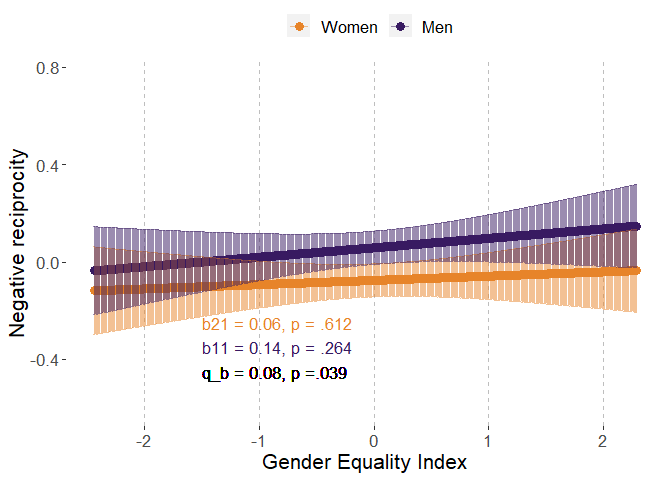
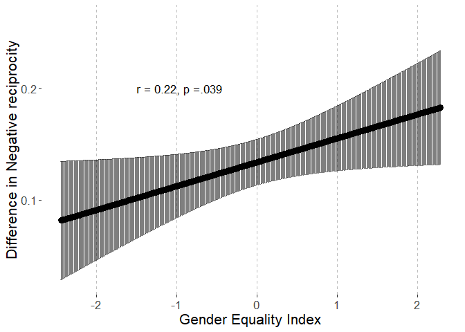
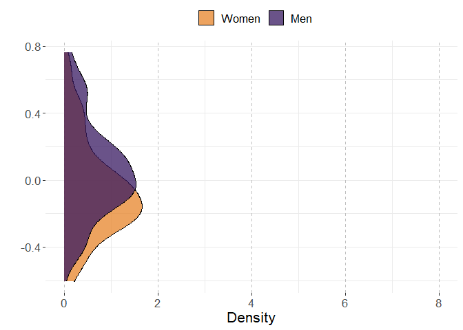
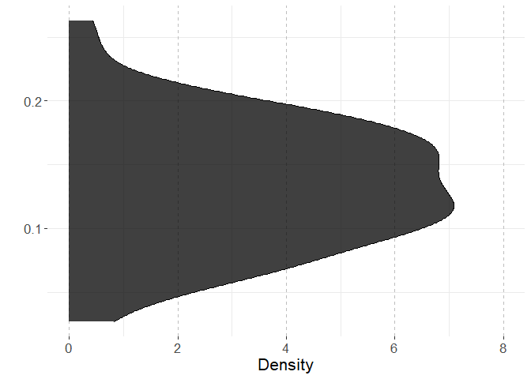
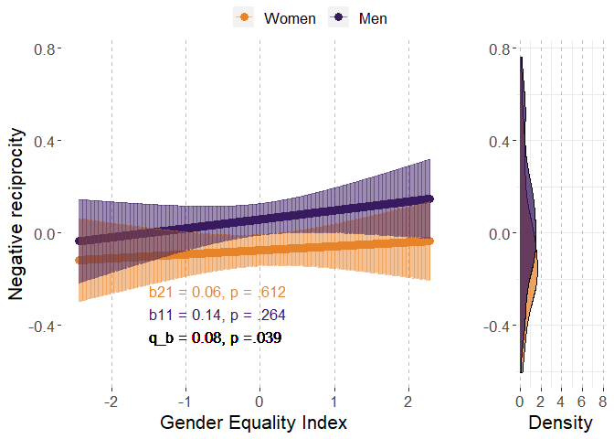
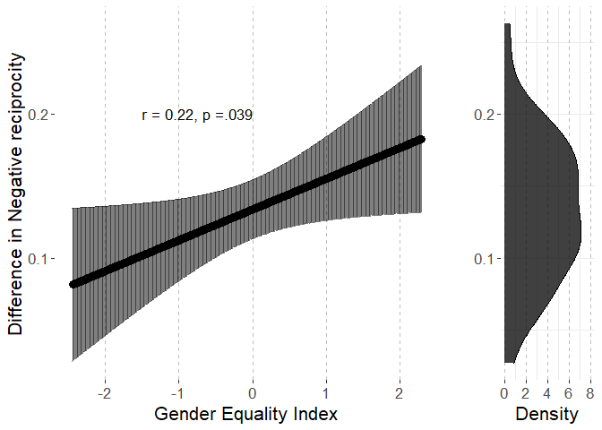
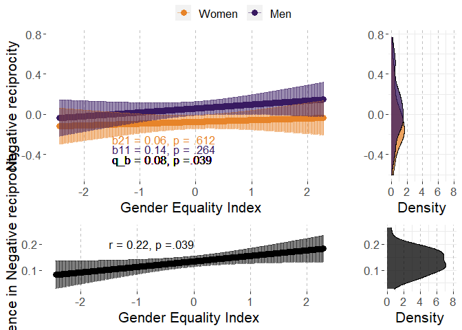

# Preparations

## Load packages


```r
library(multid)
library(lmerTest)
library(rio)
library(dplyr)
library(tibble)
library(ggpubr)
library(ggplot2)
library(MetBrewer)
library(emmeans)
library(finalfit)
source("../../custom_functions.R")
```

## Import data

Data (originally used in Falk & Hermle, 2018) is openly available at www.briq-institute.org/global-preferences/home


```r
dat.ex2 <- import("../data/Raw/individual_new.dta")
```

Import also pre-calculated indices of gender equality index (GEI)


```r
GEI <- 
  import("../data/Processed/GEI.xlsx")
```

## Compile country-level data


```r
men<-dat.ex2 %>%
  group_by(isocode) %>%
  filter(gender==0) %>%
  summarise(negrecip.men.mean=mean(negrecip,na.rm=T),
            negrecip.men.sd=sd(negrecip,na.rm=T),
            n.men=n())

women<-dat.ex2 %>%
  group_by(isocode) %>%
  filter(gender==1) %>%
  summarise(negrecip.women.mean=mean(negrecip,na.rm=T),
            negrecip.women.sd=sd(negrecip,na.rm=T),
            n.women=n())
```

Combine these with each other and with country-level GEI


```r
country.dat.ex2<-left_join(
  x=men,
  y=women,
  by="isocode")

country.dat.ex2<-
  left_join(country.dat.ex2,
            GEI,
            by=c("isocode"="ISO3"))
```

Use the regression method, process:

1.  Standardize within-country

2.  Run regression on the preference while controlling for age, age\^2, subj_math_skills

3.  Obtain the coefficients for gender as sex difference for each country


```r
countries<-unique(dat.ex2$isocode)

reg.diff.list<-list()

for (i in 1:length(countries)){
  
  temp.dat.ex2<-dat.ex2[dat.ex2$isocode==countries[i],]
  
  # standardize
  
  temp.dat.ex2$negrecip<-
    (temp.dat.ex2$negrecip-mean(temp.dat.ex2$negrecip,na.rm=T))/
    sd(temp.dat.ex2$negrecip,na.rm=T)
  
  # run the model
  
  temp.negrecip.diff<-
    coefficients(lm(negrecip~gender+age+I(age^2)+subj_math_skills,
                    data=temp.dat.ex2))["gender"]
  
  reg.diff.list[[i]]<-
    cbind.data.frame(
    isocode=countries[i],
    negrecip.reg.diff=temp.negrecip.diff)
  
}

reg.diff<-do.call(rbind,reg.diff.list)
rownames(reg.diff)<-NULL
head(reg.diff)
```

```
##   isocode negrecip.reg.diff
## 1     TUR       -0.05706155
## 2     FRA       -0.14897291
## 3     NLD       -0.36540454
## 4     ESP       -0.17827028
## 5     ITA       -0.13844118
## 6     POL       -0.20046053
```

```r
# merge to the country data
country.dat.ex2<-
  left_join(
    x=country.dat.ex2,
    y=reg.diff,
    by="isocode")

# combine to multi-level data

dat.ex2<-
  left_join(dat.ex2,
            country.dat.ex2,
            by=c("isocode"))

# recode sex variable
dat.ex2$sex.c<-(-1)*(dat.ex2$gender-0.5)
```

## Data exclusions and transformations


```r
fdat<-dat.ex2 %>%
  dplyr::select(negrecip,sex.c,country,GEI,age,subj_math_skills) %>%
  na.omit() %>%
  mutate(age_sq=age^2)
```

# Analysis

## Reliability of the difference score


```r
reliab.negrecip<-
  reliability_dms(
    data=fdat,
    diff_var="sex.c",var = "negrecip",
    diff_var_values = c(0.5,-0.5),
    group_var = "country")


export(t(data.frame(reliab.negrecip)),
       "../results/reliab.negrecip.xlsx",
       overwrite=T)
reliab.negrecip
```

```
##              r11              r22              r12              sd1 
##       0.97314811       0.97957279       0.93986992       0.28279366 
##              sd2           sd_d12               m1               m2 
##       0.28889482       0.09930857       0.07053394      -0.08860377 
##            m_d12 reliability_dmsa 
##       0.15913771       0.60939053
```

## Multi-level model

### Fit model


```r
fit_negrecip<-
  ddsc_ml(data = fdat,predictor = "GEI",
          covariates=c("age","age_sq","subj_math_skills"),
          moderator = "sex.c",moderator_values=c(0.5,-0.5),
          DV = "negrecip",lvl2_unit = "country",re_cov_test = T,
          scaling_sd = "observed")
```

```
## Warning: Some predictor variables are on very different scales: consider
## rescaling

## Warning: Some predictor variables are on very different scales: consider
## rescaling

## Warning: Some predictor variables are on very different scales: consider
## rescaling

## Warning: Some predictor variables are on very different scales: consider
## rescaling

## Warning: Some predictor variables are on very different scales: consider
## rescaling

## Warning: Some predictor variables are on very different scales: consider
## rescaling
```

### Descriptive statistics


```r
export(rownames_to_column(data.frame(fit_negrecip$descriptives)),
       "../results/negrecip_ml_desc.xlsx",
       overwrite=T)
round(fit_negrecip$descriptives,2)
```

```
##                       M   SD means_y1 means_y1_scaled means_y2
## means_y1           0.07 0.28     1.00            1.00     0.94
## means_y1_scaled    0.25 0.99     1.00            1.00     0.94
## means_y2          -0.09 0.29     0.94            0.94     1.00
## means_y2_scaled   -0.31 1.01     0.94            0.94     1.00
## GEI                0.00 1.00     0.07            0.07    -0.03
## GEI_scaled         0.00 1.00     0.07            0.07    -0.03
## diff_score         0.16 0.10     0.11            0.11    -0.23
## diff_score_scaled  0.56 0.35     0.11            0.11    -0.23
##                   means_y2_scaled   GEI GEI_scaled diff_score
## means_y1                     0.94  0.07       0.07       0.11
## means_y1_scaled              0.94  0.07       0.07       0.11
## means_y2                     1.00 -0.03      -0.03      -0.23
## means_y2_scaled              1.00 -0.03      -0.03      -0.23
## GEI                         -0.03  1.00       1.00       0.28
## GEI_scaled                  -0.03  1.00       1.00       0.28
## diff_score                  -0.23  0.28       0.28       1.00
## diff_score_scaled           -0.23  0.28       0.28       1.00
##                   diff_score_scaled
## means_y1                       0.11
## means_y1_scaled                0.11
## means_y2                      -0.23
## means_y2_scaled               -0.23
## GEI                            0.28
## GEI_scaled                     0.28
## diff_score                     1.00
## diff_score_scaled              1.00
```

```r
round(fit_negrecip$SDs,2)
```

```
##         SD_y1         SD_y2     SD_pooled SD_diff_score            VR 
##          0.28          0.29          0.29          0.10          0.96
```

### Variance heterogeneity test


```r
export(t(data.frame(fit_negrecip$re_cov_test)),
       "../results/negrecip_ml_var_test.xlsx",
       overwrite=T)
round(fit_negrecip$re_cov_test,3)
```

```
## RE_cov RE_cor  Chisq     Df      p 
##  0.001  0.054  0.108  1.000  0.742
```

### Component correlation


```r
export(rownames_to_column(data.frame(fit_negrecip$ddsc_sem_fit$variance_test)),
       "../results/negrecip_ml_comp_cor.xlsx",
       overwrite=T)
round(fit_negrecip$ddsc_sem_fit$variance_test,3)
```

```
##              est    se      z pvalue ci.lower ci.upper
## cov_y1y2   0.926 0.161  5.771    0.0    0.612    1.241
## var_y1     0.965 0.162  5.958    0.0    0.647    1.282
## var_y2     1.007 0.169  5.958    0.0    0.676    1.338
## var_diff  -0.042 0.080 -0.525    0.6   -0.199    0.115
## var_ratio  0.958 0.078 12.336    0.0    0.806    1.110
## cor_y1y2   0.940 0.014 67.894    0.0    0.913    0.967
```

### Deconstructing results


```r
export(rownames_to_column(data.frame(fit_negrecip$results)),
       "../results/negrecip_ml_results.xlsx",
       overwrite=T)
round(fit_negrecip$results,3)
```

```
##                            estimate    SE     df t.ratio p.value
## r_xy1y2                       0.215 0.102 61.364   2.115   0.039
## w_11                          0.039 0.034 68.567   1.126   0.264
## w_21                          0.017 0.034 69.004   0.509   0.612
## r_xy1                         0.137 0.122 68.567   1.126   0.264
## r_xy2                         0.060 0.119 69.004   0.509   0.612
## b_11                          0.136 0.121 68.567   1.126   0.264
## b_21                          0.061 0.120 69.004   0.509   0.612
## main_effect                   0.028 0.034 68.953   0.828   0.411
## moderator_effect              0.134 0.010 68.530  13.016   0.000
## interaction                   0.021 0.010 61.364   2.115   0.039
## q_b11_b21                     0.076    NA     NA      NA      NA
## q_rxy1_rxy2                   0.078    NA     NA      NA      NA
## cross_over_point             -6.260    NA     NA      NA      NA
## interaction_vs_main          -0.007 0.035 68.699  -0.191   0.849
## interaction_vs_main_bscale   -0.024 0.123 68.699  -0.191   0.849
## interaction_vs_main_rscale   -0.022 0.121 68.684  -0.181   0.857
## dadas                        -0.035 0.068 69.004  -0.509   0.694
## dadas_bscale                 -0.122 0.240 69.004  -0.509   0.694
## dadas_rscale                 -0.121 0.237 69.004  -0.509   0.694
## abs_diff                      0.021 0.010 61.364   2.115   0.019
## abs_sum                       0.056 0.068 68.953   0.828   0.205
## abs_diff_bscale               0.075 0.035 61.364   2.115   0.019
## abs_sum_bscale                0.197 0.238 68.953   0.828   0.205
## abs_diff_rscale               0.077 0.036 61.417   2.165   0.017
## abs_sum_rscale                0.198 0.238 68.950   0.831   0.204
```

### Multi-level model output


```r
# cross-level interaction model
summary(fit_negrecip$model)
```

```
## Linear mixed model fit by REML. t-tests use Satterthwaite's method [
## lmerModLmerTest]
## Formula: model_formula
##    Data: data
## Control: lme4::lmerControl(optimizer = "bobyqa")
## 
## REML criterion at convergence: 199373.5
## 
## Scaled residuals: 
##     Min      1Q  Median      3Q     Max 
## -2.5811 -0.7648 -0.0159  0.6821  3.4794 
## 
## Random effects:
##  Groups   Name        Variance Std.Dev. Corr
##  country  (Intercept) 0.079877 0.2826       
##           sex.c       0.003819 0.0618   0.03
##  Residual             0.887532 0.9421       
## Number of obs: 73177, groups:  country, 71
## 
## Fixed effects:
##                    Estimate Std. Error         df t value Pr(>|t|)    
## (Intercept)       4.726e-02  4.063e-02  1.450e+02   1.163 0.246664    
## sex.c             1.338e-01  1.028e-02  6.853e+01  13.016  < 2e-16 ***
## GEI               2.812e-02  3.397e-02  6.895e+01   0.828 0.410724    
## age              -3.931e-03  1.018e-03  7.312e+04  -3.863 0.000112 ***
## age_sq           -4.303e-05  1.086e-05  7.311e+04  -3.961 7.47e-05 ***
## subj_math_skills  3.804e-02  1.296e-03  7.300e+04  29.364  < 2e-16 ***
## sex.c:GEI         2.138e-02  1.011e-02  6.136e+01   2.115 0.038530 *  
## ---
## Signif. codes:  0 '***' 0.001 '**' 0.01 '*' 0.05 '.' 0.1 ' ' 1
## 
## Correlation of Fixed Effects:
##             (Intr) sex.c  GEI    age    age_sq sbj_m_
## sex.c        0.035                                   
## GEI          0.008  0.003                            
## age         -0.514  0.003 -0.005                     
## age_sq       0.473 -0.005 -0.001 -0.977              
## sbj_mth_skl -0.188 -0.085 -0.012  0.016  0.008       
## sex.c:GEI    0.002  0.021  0.021 -0.002  0.005 -0.003
## fit warnings:
## Some predictor variables are on very different scales: consider rescaling
```

```r
# reduced model without the predictor
summary(fit_negrecip$reduced_model)
```

```
## Linear mixed model fit by REML. t-tests use Satterthwaite's method [
## lmerModLmerTest]
## Formula: negrecip ~ sex.c + age + age_sq + subj_math_skills + (sex.c |  
##     country)
##    Data: data
## Control: lme4::lmerControl(optimizer = "bobyqa")
## 
## REML criterion at convergence: 199366.1
## 
## Scaled residuals: 
##     Min      1Q  Median      3Q     Max 
## -2.5737 -0.7642 -0.0160  0.6831  3.4804 
## 
## Random effects:
##  Groups   Name        Variance Std.Dev. Corr
##  country  (Intercept) 0.079480 0.28192      
##           sex.c       0.004242 0.06513  0.05
##  Residual             0.887526 0.94209      
## Number of obs: 73177, groups:  country, 71
## 
## Fixed effects:
##                    Estimate Std. Error         df t value Pr(>|t|)    
## (Intercept)       4.696e-02  4.056e-02  1.475e+02   1.158 0.248784    
## sex.c             1.334e-01  1.057e-02  7.099e+01  12.618  < 2e-16 ***
## age              -3.926e-03  1.018e-03  7.313e+04  -3.858 0.000115 ***
## age_sq           -4.310e-05  1.086e-05  7.311e+04  -3.968 7.26e-05 ***
## subj_math_skills  3.805e-02  1.295e-03  7.303e+04  29.374  < 2e-16 ***
## ---
## Signif. codes:  0 '***' 0.001 '**' 0.01 '*' 0.05 '.' 0.1 ' ' 1
## 
## Correlation of Fixed Effects:
##             (Intr) sex.c  age    age_sq
## sex.c        0.052                     
## age         -0.515  0.003              
## age_sq       0.474 -0.005 -0.977       
## sbj_mth_skl -0.188 -0.082  0.016  0.008
## fit warnings:
## Some predictor variables are on very different scales: consider rescaling
```

## Country-level path model

### Fit the model

The model is already stored within the multi-level model object.


```r
fit_negrecip_sem<-fit_negrecip$ddsc_sem_fit
```

### Results


```r
export(rownames_to_column(data.frame(fit_negrecip_sem$results)),
       "../results/negrecip_sem_results.xlsx",
       overwrite=T)
round(fit_negrecip_sem$results,3)
```

```
##                                    est    se      z pvalue ci.lower
## r_xy1_y2                         0.281 0.114  2.468  0.014    0.058
## r_xy1                            0.065 0.118  0.551  0.582   -0.167
## r_xy2                           -0.033 0.119 -0.276  0.782   -0.265
## b_11                             0.065 0.117  0.551  0.582   -0.165
## b_21                            -0.033 0.120 -0.276  0.782   -0.268
## b_10                             0.247 0.116  2.121  0.034    0.019
## b_20                            -0.310 0.119 -2.604  0.009   -0.543
## res_cov_y1_y2                    0.929 0.160  5.786  0.000    0.614
## diff_b10_b20                     0.557 0.039 14.170  0.000    0.480
## diff_b11_b21                     0.098 0.040  2.468  0.014    0.020
## diff_rxy1_rxy2                   0.098 0.039  2.483  0.013    0.021
## q_b11_b21                        0.098 0.040  2.466  0.014    0.020
## q_rxy1_rxy2                      0.098 0.040  2.479  0.013    0.021
## cross_over_point                -5.700 2.344 -2.432  0.015  -10.294
## sum_b11_b21                      0.031 0.234  0.134  0.893   -0.427
## main_effect                      0.016 0.117  0.134  0.893   -0.213
## interaction_vs_main_effect       0.082 0.126  0.651  0.515   -0.165
## diff_abs_b11_abs_b21             0.031 0.234  0.134  0.893   -0.427
## abs_diff_b11_b21                 0.098 0.040  2.468  0.007    0.020
## abs_sum_b11_b21                  0.031 0.234  0.134  0.447   -0.427
## dadas                            0.066 0.240  0.276  0.391   -0.404
## q_r_equivalence                  0.098 0.040  2.479  0.993       NA
## q_b_equivalence                  0.098 0.040  2.466  0.993       NA
## cross_over_point_equivalence     5.700 2.344  2.432  0.992       NA
## cross_over_point_minimal_effect  5.700 2.344  2.432  0.008       NA
##                                 ci.upper
## r_xy1_y2                           0.504
## r_xy1                              0.297
## r_xy2                              0.200
## b_11                               0.294
## b_21                               0.202
## b_10                               0.475
## b_20                              -0.077
## res_cov_y1_y2                      1.243
## diff_b10_b20                       0.634
## diff_b11_b21                       0.175
## diff_rxy1_rxy2                     0.175
## q_b11_b21                          0.175
## q_rxy1_rxy2                        0.176
## cross_over_point                  -1.106
## sum_b11_b21                        0.489
## main_effect                        0.245
## interaction_vs_main_effect         0.329
## diff_abs_b11_abs_b21               0.489
## abs_diff_b11_b21                   0.175
## abs_sum_b11_b21                    0.489
## dadas                              0.536
## q_r_equivalence                       NA
## q_b_equivalence                       NA
## cross_over_point_equivalence          NA
## cross_over_point_minimal_effect       NA
```

# Plotting the results


```r
# start with obtaining predicted values for means and differences

ml_negrecip<-fit_negrecip$model
ml_negrecip_red<-fit_negrecip$reduced_model
  


# point predictions as function of GEI for components

p<-
  emmip(
    ml_negrecip, 
    sex.c ~ GEI,
    at=list(sex.c = c(-0.5,0.5),
            age=mean(fdat$age,na.rm=T),
            subj_math_skills=mean(fdat$subj_math_skills,na.rm=T),
            GEI=
              seq(from=round(range(fdat$GEI,na.rm=T)[1],2),
                  to=round(range(fdat$GEI,na.rm=T)[2],2),
                  by=0.01)),
    plotit=F,CIs=T,lmerTest.limit = 1e6,disable.pbkrtest=T)

p$sex<-p$tvar
levels(p$sex)<-c("Women","Men")

# obtain min and max for aligned plots
min.y.comp<-min(p$LCL)
max.y.comp<-max(p$UCL)

# Men and Women mean distributions

p3<-coefficients(ml_negrecip_red)$country
p3<-cbind(rbind(p3,p3),weight=rep(c(-0.5,0.5),each=nrow(p3)))

p3$xvar<-p3$`(Intercept)`+
  p3$age*mean(fdat$age,na.rm=T)+
  p3$age_sq*(mean(fdat$age,na.rm=T)^2)+
  p3$subj_math_skills*mean(fdat$subj_math_skills,na.rm=T)+
  p3$sex.c*p3$weight
p3$sex<-as.factor(p3$weight)
levels(p3$sex)<-c("Women","Men")

# obtain min and max for aligned plots
min.y.mean.distr<-min(p3$xvar)
max.y.mean.distr<-max(p3$xvar)


# obtain the coefs for the sex-effect (difference) as function of GGGI

p2<-data.frame(
  emtrends(ml_negrecip,var="+1*sex.c",
           specs="GEI",
           at=list(#Sex = c(-0.5,0.5),
             age=mean(fdat$age,na.rm=T),
             subj_math_skills=mean(fdat$subj_math_skills,na.rm=T),
             GEI=
               seq(from=round(range(fdat$GEI,na.rm=T)[1],2),
                   to=round(range(fdat$GEI,na.rm=T)[2],2),
                   by=0.01)),
           lmerTest.limit = 1e6,disable.pbkrtest=T))

p2$yvar<-p2$X.1.sex.c.trend
p2$xvar<-p2$GEI
p2$LCL<-p2$lower.CL
p2$UCL<-p2$upper.CL

# obtain min and max for aligned plots
min.y.diff<-min(p2$LCL)
max.y.diff<-max(p2$UCL)

# difference score distribution

p4<-coefficients(ml_negrecip_red)$country
p4$xvar=(+1)*p4$sex.c

# obtain mix and max for aligned plots

min.y.diff.distr<-min(p4$xvar)
max.y.diff.distr<-max(p4$xvar)

# define mins and maxs

min.y.pred<-
  ifelse(min.y.comp<min.y.mean.distr,min.y.comp,min.y.mean.distr)

max.y.pred<-
  ifelse(max.y.comp>max.y.mean.distr,max.y.comp,max.y.mean.distr)

min.y.narrow<-
  ifelse(min.y.diff<min.y.diff.distr,min.y.diff,min.y.diff.distr)

max.y.narrow<-
  ifelse(max.y.diff>max.y.diff.distr,max.y.diff,max.y.diff.distr)

# Figures 

# p1

# scaled simple effects to the plot

pvals<-p_coding(c(fit_negrecip$results["b_21","p.value"],
                    fit_negrecip$results["b_11","p.value"]))

ests<-
  round_tidy(c(fit_negrecip$results["b_21","estimate"],
               fit_negrecip$results["b_11","estimate"]),2)

coef1<-paste0("b21 = ",ests[1],", p = ",pvals[1])
coef2<-paste0("b11 = ",ests[2],", p = ",pvals[2])

coef_q<-round_tidy(fit_negrecip$results["q_b11_b21","estimate"],2)
coef_q<-paste0("q_b = ",coef_q,", p ",
               ifelse(fit_negrecip$results["interaction","p.value"]<.001,"","="),
               p_coding(fit_negrecip$results["interaction","p.value"]))

coefs<-data.frame(sex=c("Women","Men"),
                  coef=c(coef1,coef2))


p1.negrecip.GEI<-ggplot(p,aes(y=yvar,x=xvar,color=sex))+
  geom_point(size=3)+
  geom_errorbar(aes(ymin=LCL, ymax=UCL),alpha=0.5)+
  xlab("Gender Equality Index")+
  #ylim=c(2.3,3.9)+
  ylim(c(min.y.pred,max.y.pred))+
  ylab("Negative reciprocity")+
  scale_color_manual(values=met.brewer("Archambault")[c(6,2)])+
  theme(legend.position = "top",
        legend.title=element_blank(),
        text=element_text(size=16,  family="sans"),
        panel.background = element_rect(fill = "white",
                                        #colour = "black",
                                        #size = 0.5, linetype = "solid"
        ),
        panel.grid.major.x = element_line(size = 0.5, linetype = 2,
                                          colour = "gray"))+
  geom_text(data = coefs,show.legend=F,
            aes(label=coef,x=-1.50,
                y=c(round(min(p$LCL),2)+0.10-0.05
                    ,round(min(p$LCL),2)-0.05),size=14,hjust="left"))+
  geom_text(inherit.aes=F,aes(x=-1.50,y=round(min(p$LCL),2)-0.15,
                              label=coef_q,size=14,hjust="left"),
            show.legend=F)
p1.negrecip.GEI
```

<!-- -->

```r
# prediction plot for difference score


pvals2<-p_coding(fit_negrecip$results["r_xy1y2","p.value"])

ests2<-
  round_tidy(fit_negrecip$results["r_xy1y2","estimate"],2)

coefs2<-paste0("r = ",ests2,
               ", p ",
               ifelse(fit_negrecip$results["r_xy1y2","p.value"]<.001,"","="),
               pvals2)


p2.negrecip.GEI<-ggplot(p2,aes(y=yvar,x=xvar))+
  geom_point(size=3)+
  geom_errorbar(aes(ymin=LCL, ymax=UCL),alpha=0.5)+
  xlab("Gender Equality Index")+
  ylim(c(min.y.narrow,max.y.narrow))+
  ylab("Difference in Negative reciprocity")+
  #scale_color_manual(values=met.brewer("Archambault")[c(6,2)])+
  theme(legend.position = "right",
        legend.title=element_blank(),
        text=element_text(size=16,  family="sans"),
        panel.background = element_rect(fill = "white",
                                        #colour = "black",
                                        #size = 0.5, linetype = "solid"
        ),
        panel.grid.major.x = element_line(size = 0.5, linetype = 2,
                                          colour = "gray"))+
  #geom_text(coef2,aes(x=0.63,y=min(p2$LCL)))
  geom_text(data = data.frame(coefs2),show.legend=F,
            aes(label=coefs2,x=-1.50,hjust="left",
                y=0.20,size=14))
p2.negrecip.GEI
```

<!-- -->

```r
# mean-level distributions

p3.negrecip.GEI<-
  ggplot(p3, aes(x=xvar, fill=sex)) + 
  geom_density(alpha=.75) + 
  scale_fill_manual(values=met.brewer("Archambault")[c(6,2)])+
  #scale_fill_manual(values=c("turquoise3","orangered2","black")) + 
  xlab("")+
  ylab("Density")+
  ylim(c(0,8))+
  xlim(c(min.y.pred,max.y.pred))+
  theme_bw()+
  theme(legend.position = "top",
        legend.title=element_blank(),
        text=element_text(size=16,  family="sans"),
        panel.border = element_blank(),
        panel.background = element_rect(fill = "white",
                                        #colour = "black",
                                        #size = 0.5, linetype = "solid"
        ),
        panel.grid.major.x = element_line(size = 0.5, linetype = 2,
                                          colour = "gray"))+
  coord_flip()
p3.negrecip.GEI
```

<!-- -->

```r
# distribution for mean differences

p4.negrecip.GEI<-
  ggplot(p4, aes(x=xvar,fill="black")) + 
  geom_density(alpha=.75) + 
  scale_fill_manual(values="black")+
  #scale_fill_manual(values=c("turquoise3","orangered2","black")) + 
  xlab("")+
  ylab("Density")+
  ylim(c(0,8))+
  xlim(c(min.y.narrow,max.y.narrow))+
  theme_bw()+
  theme(legend.position = "none",
        legend.title=element_blank(),
        text=element_text(size=16,  family="sans"),
        panel.border = element_blank(),
        panel.background = element_rect(fill = "white",
                                        #colour = "black",
                                        #size = 0.5, linetype = "solid"
        ),
        panel.grid.major.x = element_line(size = 0.5, linetype = 2,
                                          colour = "gray"))+
  coord_flip()
p4.negrecip.GEI
```

<!-- -->

```r
# combine component-specific predictions

p13.negrecip.GEI<-
  ggarrange(p1.negrecip.GEI, p3.negrecip.GEI,common.legend = T,
            ncol=2, nrow=1,widths=c(4,1.4)
  )

p13.negrecip.GEI
```

<!-- -->

```r
# combine difference score predictions

p24.negrecip.GEI<-
  ggarrange(p2.negrecip.GEI, p4.negrecip.GEI,
            ncol=2, nrow=1,widths=c(4,1.4)
  )

p24.negrecip.GEI
```

<!-- -->

```r
pall.negrecip.GEI<-
  ggarrange(p13.negrecip.GEI,p24.negrecip.GEI,align = "hv",
            ncol=1,nrow=2,heights=c(2,1))
pall.negrecip.GEI
```

<!-- -->

```r
png(filename = 
      "../results/pall.negrecip.GEI.png",
    units = "cm",
    width = 21.0,height=29.7*(4/5),res = 600)
pall.negrecip.GEI
dev.off()
```

```
## png 
##   2
```

# Session information


```r
s<-sessionInfo()
print(s,locale=F)
```

```
## R version 4.3.0 (2023-04-21 ucrt)
## Platform: x86_64-w64-mingw32/x64 (64-bit)
## Running under: Windows 10 x64 (build 19045)
## 
## Matrix products: default
## 
## 
## attached base packages:
## [1] stats     graphics  grDevices utils     datasets  methods   base     
## 
## other attached packages:
##  [1] finalfit_1.0.6    emmeans_1.8.6     MetBrewer_0.2.0  
##  [4] ggpubr_0.6.0      ggplot2_3.4.2     tibble_3.2.1     
##  [7] dplyr_1.1.2       rio_0.5.29        lmerTest_3.1-3   
## [10] lme4_1.1-33       Matrix_1.5-4      multid_0.8.0.9000
## [13] knitr_1.42        rmarkdown_2.21   
## 
## loaded via a namespace (and not attached):
##  [1] tidyselect_1.2.0    farver_2.1.1        fastmap_1.1.1      
##  [4] digest_0.6.31       estimability_1.4.1  lifecycle_1.0.3    
##  [7] survival_3.5-5      magrittr_2.0.3      compiler_4.3.0     
## [10] rlang_1.1.1         sass_0.4.6          tools_4.3.0        
## [13] utf8_1.2.3          yaml_2.3.7          data.table_1.14.8  
## [16] ggsignif_0.6.4      labeling_0.4.2      mnormt_2.1.1       
## [19] curl_5.0.0          abind_1.4-5         withr_2.5.0        
## [22] foreign_0.8-84      purrr_1.0.1         numDeriv_2016.8-1.1
## [25] grid_4.3.0          stats4_4.3.0        fansi_1.0.4        
## [28] lavaan_0.6-15       xtable_1.8-4        colorspace_2.1-0   
## [31] mice_3.15.0         scales_1.2.1        MASS_7.3-58.4      
## [34] cli_3.6.1           mvtnorm_1.1-3       crayon_1.5.2       
## [37] generics_0.1.3      rstudioapi_0.14     tzdb_0.4.0         
## [40] readxl_1.4.2        minqa_1.2.5         cachem_1.0.8       
## [43] splines_4.3.0       parallel_4.3.0      cellranger_1.1.0   
## [46] vctrs_0.6.2         boot_1.3-28.1       jsonlite_1.8.4     
## [49] carData_3.0-5       car_3.1-2           hms_1.1.3          
## [52] rstatix_0.7.2       tidyr_1.3.0         jquerylib_0.1.4    
## [55] glue_1.6.2          nloptr_2.0.3        cowplot_1.1.1      
## [58] stringi_1.7.12      gtable_0.3.3        quadprog_1.5-8     
## [61] munsell_0.5.0       pillar_1.9.0        htmltools_0.5.5    
## [64] R6_2.5.1            evaluate_0.21       pbivnorm_0.6.0     
## [67] lattice_0.21-8      highr_0.10          haven_2.5.2        
## [70] readr_2.1.4         backports_1.4.1     openxlsx_4.2.5.2   
## [73] broom_1.0.4         bslib_0.4.2         Rcpp_1.0.10        
## [76] zip_2.3.0           gridExtra_2.3       nlme_3.1-162       
## [79] xfun_0.39           forcats_1.0.0       pkgconfig_2.0.3
```
