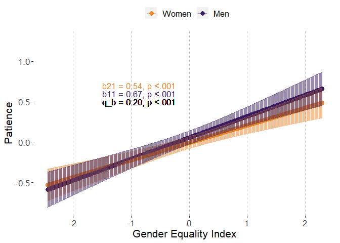
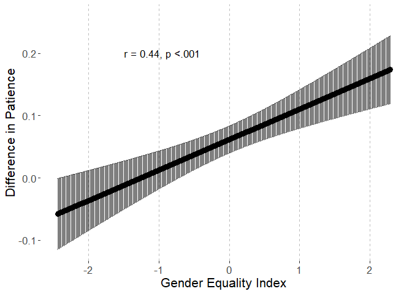
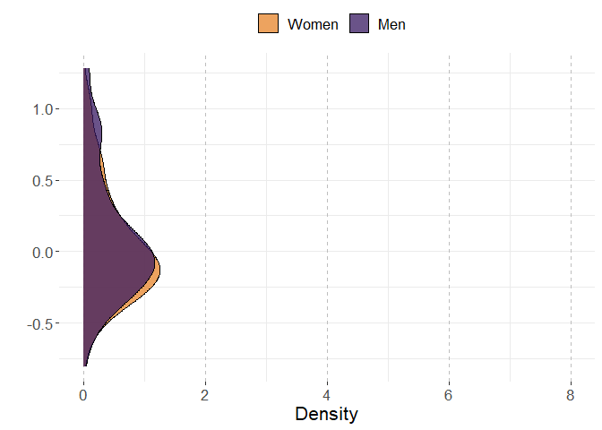
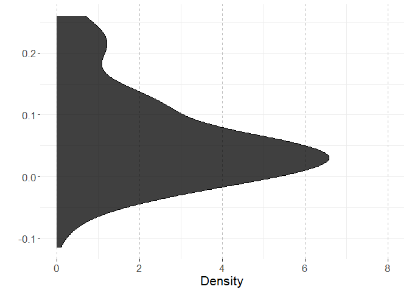
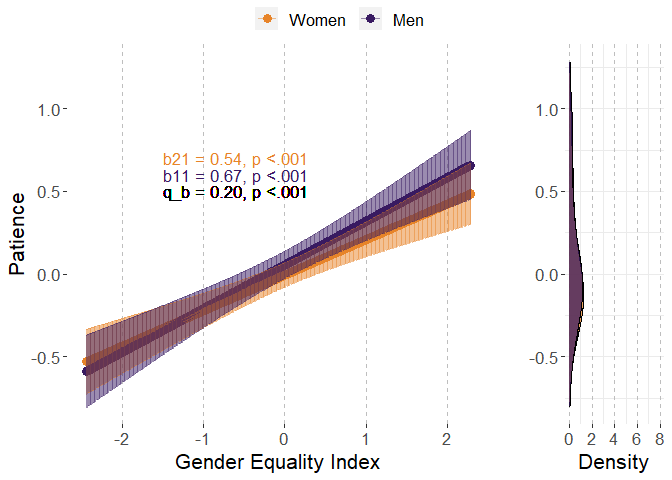
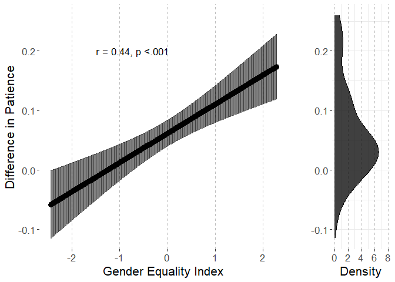
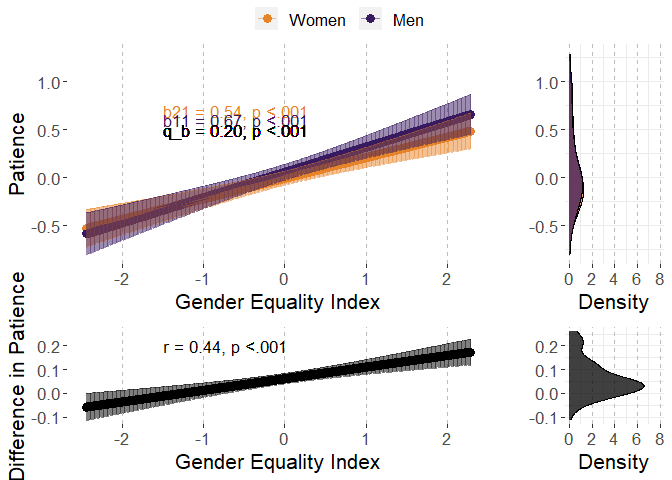

# Preparations

## Load packages


```r
library(multid)
library(lmerTest)
library(rio)
library(dplyr)
library(tibble)
library(ggpubr)
library(ggplot2)
library(MetBrewer)
library(emmeans)
library(finalfit)
source("../../custom_functions.R")
```

## Import data

Data (originally used in Falk & Hermle, 2018) is openly available at www.briq-institute.org/global-preferences/home


```r
dat.ex2 <- import("../data/Raw/individual_new.dta")
```

Import also pre-calculated indices of gender equality index (GEI)


```r
GEI <- 
  import("../data/Processed/GEI.xlsx")
```

## Compile country-level data


```r
men<-dat.ex2 %>%
  group_by(isocode) %>%
  filter(gender==0) %>%
  summarise(patience.men.mean=mean(patience,na.rm=T),
            patience.men.sd=sd(patience,na.rm=T),
            n.men=n())

women<-dat.ex2 %>%
  group_by(isocode) %>%
  filter(gender==1) %>%
  summarise(patience.women.mean=mean(patience,na.rm=T),
            patience.women.sd=sd(patience,na.rm=T),
            n.women=n())
```

Combine these with each other and with country-level GEI


```r
country.dat.ex2<-left_join(
  x=men,
  y=women,
  by="isocode")

country.dat.ex2<-
  left_join(country.dat.ex2,
            GEI,
            by=c("isocode"="ISO3"))
```

Use the regression method, process:

1.  Standardize within-country

2.  Run regression on the preference while controlling for age, age\^2, subj_math_skills

3.  Obtain the coefficients for gender as sex difference for each country


```r
countries<-unique(dat.ex2$isocode)

reg.diff.list<-list()

for (i in 1:length(countries)){
  
  temp.dat.ex2<-dat.ex2[dat.ex2$isocode==countries[i],]
  
  # standardize
  
  temp.dat.ex2$patience<-
    (temp.dat.ex2$patience-mean(temp.dat.ex2$patience,na.rm=T))/
    sd(temp.dat.ex2$patience,na.rm=T)
  
  # run the model
  
  temp.patience.diff<-
    coefficients(lm(patience~gender+age+I(age^2)+subj_math_skills,
                    data=temp.dat.ex2))["gender"]
  
  reg.diff.list[[i]]<-
    cbind.data.frame(
    isocode=countries[i],
    patience.reg.diff=temp.patience.diff)
  
}

reg.diff<-do.call(rbind,reg.diff.list)
rownames(reg.diff)<-NULL
head(reg.diff)
```

```
##   isocode patience.reg.diff
## 1     TUR        -0.2298888
## 2     FRA        -0.1874801
## 3     NLD        -0.2114069
## 4     ESP        -0.1506602
## 5     ITA        -0.1441931
## 6     POL        -0.1670311
```

```r
# merge to the country data
country.dat.ex2<-
  left_join(
    x=country.dat.ex2,
    y=reg.diff,
    by="isocode")

# combine to multi-level data

dat.ex2<-
  left_join(dat.ex2,
            country.dat.ex2,
            by=c("isocode"))

# recode sex variable
dat.ex2$sex.c<-(-1)*(dat.ex2$gender-0.5)
```

## Data exclusions and transformations


```r
fdat<-dat.ex2 %>%
  dplyr::select(patience,sex.c,country,GEI,age,subj_math_skills) %>%
  na.omit() %>%
  mutate(age_sq=age^2)
```

# Analysis

## Reliability of the difference score


```r
reliab.patience<-
  reliability_dms(
    data=fdat,
    diff_var="sex.c",var = "patience",
    diff_var_values = c(0.5,-0.5),
    group_var = "country")


export(t(data.frame(reliab.patience)),
       "../results/reliab.patience.xlsx",
       overwrite=T)
reliab.patience
```

```
##              r11              r22              r12              sd1 
##       0.98987272       0.98821487       0.97172933       0.42623959 
##              sd2           sd_d12               m1               m2 
##       0.36518551       0.11193136       0.06426680      -0.01535146 
##            m_d12 reliability_dmsa 
##       0.07961826       0.72769592
```

## Multi-level model

### Fit model


```r
fit_patience<-
  ddsc_ml(data = fdat,predictor = "GEI",
          covariates=c("age","age_sq","subj_math_skills"),
          moderator = "sex.c",moderator_values=c(0.5,-0.5),
          DV = "patience",lvl2_unit = "country",re_cov_test = T,
          scaling_sd = "observed")
```

```
## Warning: Some predictor variables are on very different scales: consider
## rescaling

## Warning: Some predictor variables are on very different scales: consider
## rescaling

## Warning: Some predictor variables are on very different scales: consider
## rescaling

## Warning: Some predictor variables are on very different scales: consider
## rescaling

## Warning: Some predictor variables are on very different scales: consider
## rescaling

## Warning: Some predictor variables are on very different scales: consider
## rescaling
```

### Descriptive statistics


```r
export(rownames_to_column(data.frame(fit_patience$descriptives)),
       "../results/patience_ml_desc.xlsx",
       overwrite=T)
round(fit_patience$descriptives,2)
```

```
##                       M   SD means_y1 means_y1_scaled means_y2 means_y2_scaled
## means_y1           0.06 0.43     1.00            1.00     0.97            0.97
## means_y1_scaled    0.16 1.07     1.00            1.00     0.97            0.97
## means_y2          -0.02 0.37     0.97            0.97     1.00            1.00
## means_y2_scaled   -0.04 0.92     0.97            0.97     1.00            1.00
## GEI                0.00 1.00     0.58            0.58     0.53            0.53
## GEI_scaled         0.00 1.00     0.58            0.58     0.53            0.53
## diff_score         0.08 0.11     0.64            0.64     0.44            0.44
## diff_score_scaled  0.20 0.28     0.64            0.64     0.44            0.44
##                    GEI GEI_scaled diff_score diff_score_scaled
## means_y1          0.58       0.58       0.64              0.64
## means_y1_scaled   0.58       0.58       0.64              0.64
## means_y2          0.53       0.53       0.44              0.44
## means_y2_scaled   0.53       0.53       0.44              0.44
## GEI               1.00       1.00       0.50              0.50
## GEI_scaled        1.00       1.00       0.50              0.50
## diff_score        0.50       0.50       1.00              1.00
## diff_score_scaled 0.50       0.50       1.00              1.00
```

```r
round(fit_patience$SDs,2)
```

```
##         SD_y1         SD_y2     SD_pooled SD_diff_score            VR 
##          0.43          0.37          0.40          0.11          1.36
```

### Variance heterogeneity test


```r
export(t(data.frame(fit_patience$re_cov_test)),
       "../results/patience_ml_var_test.xlsx",
       overwrite=T)
round(fit_patience$re_cov_test,3)
```

```
## RE_cov RE_cor  Chisq     Df      p 
##  0.024  0.682 26.960  1.000  0.000
```

### Component correlation


```r
export(rownames_to_column(data.frame(fit_patience$ddsc_sem_fit$variance_test)),
       "../results/patience_ml_comp_cor.xlsx",
       overwrite=T)
round(fit_patience$ddsc_sem_fit$variance_test,3)
```

```
##             est    se       z pvalue ci.lower ci.upper
## cov_y1y2  0.947 0.161   5.872      0    0.631    1.263
## var_y1    1.137 0.191   5.958      0    0.763    1.511
## var_y2    0.835 0.140   5.958      0    0.560    1.109
## var_diff  0.302 0.075   4.057      0    0.156    0.449
## var_ratio 1.362 0.076  17.845      0    1.213    1.512
## cor_y1y2  0.972 0.007 146.890      0    0.959    0.985
```

### Deconstructing results


```r
export(rownames_to_column(data.frame(fit_patience$results)),
       "../results/patience_ml_results.xlsx",
       overwrite=T)
round(fit_patience$results,3)
```

```
##                            estimate    SE     df t.ratio p.value ci.lower
## r_xy1y2                       0.437 0.097 61.701   4.510   0.000    0.243
## w_11                          0.264 0.042 68.839   6.317   0.000    0.180
## w_21                          0.215 0.037 68.979   5.743   0.000    0.140
## r_xy1                         0.619 0.098 68.839   6.317   0.000    0.423
## r_xy2                         0.588 0.102 68.979   5.743   0.000    0.384
## b_11                          0.666 0.105 68.839   6.317   0.000    0.456
## b_21                          0.543 0.094 68.979   5.743   0.000    0.354
## main_effect                   0.239 0.039 68.994   6.094   0.000    0.161
## moderator_effect              0.062 0.011 67.238   5.612   0.000    0.040
## interaction                   0.049 0.011 61.701   4.510   0.000    0.027
## q_b11_b21                     0.196    NA     NA      NA      NA       NA
## q_rxy1_rxy2                   0.048    NA     NA      NA      NA       NA
## cross_over_point             -1.259    NA     NA      NA      NA       NA
## interaction_vs_main          -0.190 0.036 68.714  -5.248   0.000   -0.263
## interaction_vs_main_bscale   -0.481 0.092 68.714  -5.248   0.000   -0.663
## interaction_vs_main_rscale   -0.573 0.107 68.791  -5.359   0.000   -0.786
## dadas                        -0.429 0.075 68.979  -5.743   1.000   -0.579
## dadas_bscale                 -1.085 0.189 68.979  -5.743   1.000   -1.462
## dadas_rscale                 -1.176 0.205 68.979  -5.743   1.000   -1.584
## abs_diff                      0.049 0.011 61.701   4.510   0.000    0.027
## abs_sum                       0.478 0.078 68.994   6.094   0.000    0.322
## abs_diff_bscale               0.124 0.027 61.701   4.510   0.000    0.069
## abs_sum_bscale                1.209 0.198 68.994   6.094   0.000    0.813
## abs_diff_rscale               0.031 0.026 60.288   1.197   0.118   -0.021
## abs_sum_rscale                1.206 0.199 68.999   6.072   0.000    0.810
##                            ci.upper
## r_xy1y2                       0.631
## w_11                          0.347
## w_21                          0.289
## r_xy1                         0.814
## r_xy2                         0.792
## b_11                          0.877
## b_21                          0.731
## main_effect                   0.317
## moderator_effect              0.084
## interaction                   0.071
## q_b11_b21                        NA
## q_rxy1_rxy2                      NA
## cross_over_point                 NA
## interaction_vs_main          -0.118
## interaction_vs_main_bscale   -0.298
## interaction_vs_main_rscale   -0.359
## dadas                        -0.280
## dadas_bscale                 -0.708
## dadas_rscale                 -0.767
## abs_diff                      0.071
## abs_sum                       0.635
## abs_diff_bscale               0.179
## abs_sum_bscale                1.604
## abs_diff_rscale               0.082
## abs_sum_rscale                1.603
```

### Multi-level model output


```r
# cross-level interaction model
summary(fit_patience$model)
```

```
## Linear mixed model fit by REML. t-tests use Satterthwaite's method [
## lmerModLmerTest]
## Formula: model_formula
##    Data: data
## Control: lme4::lmerControl(optimizer = "bobyqa")
## 
## REML criterion at convergence: 198972.1
## 
## Scaled residuals: 
##     Min      1Q  Median      3Q     Max 
## -2.7388 -0.6697 -0.2116  0.4412  4.0755 
## 
## Random effects:
##  Groups   Name        Variance Std.Dev. Corr
##  country  (Intercept) 0.10693  0.32700      
##           sex.c       0.00506  0.07113  0.52
##  Residual             0.85340  0.92380      
## Number of obs: 74089, groups:  country, 71
## 
## Fixed effects:
##                    Estimate Std. Error         df t value Pr(>|t|)    
## (Intercept)      -1.308e-01  4.478e-02  1.203e+02  -2.921  0.00417 ** 
## sex.c             6.163e-02  1.098e-02  6.724e+01   5.612 4.11e-07 ***
## GEI               2.392e-01  3.924e-02  6.899e+01   6.094 5.57e-08 ***
## age               7.638e-03  9.912e-04  7.401e+04   7.705 1.32e-14 ***
## age_sq           -1.506e-04  1.057e-05  7.400e+04 -14.240  < 2e-16 ***
## subj_math_skills  2.812e-02  1.261e-03  7.384e+04  22.300  < 2e-16 ***
## sex.c:GEI         4.895e-02  1.085e-02  6.170e+01   4.510 2.96e-05 ***
## ---
## Signif. codes:  0 '***' 0.001 '**' 0.01 '*' 0.05 '.' 0.1 ' ' 1
## 
## Correlation of Fixed Effects:
##             (Intr) sex.c  GEI    age    age_sq sbj_m_
## sex.c        0.360                                   
## GEI          0.006  0.002                            
## age         -0.455  0.003 -0.004                     
## age_sq       0.418 -0.005 -0.001 -0.977              
## sbj_mth_skl -0.166 -0.078 -0.010  0.015  0.008       
## sex.c:GEI    0.001  0.016  0.404 -0.001  0.005 -0.003
## fit warnings:
## Some predictor variables are on very different scales: consider rescaling
```

```r
# reduced model without the predictor
summary(fit_patience$reduced_model)
```

```
## Linear mixed model fit by REML. t-tests use Satterthwaite's method [
## lmerModLmerTest]
## Formula: patience ~ sex.c + age + age_sq + subj_math_skills + (sex.c |  
##     country)
##    Data: data
## Control: lme4::lmerControl(optimizer = "bobyqa")
## 
## REML criterion at convergence: 198993.4
## 
## Scaled residuals: 
##     Min      1Q  Median      3Q     Max 
## -2.7347 -0.6697 -0.2116  0.4413  4.0730 
## 
## Random effects:
##  Groups   Name        Variance Std.Dev. Corr
##  country  (Intercept) 0.162648 0.40330      
##           sex.c       0.007389 0.08596  0.68
##  Residual             0.853403 0.92380      
## Number of obs: 74089, groups:  country, 71
## 
## Fixed effects:
##                    Estimate Std. Error         df t value Pr(>|t|)    
## (Intercept)      -1.312e-01  5.282e-02  1.026e+02  -2.484   0.0146 *  
## sex.c             6.113e-02  1.239e-02  6.953e+01   4.935 5.27e-06 ***
## age               7.643e-03  9.912e-04  7.401e+04   7.710 1.27e-14 ***
## age_sq           -1.506e-04  1.057e-05  7.399e+04 -14.240  < 2e-16 ***
## subj_math_skills  2.812e-02  1.261e-03  7.383e+04  22.300  < 2e-16 ***
## ---
## Signif. codes:  0 '***' 0.001 '**' 0.01 '*' 0.05 '.' 0.1 ' ' 1
## 
## Correlation of Fixed Effects:
##             (Intr) sex.c  age    age_sq
## sex.c        0.522                     
## age         -0.385  0.003              
## age_sq       0.355 -0.005 -0.977       
## sbj_mth_skl -0.141 -0.069  0.015  0.008
## fit warnings:
## Some predictor variables are on very different scales: consider rescaling
```

## Country-level path model

### Fit the model

The model is already stored within the multi-level model object.


```r
fit_patience_sem<-fit_patience$ddsc_sem_fit
```

### Results


```r
export(rownames_to_column(data.frame(fit_patience_sem$results)),
       "../results/patience_sem_results.xlsx",
       overwrite=T)
round(fit_patience_sem$results,3)
```

```
##                                    est    se      z pvalue ci.lower ci.upper
## r_xy1_y2                         0.498 0.103  4.835  0.000    0.296    0.699
## r_xy1                            0.581 0.097  6.021  0.000    0.392    0.771
## r_xy2                            0.526 0.101  5.212  0.000    0.328    0.724
## b_11                             0.624 0.104  6.021  0.000    0.421    0.828
## b_21                             0.484 0.093  5.212  0.000    0.302    0.666
## b_10                             0.162 0.103  1.573  0.116   -0.040    0.364
## b_20                            -0.039 0.092 -0.419  0.675   -0.219    0.142
## res_cov_y1_y2                    0.649 0.111  5.843  0.000    0.431    0.866
## diff_b10_b20                     0.201 0.029  6.959  0.000    0.144    0.257
## diff_b11_b21                     0.140 0.029  4.835  0.000    0.083    0.197
## diff_rxy1_rxy2                   0.055 0.027  2.017  0.044    0.002    0.109
## q_b11_b21                        0.204 0.063  3.256  0.001    0.081    0.327
## q_rxy1_rxy2                      0.080 0.040  2.015  0.044    0.002    0.158
## cross_over_point                -1.429 0.360 -3.971  0.000   -2.135   -0.724
## sum_b11_b21                      1.108 0.195  5.692  0.000    0.727    1.490
## main_effect                      0.554 0.097  5.692  0.000    0.363    0.745
## interaction_vs_main_effect      -0.414 0.091 -4.572  0.000   -0.591   -0.236
## diff_abs_b11_abs_b21             0.140 0.029  4.835  0.000    0.083    0.197
## abs_diff_b11_b21                 0.140 0.029  4.835  0.000    0.083    0.197
## abs_sum_b11_b21                  1.108 0.195  5.692  0.000    0.727    1.490
## dadas                           -0.968 0.186 -5.212  1.000   -1.332   -0.604
## q_r_equivalence                  0.080 0.040  2.015  0.978       NA       NA
## q_b_equivalence                  0.204 0.063  3.256  0.999       NA       NA
## cross_over_point_equivalence     1.429 0.360  3.971  1.000       NA       NA
## cross_over_point_minimal_effect  1.429 0.360  3.971  0.000       NA       NA
```

# Plotting the results


```r
# start with obtaining predicted values for means and differences

ml_patience<-fit_patience$model
ml_patience_red<-fit_patience$reduced_model
  


# point predictions as function of GEI for components

p<-
  emmip(
    ml_patience, 
    sex.c ~ GEI,
    at=list(sex.c = c(-0.5,0.5),
            age=mean(fdat$age,na.rm=T),
            subj_math_skills=mean(fdat$subj_math_skills,na.rm=T),
            GEI=
              seq(from=round(range(fdat$GEI,na.rm=T)[1],2),
                  to=round(range(fdat$GEI,na.rm=T)[2],2),
                  by=0.01)),
    plotit=F,CIs=T,lmerTest.limit = 1e6,disable.pbkrtest=T)

p$sex<-p$tvar
levels(p$sex)<-c("Women","Men")

# obtain min and max for aligned plots
min.y.comp<-min(p$LCL)
max.y.comp<-max(p$UCL)

# Men and Women mean distributions

p3<-coefficients(ml_patience_red)$country
p3<-cbind(rbind(p3,p3),weight=rep(c(-0.5,0.5),each=nrow(p3)))

p3$xvar<-p3$`(Intercept)`+
  p3$age*mean(fdat$age,na.rm=T)+
  p3$age_sq*(mean(fdat$age,na.rm=T)^2)+
  p3$subj_math_skills*mean(fdat$subj_math_skills,na.rm=T)+
  p3$sex.c*p3$weight
p3$sex<-as.factor(p3$weight)
levels(p3$sex)<-c("Women","Men")

# obtain min and max for aligned plots
min.y.mean.distr<-min(p3$xvar)
max.y.mean.distr<-max(p3$xvar)


# obtain the coefs for the sex-effect (difference) as function of GGGI

p2<-data.frame(
  emtrends(ml_patience,var="+1*sex.c",
           specs="GEI",
           at=list(#Sex = c(-0.5,0.5),
             age=mean(fdat$age,na.rm=T),
             subj_math_skills=mean(fdat$subj_math_skills,na.rm=T),
             GEI=
               seq(from=round(range(fdat$GEI,na.rm=T)[1],2),
                   to=round(range(fdat$GEI,na.rm=T)[2],2),
                   by=0.01)),
           lmerTest.limit = 1e6,disable.pbkrtest=T))

p2$yvar<-p2$X.1.sex.c.trend
p2$xvar<-p2$GEI
p2$LCL<-p2$lower.CL
p2$UCL<-p2$upper.CL

# obtain min and max for aligned plots
min.y.diff<-min(p2$LCL)
max.y.diff<-max(p2$UCL)

# difference score distribution

p4<-coefficients(ml_patience_red)$country
p4$xvar=(+1)*p4$sex.c

# obtain mix and max for aligned plots

min.y.diff.distr<-min(p4$xvar)
max.y.diff.distr<-max(p4$xvar)

# define mins and maxs

min.y.pred<-
  ifelse(min.y.comp<min.y.mean.distr,min.y.comp,min.y.mean.distr)

max.y.pred<-
  ifelse(max.y.comp>max.y.mean.distr,max.y.comp,max.y.mean.distr)

min.y.narrow<-
  ifelse(min.y.diff<min.y.diff.distr,min.y.diff,min.y.diff.distr)

max.y.narrow<-
  ifelse(max.y.diff>max.y.diff.distr,max.y.diff,max.y.diff.distr)

# Figures 

# p1

# scaled simple effects to the plot


pvals<-p_coding(c(fit_patience$results["b_21","p.value"],
                    fit_patience$results["b_11","p.value"]))

ests<-
  round_tidy(c(fit_patience$results["b_21","estimate"],
               fit_patience$results["b_11","estimate"]),2)

coef1<-paste0("b21 = ",ests[1],", p ",
               ifelse(fit_patience$results["b_21","p.value"]<.001,
                      "","="),pvals[1])
coef2<-paste0("b11 = ",ests[2],", p ",
               ifelse(fit_patience$results["b_11","p.value"]<.001,
                      "","="),pvals[2])

coef_q<-round_tidy(fit_patience$results["q_b11_b21","estimate"],2)
coef_q<-paste0("q_b = ",coef_q,", p ",
               ifelse(fit_patience$results["interaction","p.value"]<.001,"","="),
               p_coding(fit_patience$results["interaction","p.value"]))

coefs<-data.frame(sex=c("Women","Men"),
                  coef=c(coef1,coef2))


p1.patience.GEI<-ggplot(p,aes(y=yvar,x=xvar,color=sex))+
  geom_point(size=3)+
  geom_errorbar(aes(ymin=LCL, ymax=UCL),alpha=0.5)+
  xlab("Gender Equality Index")+
  #ylim=c(2.3,3.9)+
  ylim(c(min.y.pred,max.y.pred))+
  ylab("Patience")+
  scale_color_manual(values=met.brewer("Archambault")[c(6,2)])+
  theme(legend.position = "top",
        legend.title=element_blank(),
        text=element_text(size=16,  family="sans"),
        panel.background = element_rect(fill = "white",
                                        #colour = "black",
                                        #size = 0.5, linetype = "solid"
        ),
        panel.grid.major.x = element_line(size = 0.5, linetype = 2,
                                          colour = "gray"))+
  geom_text(data = coefs,show.legend=F,
            aes(label=coef,x=-1.50,
                y=c(0.7,0.6),size=14,hjust="left"))+
  geom_text(inherit.aes=F,aes(x=-1.50,y=0.5,
                              label=coef_q,size=14,hjust="left"),
            show.legend=F)
p1.patience.GEI
```

<!-- -->

```r
# prediction plot for difference score


pvals2<-p_coding(fit_patience$results["r_xy1y2","p.value"])

ests2<-
  round_tidy(fit_patience$results["r_xy1y2","estimate"],2)

coefs2<-paste0("r = ",ests2,
               ", p ",
               ifelse(fit_patience$results["r_xy1y2","p.value"]<.001,"","="),
               pvals2)


p2.patience.GEI<-ggplot(p2,aes(y=yvar,x=xvar))+
  geom_point(size=3)+
  geom_errorbar(aes(ymin=LCL, ymax=UCL),alpha=0.5)+
  xlab("Gender Equality Index")+
  ylim(c(min.y.narrow,max.y.narrow))+
  ylab("Difference in Patience")+
  #scale_color_manual(values=met.brewer("Archambault")[c(6,2)])+
  theme(legend.position = "right",
        legend.title=element_blank(),
        text=element_text(size=16,  family="sans"),
        panel.background = element_rect(fill = "white",
                                        #colour = "black",
                                        #size = 0.5, linetype = "solid"
        ),
        panel.grid.major.x = element_line(size = 0.5, linetype = 2,
                                          colour = "gray"))+
  #geom_text(coef2,aes(x=0.63,y=min(p2$LCL)))
  geom_text(data = data.frame(coefs2),show.legend=F,
            aes(label=coefs2,x=-1.50,hjust="left",
                y=0.20,size=14))
p2.patience.GEI
```

<!-- -->

```r
# mean-level distributions

p3.patience.GEI<-
  ggplot(p3, aes(x=xvar, fill=sex)) + 
  geom_density(alpha=.75) + 
  scale_fill_manual(values=met.brewer("Archambault")[c(6,2)])+
  #scale_fill_manual(values=c("turquoise3","orangered2","black")) + 
  xlab("")+
  ylab("Density")+
  ylim(c(0,8))+
  xlim(c(min.y.pred,max.y.pred))+
  theme_bw()+
  theme(legend.position = "top",
        legend.title=element_blank(),
        text=element_text(size=16,  family="sans"),
        panel.border = element_blank(),
        panel.background = element_rect(fill = "white",
                                        #colour = "black",
                                        #size = 0.5, linetype = "solid"
        ),
        panel.grid.major.x = element_line(size = 0.5, linetype = 2,
                                          colour = "gray"))+
  coord_flip()
p3.patience.GEI
```

<!-- -->

```r
# distribution for mean differences

p4.patience.GEI<-
  ggplot(p4, aes(x=xvar,fill="black")) + 
  geom_density(alpha=.75) + 
  scale_fill_manual(values="black")+
  #scale_fill_manual(values=c("turquoise3","orangered2","black")) + 
  xlab("")+
  ylab("Density")+
  ylim(c(0,8))+
  xlim(c(min.y.narrow,max.y.narrow))+
  theme_bw()+
  theme(legend.position = "none",
        legend.title=element_blank(),
        text=element_text(size=16,  family="sans"),
        panel.border = element_blank(),
        panel.background = element_rect(fill = "white",
                                        #colour = "black",
                                        #size = 0.5, linetype = "solid"
        ),
        panel.grid.major.x = element_line(size = 0.5, linetype = 2,
                                          colour = "gray"))+
  coord_flip()
p4.patience.GEI
```

<!-- -->

```r
# combine component-specific predictions

p13.patience.GEI<-
  ggarrange(p1.patience.GEI, p3.patience.GEI,common.legend = T,
            ncol=2, nrow=1,widths=c(4,1.4)
  )

p13.patience.GEI
```

<!-- -->

```r
# combine difference score predictions

p24.patience.GEI<-
  ggarrange(p2.patience.GEI, p4.patience.GEI,
            ncol=2, nrow=1,widths=c(4,1.4)
  )

p24.patience.GEI
```

<!-- -->

```r
pall.patience.GEI<-
  ggarrange(p13.patience.GEI,p24.patience.GEI,align = "hv",
            ncol=1,nrow=2,heights=c(2,1))
pall.patience.GEI
```

<!-- -->

```r
png(filename = 
      "../results/pall.patience.GEI.png",
    units = "cm",
    width = 21.0,height=29.7*(4/5),res = 600)
pall.patience.GEI
dev.off()
```

```
## png 
##   2
```

# Session information


```r
s<-sessionInfo()
print(s,locale=F)
```

```
## R version 4.3.2 (2023-10-31 ucrt)
## Platform: x86_64-w64-mingw32/x64 (64-bit)
## Running under: Windows 10 x64 (build 19045)
## 
## Matrix products: default
## 
## 
## attached base packages:
## [1] stats     graphics  grDevices utils     datasets  methods   base     
## 
## other attached packages:
##  [1] finalfit_1.0.6    emmeans_1.10.0    MetBrewer_0.2.0   ggpubr_0.6.0     
##  [5] ggplot2_3.4.4     tibble_3.2.1      dplyr_1.1.4       rio_0.5.29       
##  [9] lmerTest_3.1-3    lme4_1.1-35.1     Matrix_1.6-5      multid_1.0.0.9000
## [13] knitr_1.44        rmarkdown_2.25   
## 
## loaded via a namespace (and not attached):
##  [1] mnormt_2.1.1        gridExtra_2.3       sandwich_3.0-2     
##  [4] readxl_1.4.2        rlang_1.1.3         magrittr_2.0.3     
##  [7] multcomp_1.4-25     compiler_4.3.2      vctrs_0.6.5        
## [10] quadprog_1.5-8      pkgconfig_2.0.3     shape_1.4.6        
## [13] crayon_1.5.2        fastmap_1.1.1       backports_1.4.1    
## [16] labeling_0.4.3      pbivnorm_0.6.0      utf8_1.2.4         
## [19] tzdb_0.4.0          haven_2.5.2         nloptr_2.0.3       
## [22] purrr_1.0.2         xfun_0.39           glmnet_4.1-8       
## [25] jomo_2.7-6          cachem_1.0.8        jsonlite_1.8.8     
## [28] pan_1.9             broom_1.0.5         parallel_4.3.2     
## [31] lavaan_0.6-17       R6_2.5.1            bslib_0.5.1        
## [34] stringi_1.8.3       car_3.1-2           boot_1.3-28.1      
## [37] rpart_4.1.21        jquerylib_0.1.4     cellranger_1.1.0   
## [40] numDeriv_2016.8-1.1 estimability_1.4.1  Rcpp_1.0.12        
## [43] iterators_1.0.14    zoo_1.8-12          readr_2.1.4        
## [46] splines_4.3.2       nnet_7.3-19         tidyselect_1.2.0   
## [49] rstudioapi_0.15.0   abind_1.4-5         yaml_2.3.7         
## [52] codetools_0.2-19    curl_5.0.2          lattice_0.21-9     
## [55] withr_3.0.0         coda_0.19-4         evaluate_0.23      
## [58] foreign_0.8-85      survival_3.5-7      zip_2.3.0          
## [61] pillar_1.9.0        carData_3.0-5       mice_3.16.0        
## [64] foreach_1.5.2       stats4_4.3.2        generics_0.1.3     
## [67] hms_1.1.3           munsell_0.5.0       scales_1.3.0       
## [70] minqa_1.2.6         xtable_1.8-4        glue_1.7.0         
## [73] tools_4.3.2         data.table_1.14.8   openxlsx_4.2.5.2   
## [76] ggsignif_0.6.4      forcats_1.0.0       mvtnorm_1.2-4      
## [79] cowplot_1.1.3       grid_4.3.2          tidyr_1.3.1        
## [82] colorspace_2.1-0    nlme_3.1-163        cli_3.6.2          
## [85] fansi_1.0.6         gtable_0.3.4        rstatix_0.7.2      
## [88] sass_0.4.7          digest_0.6.34       TH.data_1.1-2      
## [91] farver_2.1.1        htmltools_0.5.5     lifecycle_1.0.4    
## [94] mitml_0.4-5         MASS_7.3-60
```
