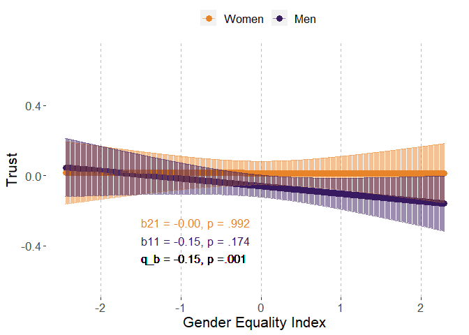
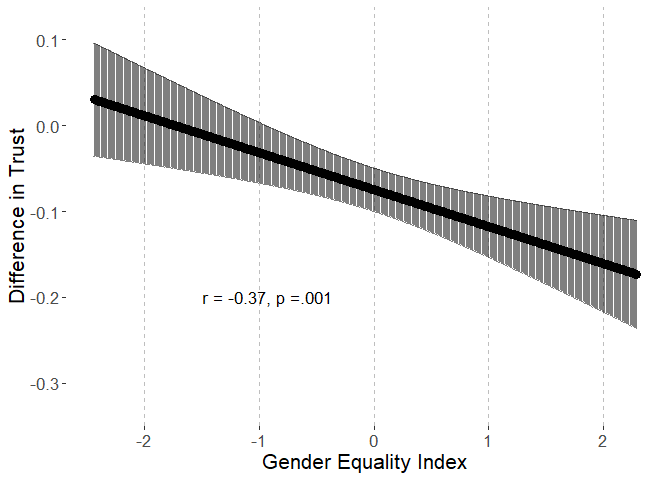
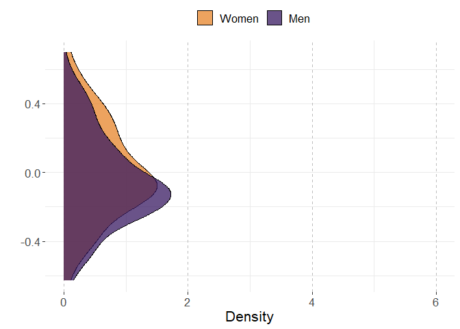
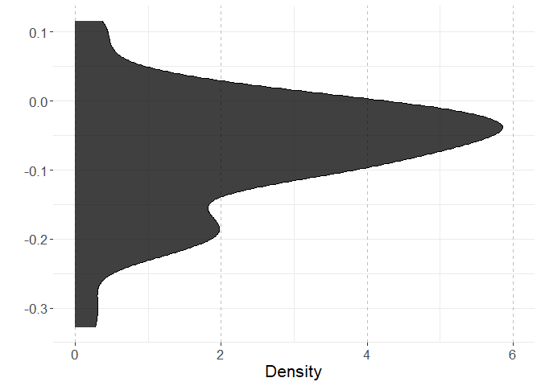
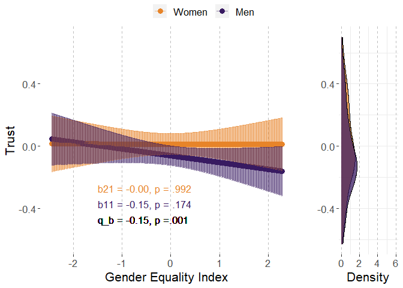
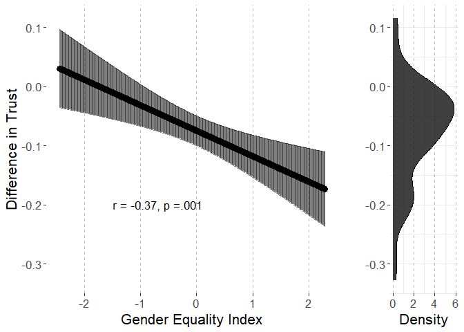
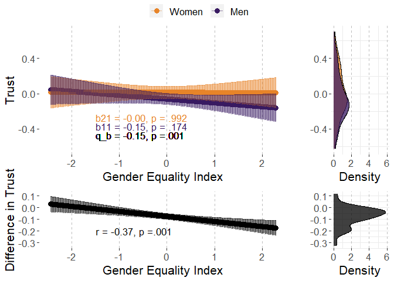

# Preparations

## Load packages


```r
library(multid)
library(lmerTest)
library(rio)
library(dplyr)
library(tibble)
library(ggpubr)
library(ggplot2)
library(MetBrewer)
library(emmeans)
library(finalfit)
source("../../custom_functions.R")
```

## Import data

Data (originally used in Falk & Hermle, 2018) is openly available at www.briq-institute.org/global-preferences/home


```r
dat.ex2 <- import("../data/Raw/individual_new.dta")
```

Import also pre-calculated indices of gender equality index (GEI)


```r
GEI <- 
  import("../data/Processed/GEI.xlsx")
```

## Compile country-level data


```r
men<-dat.ex2 %>%
  group_by(isocode) %>%
  filter(gender==0) %>%
  summarise(trust.men.mean=mean(trust,na.rm=T),
            trust.men.sd=sd(trust,na.rm=T),
            n.men=n())

women<-dat.ex2 %>%
  group_by(isocode) %>%
  filter(gender==1) %>%
  summarise(trust.women.mean=mean(trust,na.rm=T),
            trust.women.sd=sd(trust,na.rm=T),
            n.women=n())
```

Combine these with each other and with country-level GEI


```r
country.dat.ex2<-left_join(
  x=men,
  y=women,
  by="isocode")

country.dat.ex2<-
  left_join(country.dat.ex2,
            GEI,
            by=c("isocode"="ISO3"))
```

Use the regression method, process:

1.  Standardize within-country

2.  Run regression on the preference while controlling for age, age\^2, subj_math_skills

3.  Obtain the coefficients for gender as sex difference for each country


```r
countries<-unique(dat.ex2$isocode)

reg.diff.list<-list()

for (i in 1:length(countries)){
  
  temp.dat.ex2<-dat.ex2[dat.ex2$isocode==countries[i],]
  
  # standardize
  
  temp.dat.ex2$trust<-
    (temp.dat.ex2$trust-mean(temp.dat.ex2$trust,na.rm=T))/
    sd(temp.dat.ex2$trust,na.rm=T)
  
  # run the model
  
  temp.trust.diff<-
    coefficients(lm(trust~gender+age+I(age^2)+subj_math_skills,
                    data=temp.dat.ex2))["gender"]
  
  reg.diff.list[[i]]<-
    cbind.data.frame(
    isocode=countries[i],
    trust.reg.diff=temp.trust.diff)
  
}

reg.diff<-do.call(rbind,reg.diff.list)
rownames(reg.diff)<-NULL
head(reg.diff)
```

```
##   isocode trust.reg.diff
## 1     TUR     0.01414796
## 2     FRA     0.02465503
## 3     NLD     0.20586979
## 4     ESP     0.03015748
## 5     ITA     0.07507134
## 6     POL     0.11704755
```

```r
# merge to the country data
country.dat.ex2<-
  left_join(
    x=country.dat.ex2,
    y=reg.diff,
    by="isocode")

# combine to multi-level data

dat.ex2<-
  left_join(dat.ex2,
            country.dat.ex2,
            by=c("isocode"))

# recode sex variable
dat.ex2$sex.c<-(-1)*(dat.ex2$gender-0.5)
```

## Data exclusions and transformations


```r
fdat<-dat.ex2 %>%
  dplyr::select(trust,sex.c,country,GEI,age,subj_math_skills) %>%
  na.omit() %>%
  mutate(age_sq=age^2)
```

# Analysis

## Reliability of the difference score


```r
reliab.trust<-
  reliability_dms(
    data=fdat,
    diff_var="sex.c",var = "trust",
    diff_var_values = c(0.5,-0.5),
    group_var = "country")


export(t(data.frame(reliab.trust)),
       "../results/reliab.trust.xlsx",
       overwrite=T)
reliab.trust
```

```
##              r11              r22              r12              sd1 
##       0.97780321       0.98301164       0.92820473       0.27815162 
##              sd2           sd_d12               m1               m2 
##       0.30865323       0.11514313      -0.03833424      -0.00233662 
##            m_d12 reliability_dmsa 
##      -0.03599762       0.74839562
```

## Multi-level model

### Fit model


```r
fit_trust<-
  ddsc_ml(data = fdat,predictor = "GEI",
          covariates=c("age","age_sq","subj_math_skills"),
          moderator = "sex.c",moderator_values=c(0.5,-0.5),
          DV = "trust",lvl2_unit = "country",re_cov_test = T,
          scaling_sd = "observed")
```

```
## Warning: Some predictor variables are on very different scales: consider
## rescaling

## Warning: Some predictor variables are on very different scales: consider
## rescaling

## Warning: Some predictor variables are on very different scales: consider
## rescaling

## Warning: Some predictor variables are on very different scales: consider
## rescaling

## Warning: Some predictor variables are on very different scales: consider
## rescaling

## Warning: Some predictor variables are on very different scales: consider
## rescaling
```

### Descriptive statistics


```r
export(rownames_to_column(data.frame(fit_trust$descriptives)),
       "../results/trust_ml_desc.xlsx",
       overwrite=T)
round(fit_trust$descriptives,2)
```

```
##                       M   SD means_y1 means_y1_scaled means_y2 means_y2_scaled
## means_y1          -0.04 0.28     1.00            1.00     0.93            0.93
## means_y1_scaled   -0.13 0.95     1.00            1.00     0.93            0.93
## means_y2           0.00 0.31     0.93            0.93     1.00            1.00
## means_y2_scaled   -0.01 1.05     0.93            0.93     1.00            1.00
## GEI                0.00 1.00    -0.06           -0.06     0.09            0.09
## GEI_scaled         0.00 1.00    -0.06           -0.06     0.09            0.09
## diff_score        -0.04 0.12    -0.07           -0.07    -0.44           -0.44
## diff_score_scaled -0.12 0.39    -0.07           -0.07    -0.44           -0.44
##                     GEI GEI_scaled diff_score diff_score_scaled
## means_y1          -0.06      -0.06      -0.07             -0.07
## means_y1_scaled   -0.06      -0.06      -0.07             -0.07
## means_y2           0.09       0.09      -0.44             -0.44
## means_y2_scaled    0.09       0.09      -0.44             -0.44
## GEI                1.00       1.00      -0.38             -0.38
## GEI_scaled         1.00       1.00      -0.38             -0.38
## diff_score        -0.38      -0.38       1.00              1.00
## diff_score_scaled -0.38      -0.38       1.00              1.00
```

```r
round(fit_trust$SDs,2)
```

```
##         SD_y1         SD_y2     SD_pooled SD_diff_score            VR 
##          0.28          0.31          0.29          0.12          0.81
```

### Variance heterogeneity test


```r
export(t(data.frame(fit_trust$re_cov_test)),
       "../results/trust_ml_var_test.xlsx",
       overwrite=T)
round(fit_trust$re_cov_test,3)
```

```
## RE_cov RE_cor  Chisq     Df      p 
## -0.004 -0.168  1.463  1.000  0.227
```

### Component correlation


```r
export(rownames_to_column(data.frame(fit_trust$ddsc_sem_fit$variance_test)),
       "../results/trust_ml_comp_cor.xlsx",
       overwrite=T)
round(fit_trust$ddsc_sem_fit$variance_test,3)
```

```
##              est    se      z pvalue ci.lower ci.upper
## cov_y1y2   0.910 0.159  5.732  0.000    0.599    1.221
## var_y1     0.884 0.148  5.958  0.000    0.593    1.174
## var_y2     1.088 0.183  5.958  0.000    0.730    1.446
## var_diff  -0.204 0.093 -2.195  0.028   -0.387   -0.022
## var_ratio  0.812 0.072 11.323  0.000    0.672    0.953
## cor_y1y2   0.928 0.016 56.497  0.000    0.896    0.960
```

### Deconstructing results


```r
export(rownames_to_column(data.frame(fit_trust$results)),
       "../results/trust_ml_results.xlsx",
       overwrite=T)
round(fit_trust$results,3)
```

```
##                            estimate    SE     df t.ratio p.value ci.lower
## r_xy1y2                      -0.374 0.109 66.417  -3.431   0.001   -0.592
## w_11                         -0.043 0.032 68.926  -1.373   0.174   -0.107
## w_21                          0.000 0.034 69.032  -0.011   0.992   -0.068
## r_xy1                        -0.156 0.114 68.926  -1.373   0.174   -0.383
## r_xy2                        -0.001 0.110 69.032  -0.011   0.992   -0.221
## b_11                         -0.148 0.108 68.926  -1.373   0.174   -0.363
## b_21                         -0.001 0.116 69.032  -0.011   0.992   -0.232
## main_effect                  -0.022 0.032 69.054  -0.680   0.499   -0.086
## moderator_effect             -0.075 0.013 70.805  -5.898   0.000   -0.100
## interaction                  -0.043 0.013 66.417  -3.431   0.001   -0.068
## q_b11_b21                    -0.148    NA     NA      NA      NA       NA
## q_rxy1_rxy2                  -0.156    NA     NA      NA      NA       NA
## cross_over_point             -1.732    NA     NA      NA      NA       NA
## interaction_vs_main           0.021 0.037 68.846   0.577   0.566   -0.052
## interaction_vs_main_bscale    0.072 0.125 68.846   0.577   0.566   -0.177
## interaction_vs_main_rscale    0.076 0.114 68.801   0.669   0.506   -0.151
## dadas                        -0.001 0.068 69.032  -0.011   0.504   -0.136
## dadas_bscale                 -0.002 0.231 69.032  -0.011   0.504   -0.464
## dadas_rscale                 -0.002 0.220 69.032  -0.011   0.504   -0.441
## abs_diff                      0.043 0.013 66.417   3.431   0.001    0.018
## abs_sum                       0.044 0.064 69.054   0.680   0.249   -0.085
## abs_diff_bscale               0.147 0.043 66.417   3.431   0.001    0.061
## abs_sum_bscale                0.149 0.220 69.054   0.680   0.249   -0.289
## abs_diff_rscale               0.155 0.042 66.737   3.665   0.000    0.071
## abs_sum_rscale                0.157 0.220 69.050   0.716   0.238   -0.281
##                            ci.upper
## r_xy1y2                      -0.156
## w_11                          0.020
## w_21                          0.067
## r_xy1                         0.071
## r_xy2                         0.218
## b_11                          0.067
## b_21                          0.230
## main_effect                   0.042
## moderator_effect             -0.049
## interaction                  -0.018
## q_b11_b21                        NA
## q_rxy1_rxy2                      NA
## cross_over_point                 NA
## interaction_vs_main           0.094
## interaction_vs_main_bscale    0.322
## interaction_vs_main_rscale    0.304
## dadas                         0.135
## dadas_bscale                  0.459
## dadas_rscale                  0.437
## abs_diff                      0.068
## abs_sum                       0.172
## abs_diff_bscale               0.232
## abs_sum_bscale                0.587
## abs_diff_rscale               0.240
## abs_sum_rscale                0.596
```

### Multi-level model output


```r
# cross-level interaction model
summary(fit_trust$model)
```

```
## Linear mixed model fit by REML. t-tests use Satterthwaite's method [
## lmerModLmerTest]
## Formula: model_formula
##    Data: data
## Control: lme4::lmerControl(optimizer = "bobyqa")
## 
## REML criterion at convergence: 200125.6
## 
## Scaled residuals: 
##      Min       1Q   Median       3Q      Max 
## -3.12399 -0.63186  0.02245  0.68895  2.82587 
## 
## Random effects:
##  Groups   Name        Variance Std.Dev. Corr 
##  country  (Intercept) 0.071751 0.26786       
##           sex.c       0.007686 0.08767  -0.23
##  Residual             0.887150 0.94189       
## Number of obs: 73458, groups:  country, 71
## 
## Fixed effects:
##                    Estimate Std. Error         df t value Pr(>|t|)    
## (Intercept)      -4.803e-01  3.917e-02  1.551e+02 -12.260  < 2e-16 ***
## sex.c            -7.466e-02  1.266e-02  7.080e+01  -5.898 1.15e-07 ***
## GEI              -2.191e-02  3.222e-02  6.905e+01  -0.680 0.498851    
## age               3.877e-03  1.015e-03  7.342e+04   3.820 0.000134 ***
## age_sq            4.886e-07  1.083e-05  7.341e+04   0.045 0.964001    
## subj_math_skills  5.633e-02  1.293e-03  7.341e+04  43.562  < 2e-16 ***
## sex.c:GEI        -4.310e-02  1.256e-02  6.642e+01  -3.431 0.001040 ** 
## ---
## Signif. codes:  0 '***' 0.001 '**' 0.01 '*' 0.05 '.' 0.1 ' ' 1
## 
## Correlation of Fixed Effects:
##             (Intr) sex.c  GEI    age    age_sq sbj_m_
## sex.c       -0.136                                   
## GEI          0.009  0.003                            
## age         -0.532  0.003 -0.005                     
## age_sq       0.490 -0.005 -0.001 -0.977              
## sbj_mth_skl -0.195 -0.070 -0.012  0.016  0.007       
## sex.c:GEI    0.001  0.011 -0.187 -0.002  0.005 -0.002
## fit warnings:
## Some predictor variables are on very different scales: consider rescaling
```

```r
# reduced model without the predictor
summary(fit_trust$reduced_model)
```

```
## Linear mixed model fit by REML. t-tests use Satterthwaite's method [
## lmerModLmerTest]
## Formula: trust ~ sex.c + age + age_sq + subj_math_skills + (sex.c | country)
##    Data: data
## Control: lme4::lmerControl(optimizer = "bobyqa")
## 
## REML criterion at convergence: 200126.1
## 
## Scaled residuals: 
##      Min       1Q   Median       3Q      Max 
## -3.13750 -0.63283  0.02269  0.68934  2.82644 
## 
## Random effects:
##  Groups   Name        Variance Std.Dev. Corr 
##  country  (Intercept) 0.07126  0.26695       
##           sex.c       0.00944  0.09716  -0.17
##  Residual             0.88715  0.94189       
## Number of obs: 73458, groups:  country, 71
## 
## Fixed effects:
##                    Estimate Std. Error         df t value Pr(>|t|)    
## (Intercept)      -4.798e-01  3.909e-02  1.580e+02 -12.276  < 2e-16 ***
## sex.c            -7.421e-02  1.360e-02  7.220e+01  -5.455 6.52e-07 ***
## age               3.867e-03  1.015e-03  7.342e+04   3.810 0.000139 ***
## age_sq            5.872e-07  1.083e-05  7.341e+04   0.054 0.956742    
## subj_math_skills  5.632e-02  1.293e-03  7.344e+04  43.556  < 2e-16 ***
## ---
## Signif. codes:  0 '***' 0.001 '**' 0.01 '*' 0.05 '.' 0.1 ' ' 1
## 
## Correlation of Fixed Effects:
##             (Intr) sex.c  age    age_sq
## sex.c       -0.100                     
## age         -0.534  0.003              
## age_sq       0.491 -0.004 -0.977       
## sbj_mth_skl -0.195 -0.065  0.016  0.007
## fit warnings:
## Some predictor variables are on very different scales: consider rescaling
```

## Country-level path model

### Fit the model

The model is already stored within the multi-level model object.


```r
fit_trust_sem<-fit_trust$ddsc_sem_fit
```

### Results


```r
export(rownames_to_column(data.frame(fit_trust_sem$results)),
       "../results/trust_sem_results.xlsx",
       overwrite=T)
round(fit_trust_sem$results,3)
```

```
##                                    est    se      z pvalue ci.lower ci.upper
## r_xy1_y2                        -0.384 0.110 -3.506  0.000   -0.599   -0.169
## r_xy1                           -0.056 0.118 -0.472  0.637   -0.288    0.176
## r_xy2                            0.093 0.118  0.786  0.432   -0.139    0.325
## b_11                            -0.053 0.112 -0.472  0.637   -0.273    0.167
## b_21                             0.098 0.124  0.786  0.432   -0.146    0.341
## b_10                            -0.130 0.111 -1.171  0.241   -0.349    0.088
## b_20                            -0.008 0.123 -0.065  0.949   -0.250    0.234
## res_cov_y1_y2                    0.915 0.159  5.768  0.000    0.604    1.226
## diff_b10_b20                    -0.123 0.043 -2.874  0.004   -0.206   -0.039
## diff_b11_b21                    -0.151 0.043 -3.506  0.000   -0.235   -0.066
## diff_rxy1_rxy2                  -0.149 0.041 -3.599  0.000   -0.230   -0.068
## q_b11_b21                       -0.151 0.043 -3.474  0.001   -0.236   -0.066
## q_rxy1_rxy2                     -0.149 0.042 -3.586  0.000   -0.231   -0.068
## cross_over_point                -0.814 0.366 -2.222  0.026   -1.531   -0.096
## sum_b11_b21                      0.045 0.233  0.192  0.848   -0.411    0.501
## main_effect                      0.022 0.116  0.192  0.848   -0.206    0.250
## interaction_vs_main_effect       0.128 0.112  1.144  0.253   -0.091    0.348
## diff_abs_b11_abs_b21            -0.045 0.233 -0.192  0.848   -0.501    0.411
## abs_diff_b11_b21                 0.151 0.043  3.506  0.000    0.066    0.235
## abs_sum_b11_b21                  0.045 0.233  0.192  0.424   -0.411    0.501
## dadas                            0.106 0.224  0.472  0.319   -0.334    0.546
## q_r_equivalence                  0.149 0.042  3.586  1.000       NA       NA
## q_b_equivalence                  0.151 0.043  3.474  1.000       NA       NA
## cross_over_point_equivalence     0.814 0.366  2.222  0.987       NA       NA
## cross_over_point_minimal_effect  0.814 0.366  2.222  0.013       NA       NA
```

# Plotting the results


```r
# start with obtaining predicted values for means and differences

ml_trust<-fit_trust$model
ml_trust_red<-fit_trust$reduced_model
  


# point predictions as function of GEI for components

p<-
  emmip(
    ml_trust, 
    sex.c ~ GEI,
    at=list(sex.c = c(-0.5,0.5),
            age=mean(fdat$age,na.rm=T),
            subj_math_skills=mean(fdat$subj_math_skills,na.rm=T),
            GEI=
              seq(from=round(range(fdat$GEI,na.rm=T)[1],2),
                  to=round(range(fdat$GEI,na.rm=T)[2],2),
                  by=0.01)),
    plotit=F,CIs=T,lmerTest.limit = 1e6,disable.pbkrtest=T)

p$sex<-p$tvar
levels(p$sex)<-c("Women","Men")

# obtain min and max for aligned plots
min.y.comp<-min(p$LCL)
max.y.comp<-max(p$UCL)

# Men and Women mean distributions

p3<-coefficients(ml_trust_red)$country
p3<-cbind(rbind(p3,p3),weight=rep(c(-0.5,0.5),each=nrow(p3)))

p3$xvar<-p3$`(Intercept)`+
  p3$age*mean(fdat$age,na.rm=T)+
  p3$age_sq*(mean(fdat$age,na.rm=T)^2)+
  p3$subj_math_skills*mean(fdat$subj_math_skills,na.rm=T)+
  p3$sex.c*p3$weight
p3$sex<-as.factor(p3$weight)
levels(p3$sex)<-c("Women","Men")

# obtain min and max for aligned plots
min.y.mean.distr<-min(p3$xvar)
max.y.mean.distr<-max(p3$xvar)


# obtain the coefs for the sex-effect (difference) as function of GGGI

p2<-data.frame(
  emtrends(ml_trust,var="+1*sex.c",
           specs="GEI",
           at=list(#Sex = c(-0.5,0.5),
             age=mean(fdat$age,na.rm=T),
             subj_math_skills=mean(fdat$subj_math_skills,na.rm=T),
             GEI=
               seq(from=round(range(fdat$GEI,na.rm=T)[1],2),
                   to=round(range(fdat$GEI,na.rm=T)[2],2),
                   by=0.01)),
           lmerTest.limit = 1e6,disable.pbkrtest=T))

p2$yvar<-p2$X.1.sex.c.trend
p2$xvar<-p2$GEI
p2$LCL<-p2$lower.CL
p2$UCL<-p2$upper.CL

# obtain min and max for aligned plots
min.y.diff<-min(p2$LCL)
max.y.diff<-max(p2$UCL)

# difference score distribution

p4<-coefficients(ml_trust_red)$country
p4$xvar=(+1)*p4$sex.c

# obtain mix and max for aligned plots

min.y.diff.distr<-min(p4$xvar)
max.y.diff.distr<-max(p4$xvar)

# define mins and maxs

min.y.pred<-
  ifelse(min.y.comp<min.y.mean.distr,min.y.comp,min.y.mean.distr)

max.y.pred<-
  ifelse(max.y.comp>max.y.mean.distr,max.y.comp,max.y.mean.distr)

min.y.narrow<-
  ifelse(min.y.diff<min.y.diff.distr,min.y.diff,min.y.diff.distr)

max.y.narrow<-
  ifelse(max.y.diff>max.y.diff.distr,max.y.diff,max.y.diff.distr)

# Figures 

# p1

# scaled simple effects to the plot

pvals<-p_coding(c(fit_trust$results["b_21","p.value"],
                    fit_trust$results["b_11","p.value"]))

ests<-
  round_tidy(c(fit_trust$results["b_21","estimate"],
               fit_trust$results["b_11","estimate"]),2)

coef1<-paste0("b21 = ",ests[1],", p = ",pvals[1])
coef2<-paste0("b11 = ",ests[2],", p = ",pvals[2])

coef_q<-round_tidy(fit_trust$results["q_b11_b21","estimate"],2)
coef_q<-paste0("q_b = ",coef_q,", p ",
               ifelse(fit_trust$results["interaction","p.value"]<.001,"","="),
               p_coding(fit_trust$results["interaction","p.value"]))

coefs<-data.frame(sex=c("Women","Men"),
                  coef=c(coef1,coef2))


p1.trust.GEI<-ggplot(p,aes(y=yvar,x=xvar,color=sex))+
  geom_point(size=3)+
  geom_errorbar(aes(ymin=LCL, ymax=UCL),alpha=0.5)+
  xlab("Gender Equality Index")+
  #ylim=c(2.3,3.9)+
  ylim(c(min.y.pred,max.y.pred))+
  ylab("Trust")+
  scale_color_manual(values=met.brewer("Archambault")[c(6,2)])+
  theme(legend.position = "top",
        legend.title=element_blank(),
        text=element_text(size=16,  family="sans"),
        panel.background = element_rect(fill = "white",
                                        #colour = "black",
                                        #size = 0.5, linetype = "solid"
        ),
        panel.grid.major.x = element_line(size = 0.5, linetype = 2,
                                          colour = "gray"))+
  geom_text(data = coefs,show.legend=F,
            aes(label=coef,x=-1.50,
                y=c(round(min(p$LCL),2)+0.10-0.05
                    ,round(min(p$LCL),2)-0.05),size=14,hjust="left"))+
  geom_text(inherit.aes=F,aes(x=-1.50,y=round(min(p$LCL),2)-0.15,
                              label=coef_q,size=14,hjust="left"),
            show.legend=F)
p1.trust.GEI
```

<!-- -->

```r
# prediction plot for difference score


pvals2<-p_coding(fit_trust$results["r_xy1y2","p.value"])

ests2<-
  round_tidy(fit_trust$results["r_xy1y2","estimate"],2)

coefs2<-paste0("r = ",ests2,
               ", p ",
               ifelse(fit_trust$results["r_xy1y2","p.value"]<.001,"","="),
               pvals2)


p2.trust.GEI<-ggplot(p2,aes(y=yvar,x=xvar))+
  geom_point(size=3)+
  geom_errorbar(aes(ymin=LCL, ymax=UCL),alpha=0.5)+
  xlab("Gender Equality Index")+
  ylim(c(min.y.narrow,max.y.narrow))+
  ylab("Difference in Trust")+
  #scale_color_manual(values=met.brewer("Archambault")[c(6,2)])+
  theme(legend.position = "right",
        legend.title=element_blank(),
        text=element_text(size=16,  family="sans"),
        panel.background = element_rect(fill = "white",
                                        #colour = "black",
                                        #size = 0.5, linetype = "solid"
        ),
        panel.grid.major.x = element_line(size = 0.5, linetype = 2,
                                          colour = "gray"))+
  #geom_text(coef2,aes(x=0.63,y=min(p2$LCL)))
  geom_text(data = data.frame(coefs2),show.legend=F,
            aes(label=coefs2,x=-1.50,hjust="left",
                y=-0.20,size=14))
p2.trust.GEI
```

<!-- -->

```r
# mean-level distributions

p3.trust.GEI<-
  ggplot(p3, aes(x=xvar, fill=sex)) + 
  geom_density(alpha=.75) + 
  scale_fill_manual(values=met.brewer("Archambault")[c(6,2)])+
  #scale_fill_manual(values=c("turquoise3","orangered2","black")) + 
  xlab("")+
  ylab("Density")+
  ylim(c(0,6))+
  xlim(c(min.y.pred,max.y.pred))+
  theme_bw()+
  theme(legend.position = "top",
        legend.title=element_blank(),
        text=element_text(size=16,  family="sans"),
        panel.border = element_blank(),
        panel.background = element_rect(fill = "white",
                                        #colour = "black",
                                        #size = 0.5, linetype = "solid"
        ),
        panel.grid.major.x = element_line(size = 0.5, linetype = 2,
                                          colour = "gray"))+
  coord_flip()
p3.trust.GEI
```

<!-- -->

```r
# distribution for mean differences

p4.trust.GEI<-
  ggplot(p4, aes(x=xvar,fill="black")) + 
  geom_density(alpha=.75) + 
  scale_fill_manual(values="black")+
  #scale_fill_manual(values=c("turquoise3","orangered2","black")) + 
  xlab("")+
  ylab("Density")+
  ylim(c(0,6))+
  xlim(c(min.y.narrow,max.y.narrow))+
  theme_bw()+
  theme(legend.position = "none",
        legend.title=element_blank(),
        text=element_text(size=16,  family="sans"),
        panel.border = element_blank(),
        panel.background = element_rect(fill = "white",
                                        #colour = "black",
                                        #size = 0.5, linetype = "solid"
        ),
        panel.grid.major.x = element_line(size = 0.5, linetype = 2,
                                          colour = "gray"))+
  coord_flip()
p4.trust.GEI
```

<!-- -->

```r
# combine component-specific predictions

p13.trust.GEI<-
  ggarrange(p1.trust.GEI, p3.trust.GEI,common.legend = T,
            ncol=2, nrow=1,widths=c(4,1.4)
  )

p13.trust.GEI
```

<!-- -->

```r
# combine difference score predictions

p24.trust.GEI<-
  ggarrange(p2.trust.GEI, p4.trust.GEI,
            ncol=2, nrow=1,widths=c(4,1.4)
  )

p24.trust.GEI
```

<!-- -->

```r
pall.trust.GEI<-
  ggarrange(p13.trust.GEI,p24.trust.GEI,align = "hv",
            ncol=1,nrow=2,heights=c(2,1))
pall.trust.GEI
```

<!-- -->

```r
png(filename = 
      "../results/pall.trust.GEI.png",
    units = "cm",
    width = 21.0,height=29.7*(4/5),res = 600)
pall.trust.GEI
dev.off()
```

```
## png 
##   2
```

# Session information


```r
s<-sessionInfo()
print(s,locale=F)
```

```
## R version 4.3.2 (2023-10-31 ucrt)
## Platform: x86_64-w64-mingw32/x64 (64-bit)
## Running under: Windows 10 x64 (build 19045)
## 
## Matrix products: default
## 
## 
## attached base packages:
## [1] stats     graphics  grDevices utils     datasets  methods   base     
## 
## other attached packages:
##  [1] finalfit_1.0.6    emmeans_1.10.0    MetBrewer_0.2.0   ggpubr_0.6.0     
##  [5] ggplot2_3.4.4     tibble_3.2.1      dplyr_1.1.4       rio_0.5.29       
##  [9] lmerTest_3.1-3    lme4_1.1-35.1     Matrix_1.6-5      multid_1.0.0.9000
## [13] knitr_1.44        rmarkdown_2.25   
## 
## loaded via a namespace (and not attached):
##  [1] mnormt_2.1.1        gridExtra_2.3       sandwich_3.0-2     
##  [4] readxl_1.4.2        rlang_1.1.3         magrittr_2.0.3     
##  [7] multcomp_1.4-25     compiler_4.3.2      vctrs_0.6.5        
## [10] quadprog_1.5-8      pkgconfig_2.0.3     shape_1.4.6        
## [13] crayon_1.5.2        fastmap_1.1.1       backports_1.4.1    
## [16] labeling_0.4.3      pbivnorm_0.6.0      utf8_1.2.4         
## [19] tzdb_0.4.0          haven_2.5.2         nloptr_2.0.3       
## [22] purrr_1.0.2         xfun_0.39           glmnet_4.1-8       
## [25] jomo_2.7-6          cachem_1.0.8        jsonlite_1.8.8     
## [28] pan_1.9             broom_1.0.5         parallel_4.3.2     
## [31] lavaan_0.6-17       R6_2.5.1            bslib_0.5.1        
## [34] stringi_1.8.3       car_3.1-2           boot_1.3-28.1      
## [37] rpart_4.1.21        jquerylib_0.1.4     cellranger_1.1.0   
## [40] numDeriv_2016.8-1.1 estimability_1.4.1  Rcpp_1.0.12        
## [43] iterators_1.0.14    zoo_1.8-12          readr_2.1.4        
## [46] splines_4.3.2       nnet_7.3-19         tidyselect_1.2.0   
## [49] rstudioapi_0.15.0   abind_1.4-5         yaml_2.3.7         
## [52] codetools_0.2-19    curl_5.0.2          lattice_0.21-9     
## [55] withr_3.0.0         coda_0.19-4         evaluate_0.23      
## [58] foreign_0.8-85      survival_3.5-7      zip_2.3.0          
## [61] pillar_1.9.0        carData_3.0-5       mice_3.16.0        
## [64] foreach_1.5.2       stats4_4.3.2        generics_0.1.3     
## [67] hms_1.1.3           munsell_0.5.0       scales_1.3.0       
## [70] minqa_1.2.6         xtable_1.8-4        glue_1.7.0         
## [73] tools_4.3.2         data.table_1.14.8   openxlsx_4.2.5.2   
## [76] ggsignif_0.6.4      forcats_1.0.0       mvtnorm_1.2-4      
## [79] cowplot_1.1.3       grid_4.3.2          tidyr_1.3.1        
## [82] colorspace_2.1-0    nlme_3.1-163        cli_3.6.2          
## [85] fansi_1.0.6         gtable_0.3.4        rstatix_0.7.2      
## [88] sass_0.4.7          digest_0.6.34       TH.data_1.1-2      
## [91] farver_2.1.1        htmltools_0.5.5     lifecycle_1.0.4    
## [94] mitml_0.4-5         MASS_7.3-60
```
