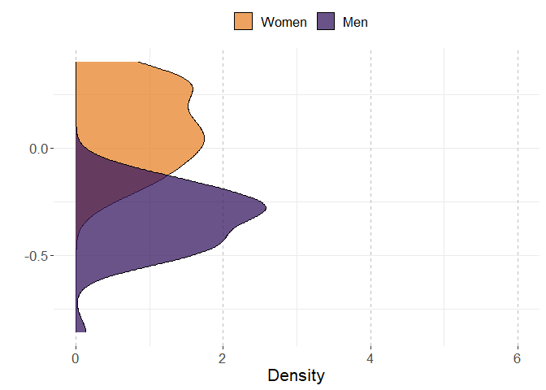

# Preparations

## Load packages


```r
library(multid)
library(lmerTest)
library(rio)
library(dplyr)
library(tibble)
library(ggpubr)
library(ggplot2)
library(MetBrewer)
library(emmeans)
library(finalfit)
source("../../custom_functions.R")
```

## Import data


```r
dat <- import("../data/ipip_processed.rda")
correlates <- import("../data/correlates.xlsx")
```


## Save variable names of the multivariate set to a vector


```r
per.facets<-
  names(dat)[which(names(dat)=="A.trust"):
              which(names(dat)=="O.liberalism")]
```


## Calculate trait means


```r
A.facets<-
  per.facets[grepl("A.",per.facets)]

dat$A<-rowMeans(dat[,A.facets],na.rm=T)

# standardize

dat$A.z<-(dat$A-mean(dat$A,na.rm=T))/sd(dat$A,na.rm=T)
```

## Standardize country-level predictors


```r
# save raw values for plotting
correlates$GenderGapIndex.raw<-correlates$GenderGapIndex
# standardize
correlates$GenderGapIndex<-
  scale(correlates$GenderGapIndex, center = T, scale=T)
```


## Merge correlates to the data files


```r
fdat<-left_join(x=dat,
                 y=correlates,
                 by=c("COUNTRY"="Country"))

fdat$sex.ratio<-fdat$nMale/(fdat$nMale+fdat$nFemale)

fdat$sex.c<-ifelse(fdat$SEX=="Female",-0.5,
                   ifelse(fdat$SEX=="Male",0.5,NA))

# exclude missing values
fdat <- fdat %>%
  dplyr::select("sex.c","A","A.z","COUNTRY","sex.ratio",
                "GenderGapIndex","GenderGapIndex.raw") %>%
  na.omit()
```


# Analysis

## Reliability of the difference score


```r
reliab.A.z<-
  reliability_dms(data=fdat,diff_var="sex.c",var = "A.z",
                  diff_var_values = c(0.5,-0.5),group_var = "COUNTRY")

export(t(data.frame(reliab.A.z)),
       "../results/reliab.A.z.xlsx",
       overwrite=T)
reliab.A.z
```

```
##              r11              r22              r12              sd1 
##       0.96932696       0.98818636       0.73990900       0.17214576 
##              sd2           sd_d12               m1               m2 
##       0.19707618       0.13516335      -0.35923391       0.07444998 
##            m_d12 reliability_dmsa 
##      -0.43368388       0.92513053
```


## Multi-level model

### Fit model


```r
fit_A.z<-
  ddsc_ml(data = fdat,predictor = "GenderGapIndex",
          covariates="sex.ratio",
          moderator = "sex.c",moderator_values=c(0.5,-0.5),
          DV = "A.z",lvl2_unit = "COUNTRY",re_cov_test = T,
          scaling_sd = "observed")
```

### Descriptive statistics


```r
export(rownames_to_column(data.frame(fit_A.z$descriptives)),
       "../results/A.z_ml_desc.xlsx",
       overwrite=T)
round(fit_A.z$descriptives,2)
```

```
##                           M   SD means_y1 means_y1_scaled means_y2
## means_y1              -0.36 0.17     1.00            1.00     0.74
## means_y1_scaled       -1.94 0.93     1.00            1.00     0.74
## means_y2               0.07 0.20     0.74            0.74     1.00
## means_y2_scaled        0.40 1.07     0.74            0.74     1.00
## GenderGapIndex         0.00 1.00     0.17            0.17     0.26
## GenderGapIndex_scaled  0.00 1.00     0.17            0.17     0.26
## diff_score            -0.43 0.14     0.19            0.19    -0.52
## diff_score_scaled     -2.34 0.73     0.19            0.19    -0.52
##                       means_y2_scaled GenderGapIndex GenderGapIndex_scaled
## means_y1                         0.74           0.17                  0.17
## means_y1_scaled                  0.74           0.17                  0.17
## means_y2                         1.00           0.26                  0.26
## means_y2_scaled                  1.00           0.26                  0.26
## GenderGapIndex                   0.26           1.00                  1.00
## GenderGapIndex_scaled            0.26           1.00                  1.00
## diff_score                      -0.52          -0.17                 -0.17
## diff_score_scaled               -0.52          -0.17                 -0.17
##                       diff_score diff_score_scaled
## means_y1                    0.19              0.19
## means_y1_scaled             0.19              0.19
## means_y2                   -0.52             -0.52
## means_y2_scaled            -0.52             -0.52
## GenderGapIndex             -0.17             -0.17
## GenderGapIndex_scaled      -0.17             -0.17
## diff_score                  1.00              1.00
## diff_score_scaled           1.00              1.00
```

```r
round(fit_A.z$SDs,2)
```

```
##         SD_y1         SD_y2     SD_pooled SD_diff_score            VR 
##          0.17          0.20          0.18          0.14          0.76
```

### Variance heterogeneity test


```r
export(t(data.frame(fit_A.z$re_cov_test)),
       "../results/A.z_ml_var_test.xlsx",
       overwrite=T)
round(fit_A.z$re_cov_test,3)
```

```
## RE_cov RE_cor  Chisq     Df      p 
## -0.006 -0.296  3.900  1.000  0.048
```

### Component correlation


```r
export(rownames_to_column(data.frame(fit_A.z$ddsc_sem_fit$variance_test)),
       "../results/A.z_ml_comp_cor.xlsx",
       overwrite=T)
round(fit_A.z$ddsc_sem_fit$variance_test,3)
```

```
##              est    se      z pvalue ci.lower ci.upper
## cov_y1y2   0.719 0.171  4.206   0.00    0.384    1.053
## var_y1     0.848 0.170  5.000   0.00    0.516    1.181
## var_y2     1.112 0.222  5.000   0.00    0.676    1.548
## var_diff  -0.263 0.192 -1.371   0.17   -0.640    0.113
## var_ratio  0.763 0.145  5.256   0.00    0.478    1.048
## cor_y1y2   0.740 0.064 11.561   0.00    0.614    0.865
```

### Deconstructing results


```r
export(rownames_to_column(data.frame(fit_A.z$results)),
       "../results/A.z_ml_results.xlsx",
       overwrite=T)
round(fit_A.z$results,3)
```

```
##                            estimate    SE     df t.ratio p.value ci.lower
## r_xy1y2                      -0.160 0.140 46.138  -1.143   0.259   -0.441
## w_11                          0.034 0.022 45.849   1.529   0.133   -0.011
## w_21                          0.055 0.026 48.007   2.106   0.040    0.003
## r_xy1                         0.196 0.128 45.849   1.529   0.133   -0.062
## r_xy2                         0.281 0.133 48.007   2.106   0.040    0.013
## b_11                          0.183 0.120 45.849   1.529   0.133   -0.058
## b_21                          0.300 0.142 48.007   2.106   0.040    0.014
## main_effect                   0.045 0.022 46.993   1.993   0.052    0.000
## moderator_effect             -0.430 0.019 47.451 -22.768   0.000   -0.468
## interaction                  -0.022 0.019 46.138  -1.143   0.259   -0.060
## q_b11_b21                    -0.125    NA     NA      NA      NA       NA
## q_rxy1_rxy2                  -0.090    NA     NA      NA      NA       NA
## cross_over_point            -19.877    NA     NA      NA      NA       NA
## interaction_vs_main          -0.023 0.026 44.523  -0.898   0.374   -0.074
## interaction_vs_main_bscale   -0.124 0.138 44.523  -0.898   0.374   -0.403
## interaction_vs_main_rscale   -0.154 0.153 44.735  -1.007   0.319   -0.461
## dadas                        -0.068 0.044 45.849  -1.529   0.933   -0.156
## dadas_bscale                 -0.366 0.239 45.849  -1.529   0.933   -0.847
## dadas_rscale                 -0.392 0.257 45.849  -1.529   0.933   -0.909
## abs_diff                      0.022 0.019 46.138   1.143   0.129   -0.016
## abs_sum                       0.089 0.045 46.993   1.993   0.026   -0.001
## abs_diff_bscale               0.117 0.102 46.138   1.143   0.129   -0.089
## abs_sum_bscale                0.483 0.242 46.993   1.993   0.026   -0.005
## abs_diff_rscale               0.085 0.100 45.112   0.847   0.201   -0.117
## abs_sum_rscale                0.477 0.242 46.921   1.973   0.027   -0.009
##                            ci.upper
## r_xy1y2                       0.122
## w_11                          0.078
## w_21                          0.108
## r_xy1                         0.454
## r_xy2                         0.549
## b_11                          0.424
## b_21                          0.586
## main_effect                   0.090
## moderator_effect             -0.392
## interaction                   0.016
## q_b11_b21                        NA
## q_rxy1_rxy2                      NA
## cross_over_point                 NA
## interaction_vs_main           0.029
## interaction_vs_main_bscale    0.155
## interaction_vs_main_rscale    0.154
## dadas                         0.021
## dadas_bscale                  0.116
## dadas_rscale                  0.124
## abs_diff                      0.060
## abs_sum                       0.179
## abs_diff_bscale               0.323
## abs_sum_bscale                0.970
## abs_diff_rscale               0.287
## abs_sum_rscale                0.964
```

### Multi-level model output


```r
# cross-level interaction model
summary(fit_A.z$model)
```

```
## Linear mixed model fit by REML. t-tests use Satterthwaite's method [
## lmerModLmerTest]
## Formula: model_formula
##    Data: data
## Control: lme4::lmerControl(optimizer = "bobyqa")
## 
## REML criterion at convergence: 2343561
## 
## Scaled residuals: 
##     Min      1Q  Median      3Q     Max 
## -5.6436 -0.5959  0.0669  0.7167  3.1319 
## 
## Random effects:
##  Groups   Name        Variance Std.Dev. Corr 
##  COUNTRY  (Intercept) 0.02383  0.1544        
##           sex.c       0.01527  0.1236   -0.26
##  Residual             0.92773  0.9632        
## Number of obs: 848115, groups:  COUNTRY, 50
## 
## Fixed effects:
##                      Estimate Std. Error       df t value Pr(>|t|)    
## (Intercept)          -0.61504    0.14875 46.10826  -4.135 0.000149 ***
## sex.c                -0.42966    0.01887 47.45084 -22.768  < 2e-16 ***
## GenderGapIndex        0.04457    0.02236 46.99274   1.993 0.052073 .  
## sex.ratio             0.99221    0.30809 45.97190   3.220 0.002351 ** 
## sex.c:GenderGapIndex -0.02162    0.01891 46.13844  -1.143 0.258776    
## ---
## Signif. codes:  0 '***' 0.001 '**' 0.01 '*' 0.05 '.' 0.1 ' ' 1
## 
## Correlation of Fixed Effects:
##             (Intr) sex.c  GndrGI sex.rt
## sex.c       -0.032                     
## GendrGpIndx -0.059 -0.001              
## sex.ratio   -0.989 -0.003  0.059       
## sx.c:GndrGI -0.004 -0.034 -0.241  0.003
```

```r
# reduced model without the predictor
summary(fit_A.z$reduced_model)
```

```
## Linear mixed model fit by REML. t-tests use Satterthwaite's method [
## lmerModLmerTest]
## Formula: A.z ~ sex.c + sex.ratio + (sex.c | COUNTRY)
##    Data: data
## Control: lme4::lmerControl(optimizer = "bobyqa")
## 
## REML criterion at convergence: 2343554
## 
## Scaled residuals: 
##     Min      1Q  Median      3Q     Max 
## -5.6415 -0.5959  0.0669  0.7167  3.1318 
## 
## Random effects:
##  Groups   Name        Variance Std.Dev. Corr 
##  COUNTRY  (Intercept) 0.02535  0.1592        
##           sex.c       0.01531  0.1237   -0.30
##  Residual             0.92773  0.9632        
## Number of obs: 848115, groups:  COUNTRY, 50
## 
## Fixed effects:
##             Estimate Std. Error       df t value Pr(>|t|)    
## (Intercept) -0.60189    0.15162 47.34777  -3.970 0.000243 ***
## sex.c       -0.42993    0.01888 48.09689 -22.775  < 2e-16 ***
## sex.ratio    0.96514    0.31397 47.13876   3.074 0.003507 ** 
## ---
## Signif. codes:  0 '***' 0.001 '**' 0.01 '*' 0.05 '.' 0.1 ' ' 1
## 
## Correlation of Fixed Effects:
##           (Intr) sex.c 
## sex.c     -0.038       
## sex.ratio -0.989 -0.002
```

## COUNTRY-level path model

### Fit the model

The model is already stored within the multi-level model object. 


```r
fit_A.z_sem<-fit_A.z$ddsc_sem_fit
```

### Results


```r
export(rownames_to_column(data.frame(fit_A.z_sem$results)),
       "../results/A.z_sem_results.xlsx",
       overwrite=T)
round(fit_A.z_sem$results,3)
```

```
##                                     est     se       z pvalue ci.lower ci.upper
## r_xy1_y2                         -0.172  0.139  -1.236  0.217   -0.445    0.101
## r_xy1                             0.166  0.139   1.190  0.234   -0.107    0.439
## r_xy2                             0.263  0.136   1.928  0.054   -0.004    0.530
## b_11                              0.154  0.130   1.190  0.234   -0.100    0.409
## b_21                              0.280  0.145   1.928  0.054   -0.005    0.565
## b_10                             -1.941  0.128 -15.115  0.000   -2.193   -1.690
## b_20                              0.402  0.144   2.797  0.005    0.120    0.684
## res_cov_y1_y2                     0.676  0.162   4.176  0.000    0.359    0.993
## diff_b10_b20                     -2.344  0.101 -23.266  0.000   -2.541   -2.146
## diff_b11_b21                     -0.126  0.102  -1.236  0.217   -0.325    0.074
## diff_rxy1_rxy2                   -0.097  0.101  -0.961  0.337   -0.295    0.101
## q_b11_b21                        -0.132  0.109  -1.214  0.225   -0.346    0.081
## q_rxy1_rxy2                      -0.102  0.106  -0.959  0.338   -0.310    0.106
## cross_over_point                -18.637 15.102  -1.234  0.217  -48.237   10.963
## sum_b11_b21                       0.435  0.256   1.697  0.090   -0.067    0.936
## main_effect                       0.217  0.128   1.697  0.090   -0.034    0.468
## interaction_vs_main_effect       -0.091  0.150  -0.610  0.542   -0.385    0.202
## diff_abs_b11_abs_b21             -0.126  0.102  -1.236  0.217   -0.325    0.074
## abs_diff_b11_b21                  0.126  0.102   1.236  0.108   -0.074    0.325
## abs_sum_b11_b21                   0.435  0.256   1.697  0.045   -0.067    0.936
## dadas                            -0.309  0.259  -1.190  0.883   -0.817    0.200
## q_r_equivalence                   0.102  0.106   0.959  0.831       NA       NA
## q_b_equivalence                   0.132  0.109   1.214  0.888       NA       NA
## cross_over_point_equivalence     18.637 15.102   1.234  0.891       NA       NA
## cross_over_point_minimal_effect  18.637 15.102   1.234  0.109       NA       NA
```


# Plotting the results


```r
# refit reduced and full models with GGGI in original scale

ml_A.z_red<-fit_A.z$reduced_model
  
# refit the model with raw variable
ml_A.z<-
  lmer(A.z~sex.c+
         sex.ratio+
         GenderGapIndex.raw+
         sex.c:GenderGapIndex.raw+
         (sex.c|COUNTRY),data=fdat,
       control = lmerControl(optimizer="bobyqa",
                             optCtrl=list(maxfun=2e6)))


# point predictions as function of GGGI for components

p<-
  emmip(
    ml_A.z, 
    sex.c ~ GenderGapIndex.raw,
    at=list(sex.c = c(-0.5,0.5),
            GenderGapIndex.raw=
              seq(from=round(range(fdat$GenderGapIndex.raw)[1],2),
                  to=round(range(fdat$GenderGapIndex.raw)[2],2),
                  by=0.001)),
    plotit=F,CIs=T,lmerTest.limit = 1e6,disable.pbkrtest=T)

p$sex<-p$tvar
levels(p$sex)<-c("Women","Men")

# obtain min and max for aligned plots
min.y.comp<-min(p$LCL)
max.y.comp<-max(p$UCL)

# Men and Women mean distributions

p3<-coefficients(ml_A.z_red)$COUNTRY
p3<-cbind(rbind(p3,p3),weight=rep(c(-0.5,0.5),each=nrow(p3)))
p3$xvar<-p3$`(Intercept)`+p3$sex.ratio*0.5+p3$sex.c*p3$weight
p3$sex<-as.factor(p3$weight)
levels(p3$sex)<-c("Women","Men")

# obtain min and max for aligned plots
min.y.mean.distr<-min(p3$xvar)
max.y.mean.distr<-max(p3$xvar)


# obtain the coefs for the sex-effect (difference) as function of GGGI

p2<-data.frame(
  emtrends(ml_A.z,var="+1*sex.c",
           specs="GenderGapIndex.raw",
           at=list(#sex.c = c(-0.5,0.5),
             GenderGapIndex.raw=
               seq(from=round(range(fdat$GenderGapIndex.raw)[1],2),
                   to=round(range(fdat$GenderGapIndex.raw)[2],2),
                   by=0.001)),
           lmerTest.limit = 1e6,disable.pbkrtest=T))

p2$yvar<-p2$X.1.sex.c.trend
p2$xvar<-p2$GenderGapIndex.raw
p2$LCL<-p2$lower.CL
p2$UCL<-p2$upper.CL

# obtain min and max for aligned plots
min.y.diff<-min(p2$LCL)
max.y.diff<-max(p2$UCL)

# difference score distribution

p4<-coefficients(ml_A.z_red)$COUNTRY
p4$xvar=(+1)*p4$sex.c

# obtain mix and max for aligned plots

min.y.diff.distr<-min(p4$xvar)
max.y.diff.distr<-max(p4$xvar)

# define mins and maxs

min.y.pred<-
  ifelse(min.y.comp<min.y.mean.distr,min.y.comp,min.y.mean.distr)

max.y.pred<-
  ifelse(max.y.comp>max.y.mean.distr,max.y.comp,max.y.mean.distr)

min.y.narrow<-
  ifelse(min.y.diff<min.y.diff.distr,min.y.diff,min.y.diff.distr)

max.y.narrow<-
  ifelse(max.y.diff>max.y.diff.distr,max.y.diff,max.y.diff.distr)


# Figures 

# p1

# scaled simple effects to the plot


pvals<-p_coding(c(fit_A.z$results["b_21","p.value"],
                    fit_A.z$results["b_11","p.value"]))

ests<-
  round_tidy(c(fit_A.z$results["b_21","estimate"],
               fit_A.z$results["b_11","estimate"]),2)

coef1<-paste0("b21 = ",ests[1],", p ",
               ifelse(fit_A.z$results["b_21","p.value"]<.001,
                      "","="),pvals[1])
coef2<-paste0("b11 = ",ests[2],", p ",
               ifelse(fit_A.z$results["b_11","p.value"]<.001,
                      "","="),pvals[2])

coef_q<-round_tidy(fit_A.z$results["q_b11_b21","estimate"],2)
coef_q<-paste0("q_b = ",coef_q,", p ",
               ifelse(fit_A.z$results["interaction","p.value"]<.001,"","="),
               p_coding(fit_A.z$results["interaction","p.value"]))

coefs<-data.frame(sex=c("Women","Men"),
                  coef=c(coef1,coef2))

p1.A.z<-ggplot(p,aes(y=yvar,x=xvar,color=sex))+
  geom_point(size=3)+
  geom_errorbar(aes(ymin=LCL, ymax=UCL),alpha=0.5)+
  xlab("Global Gender Gap Index")+
  #ylim=c(2.3,3.9)+
  ylim(c(min.y.pred,max.y.pred))+
  ylab("Agreeableness Mean-Level")+
  scale_color_manual(values=met.brewer("Archambault")[c(6,2)])+
  theme(legend.position = "top",
        legend.title=element_blank(),
        text=element_text(size=16,  family="sans"),
        panel.background = element_rect(fill = "white",
                                        #colour = "black",
                                        #size = 0.5, linetype = "solid"
        ),
        panel.grid.major.x = element_line(linewidth = 0.5, linetype = 2,
                                          colour = "gray"))+
  geom_text(data = coefs,show.legend=F,
            aes(label=coef,x=0.63,
                y=c(-0.6
                    ,-0.7),size=14,hjust="left"))+
  geom_text(inherit.aes=F,aes(x=0.63,y=-0.8,
                              label=coef_q,size=14,hjust="left"),
            show.legend=F)
p1.A.z
```

<!-- -->

```r
# prediction plot for difference score


pvals2<-p_coding(fit_A.z$results["r_xy1y2","p.value"])

ests2<-
  round_tidy(fit_A.z$results["r_xy1y2","estimate"],2)

coefs2<-paste0("r = ",ests2,
               ", p ",
               ifelse(fit_A.z$results["r_xy1y2","p.value"]<.001,"","="),
               pvals2)


p2.A.z<-ggplot(p2,aes(y=yvar,x=xvar))+
  geom_point(size=3)+
  geom_errorbar(aes(ymin=LCL, ymax=UCL),alpha=0.5)+
  xlab("Global Gender Gap Index")+
  ylim(c(min.y.narrow,max.y.narrow))+
  ylab("Difference in Agreeableness")+
  #scale_color_manual(values=met.brewer("Archambault")[c(6,2)])+
  theme(legend.position = "right",
        legend.title=element_blank(),
        text=element_text(size=16,  family="sans"),
        panel.background = element_rect(fill = "white",
                                        #colour = "black",
                                        #size = 0.5, linetype = "solid"
        ),
        panel.grid.major.x = element_line(size = 0.5, linetype = 2,
                                          colour = "gray"))+
  #geom_text(coef2,aes(x=0.63,y=min(p2$LCL)))
  geom_text(data = data.frame(coefs2),show.legend=F,
            aes(label=coefs2,x=0.63,hjust="left",
                y=c(round(min(p2$LCL),2)),size=14))
p2.A.z
```

<!-- -->

```r
# mean-level distributions

p3.A.z<-
  ggplot(p3, aes(x=xvar, fill=sex)) + 
  geom_density(alpha=.75) + 
  scale_fill_manual(values=met.brewer("Archambault")[c(6,2)])+
  #scale_fill_manual(values=c("turquoise3","orangered2","black")) + 
  xlab("")+
  ylab("Density")+
  ylim(c(0,6))+
  xlim(c(min.y.pred,max.y.pred))+
  theme_bw()+
  theme(legend.position = "top",
        legend.title=element_blank(),
        text=element_text(size=16,  family="sans"),
        panel.border = element_blank(),
        panel.background = element_rect(fill = "white",
                                        #colour = "black",
                                        #size = 0.5, linetype = "solid"
        ),
        panel.grid.major.x = element_line(size = 0.5, linetype = 2,
                                          colour = "gray"))+
  coord_flip()
p3.A.z
```

<!-- -->

```r
# distribution for mean differences

p4.A.z<-
  ggplot(p4, aes(x=xvar,fill="black")) + 
  geom_density(alpha=.75) + 
  scale_fill_manual(values="black")+
  #scale_fill_manual(values=c("turquoise3","orangered2","black")) + 
  xlab("")+
  ylab("Density")+
  ylim(c(0,6))+
  xlim(c(min.y.narrow,max.y.narrow))+
  theme_bw()+
  theme(legend.position = "none",
        legend.title=element_blank(),
        text=element_text(size=16,  family="sans"),
        panel.border = element_blank(),
        panel.background = element_rect(fill = "white",
                                        #colour = "black",
                                        #size = 0.5, linetype = "solid"
        ),
        panel.grid.major.x = element_line(size = 0.5, linetype = 2,
                                          colour = "gray"))+
  coord_flip()
p4.A.z
```

<!-- -->

```r
# combine component-specific predictions

p13.A.z<-
  ggarrange(p1.A.z, p3.A.z,common.legend = T,
            ncol=2, nrow=1,widths=c(4,1.4)
  )

p13.A.z
```

<!-- -->

```r
# combine difference score predictions

p24.A.z<-
  ggarrange(p2.A.z, p4.A.z,
            ncol=2, nrow=1,widths=c(4,1.4)
  )

p24.A.z
```

<!-- -->

```r
pall.A.z<-
  ggarrange(p13.A.z,p24.A.z,align = "hv",
            ncol=1,nrow=2,heights=c(2,1))
pall.A.z
```

<!-- -->

```r
png(filename = 
      "../results/pall.A.z.png",
    units = "cm",
    width = 21.0,height=29.7*(4/5),res = 600)
pall.A.z
dev.off()
```

```
## png 
##   2
```

# Session information


```r
s<-sessionInfo()
print(s,locale=F)
```

```
## R version 4.3.2 (2023-10-31 ucrt)
## Platform: x86_64-w64-mingw32/x64 (64-bit)
## Running under: Windows 10 x64 (build 19045)
## 
## Matrix products: default
## 
## 
## attached base packages:
## [1] stats     graphics  grDevices utils     datasets  methods   base     
## 
## other attached packages:
##  [1] finalfit_1.0.6    emmeans_1.10.0    MetBrewer_0.2.0   ggpubr_0.6.0     
##  [5] ggplot2_3.4.4     tibble_3.2.1      dplyr_1.1.4       rio_0.5.29       
##  [9] lmerTest_3.1-3    lme4_1.1-35.1     Matrix_1.6-5      multid_1.0.0.9000
## [13] knitr_1.44        rmarkdown_2.25   
## 
## loaded via a namespace (and not attached):
##  [1] mnormt_2.1.1        pROC_1.18.5         gridExtra_2.3      
##  [4] sandwich_3.0-2      readxl_1.4.2        rlang_1.1.3        
##  [7] magrittr_2.0.3      multcomp_1.4-25     compiler_4.3.2     
## [10] vctrs_0.6.5         quadprog_1.5-8      pkgconfig_2.0.3    
## [13] shape_1.4.6         crayon_1.5.2        fastmap_1.1.1      
## [16] backports_1.4.1     labeling_0.4.3      pbivnorm_0.6.0     
## [19] utf8_1.2.4          tzdb_0.4.0          haven_2.5.2        
## [22] nloptr_2.0.3        purrr_1.0.2         xfun_0.39          
## [25] glmnet_4.1-8        jomo_2.7-6          cachem_1.0.8       
## [28] jsonlite_1.8.8      pan_1.9             broom_1.0.5        
## [31] parallel_4.3.2      lavaan_0.6-17       R6_2.5.1           
## [34] bslib_0.5.1         stringi_1.8.3       car_3.1-2          
## [37] boot_1.3-28.1       rpart_4.1.21        jquerylib_0.1.4    
## [40] cellranger_1.1.0    numDeriv_2016.8-1.1 estimability_1.4.1 
## [43] Rcpp_1.0.12         iterators_1.0.14    zoo_1.8-12         
## [46] readr_2.1.4         splines_4.3.2       nnet_7.3-19        
## [49] tidyselect_1.2.0    rstudioapi_0.15.0   abind_1.4-5        
## [52] yaml_2.3.7          codetools_0.2-19    curl_5.0.2         
## [55] plyr_1.8.9          lattice_0.21-9      withr_3.0.0        
## [58] coda_0.19-4         evaluate_0.23       foreign_0.8-85     
## [61] survival_3.5-7      zip_2.3.0           pillar_1.9.0       
## [64] carData_3.0-5       mice_3.16.0         foreach_1.5.2      
## [67] stats4_4.3.2        generics_0.1.3      hms_1.1.3          
## [70] munsell_0.5.0       scales_1.3.0        minqa_1.2.6        
## [73] xtable_1.8-4        glue_1.7.0          tools_4.3.2        
## [76] data.table_1.14.8   openxlsx_4.2.5.2    ggsignif_0.6.4     
## [79] forcats_1.0.0       mvtnorm_1.2-4       cowplot_1.1.3      
## [82] grid_4.3.2          tidyr_1.3.1         colorspace_2.1-0   
## [85] nlme_3.1-163        cli_3.6.2           fansi_1.0.6        
## [88] gtable_0.3.4        rstatix_0.7.2       sass_0.4.7         
## [91] digest_0.6.34       TH.data_1.1-2       farver_2.1.1       
## [94] htmltools_0.5.5     lifecycle_1.0.4     mitml_0.4-5        
## [97] MASS_7.3-60
```

