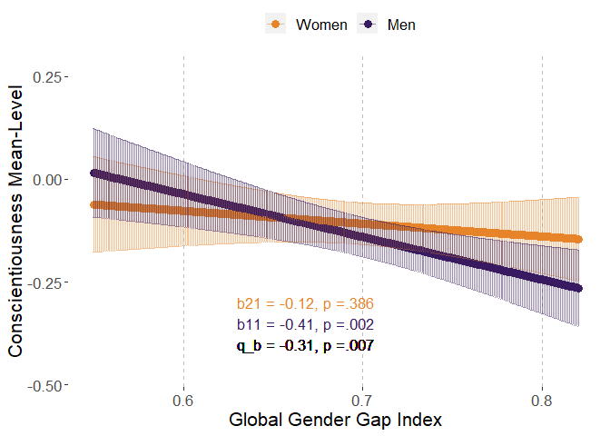
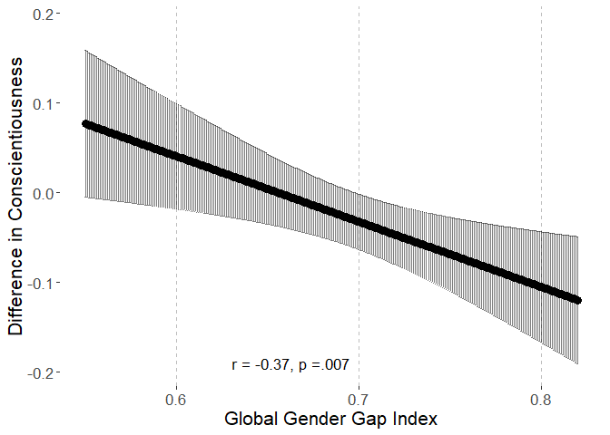
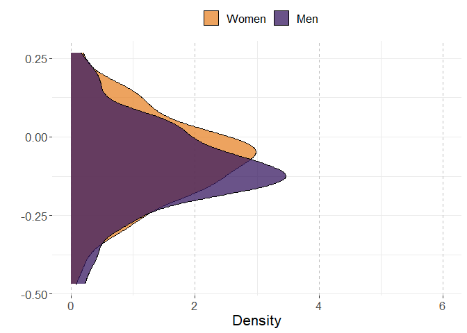
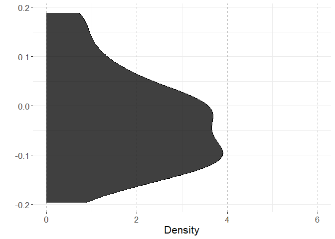
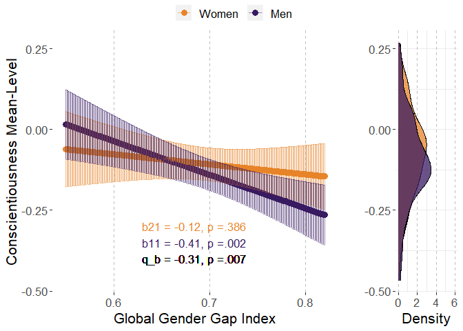
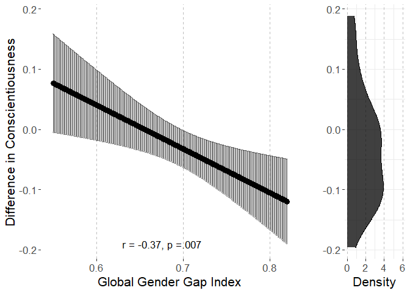
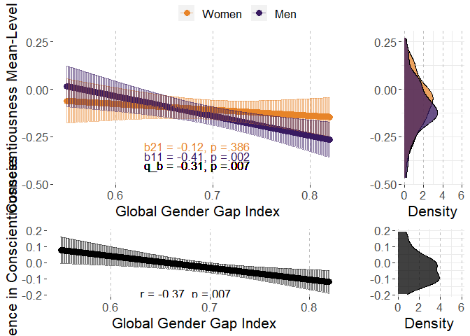

# Preparations

## Load packages


```r
library(multid)
library(lmerTest)
library(rio)
library(dplyr)
library(tibble)
library(ggpubr)
library(ggplot2)
library(MetBrewer)
library(emmeans)
library(finalfit)
source("../../custom_functions.R")
```

## Import data


```r
dat <- import("../data/ipip_processed.rda")
correlates <- import("../data/correlates.xlsx")
```


## Save variable names of the multivariate set to a vector


```r
per.facets<-
  names(dat)[which(names(dat)=="A.trust"):
              which(names(dat)=="O.liberalism")]
```


## Calculate trait means


```r
C.facets<-
  per.facets[grepl("C.",per.facets)]

dat$C<-rowMeans(dat[,C.facets],na.rm=T)

# standardize

dat$C.z<-(dat$C-mean(dat$C,na.rm=T))/sd(dat$C,na.rm=T)
```

## Standardize country-level predictors


```r
# save raw values for plotting
correlates$GenderGapIndex.raw<-correlates$GenderGapIndex
# standardize
correlates$GenderGapIndex<-
  scale(correlates$GenderGapIndex, center = T, scale=T)
```


## Merge correlates to the data files


```r
fdat<-left_join(x=dat,
                 y=correlates,
                 by=c("COUNTRY"="Country"))

fdat$sex.ratio<-fdat$nMale/(fdat$nMale+fdat$nFemale)

fdat$sex.c<-ifelse(fdat$SEX=="Female",-0.5,
                   ifelse(fdat$SEX=="Male",0.5,NA))

# exclude missing values
fdat <- fdat %>%
  dplyr::select("sex.c","C","C.z","COUNTRY","sex.ratio",
                "GenderGapIndex","GenderGapIndex.raw") %>%
  na.omit()
```


# Analysis

## Reliability of the difference score


```r
reliab.C.z<-
  reliability_dms(data=fdat,diff_var="sex.c",var = "C.z",
                  diff_var_values = c(0.5,-0.5),group_var = "COUNTRY")

export(t(data.frame(reliab.C.z)),
       "../results/reliab.C.z.xlsx",
       overwrite=T)
reliab.C.z
```

```
##              r11              r22              r12              sd1 
##       0.98910001       0.99382073       0.68850551       0.15320380 
##              sd2           sd_d12               m1               m2 
##       0.14720440       0.11868366      -0.10941574      -0.08080995 
##            m_d12 reliability_dmsa 
##      -0.02860578       0.97233119
```


## Multi-level model

### Fit model


```r
fit_C.z<-
  ddsc_ml(data = fdat,predictor = "GenderGapIndex",
          covariates="sex.ratio",
          moderator = "sex.c",moderator_values=c(0.5,-0.5),
          DV = "C.z",lvl2_unit = "COUNTRY",re_cov_test = T,
          scaling_sd = "observed")
```

```
## Warning in checkConv(attr(opt, "derivs"), opt$par, ctrl = control$checkConv, :
## Model failed to converge with max|grad| = 0.00225875 (tol = 0.002, component 1)
```

```
## NOTE: Results may be misleading due to involvement in interactions
```

```
## refitting model(s) with ML (instead of REML)
```

### Descriptive statistics


```r
export(rownames_to_column(data.frame(fit_C.z$descriptives)),
       "../results/C.z_ml_desc.xlsx",
       overwrite=T)
round(fit_C.z$descriptives,2)
```

```
##                           M   SD means_y1 means_y1_scaled means_y2
## means_y1              -0.11 0.15     1.00            1.00     0.69
## means_y1_scaled       -0.73 1.02     1.00            1.00     0.69
## means_y2              -0.08 0.15     0.69            0.69     1.00
## means_y2_scaled       -0.54 0.98     0.69            0.69     1.00
## GenderGapIndex         0.00 1.00    -0.42           -0.42    -0.13
## GenderGapIndex_scaled  0.00 1.00    -0.42           -0.42    -0.13
## diff_score            -0.03 0.12     0.44            0.44    -0.35
## diff_score_scaled     -0.19 0.79     0.44            0.44    -0.35
##                       means_y2_scaled GenderGapIndex GenderGapIndex_scaled
## means_y1                         0.69          -0.42                 -0.42
## means_y1_scaled                  0.69          -0.42                 -0.42
## means_y2                         1.00          -0.13                 -0.13
## means_y2_scaled                  1.00          -0.13                 -0.13
## GenderGapIndex                  -0.13           1.00                  1.00
## GenderGapIndex_scaled           -0.13           1.00                  1.00
## diff_score                      -0.35          -0.38                 -0.38
## diff_score_scaled               -0.35          -0.38                 -0.38
##                       diff_score diff_score_scaled
## means_y1                    0.44              0.44
## means_y1_scaled             0.44              0.44
## means_y2                   -0.35             -0.35
## means_y2_scaled            -0.35             -0.35
## GenderGapIndex             -0.38             -0.38
## GenderGapIndex_scaled      -0.38             -0.38
## diff_score                  1.00              1.00
## diff_score_scaled           1.00              1.00
```

```r
round(fit_C.z$SDs,2)
```

```
##         SD_y1         SD_y2     SD_pooled SD_diff_score            VR 
##          0.15          0.15          0.15          0.12          1.08
```

### Variance heterogeneity test


```r
export(t(data.frame(fit_C.z$re_cov_test)),
       "../results/C.z_ml_var_test.xlsx",
       overwrite=T)
round(fit_C.z$re_cov_test,3)
```

```
## RE_cov RE_cor  Chisq     Df      p 
##  0.000  0.011  0.004  1.000  0.948
```

### Component correlation


```r
export(rownames_to_column(data.frame(fit_C.z$ddsc_sem_fit$variance_test)),
       "../results/C.z_ml_comp_cor.xlsx",
       overwrite=T)
round(fit_C.z$ddsc_sem_fit$variance_test,3)
```

```
##             est    se     z pvalue ci.lower ci.upper
## cov_y1y2  0.674 0.168 4.010  0.000    0.345    1.004
## var_y1    1.019 0.204 5.000  0.000    0.620    1.419
## var_y2    0.941 0.188 5.000  0.000    0.572    1.310
## var_diff  0.078 0.201 0.388  0.698   -0.317    0.473
## var_ratio 1.083 0.222 4.875  0.000    0.648    1.519
## cor_y1y2  0.689 0.074 9.256  0.000    0.543    0.834
```

### Deconstructing results


```r
export(rownames_to_column(data.frame(fit_C.z$results)),
       "../results/C.z_ml_results.xlsx",
       overwrite=T)
round(fit_C.z$results,3)
```

```
##                            estimate    SE     df t.ratio p.value
## r_xy1y2                      -0.366 0.129 45.019  -2.838   0.007
## w_11                         -0.062 0.019 46.205  -3.203   0.002
## w_21                         -0.019 0.021 47.467  -0.875   0.386
## r_xy1                        -0.404 0.126 46.205  -3.203   0.002
## r_xy2                        -0.126 0.144 47.467  -0.875   0.386
## b_11                         -0.412 0.129 46.205  -3.203   0.002
## b_21                         -0.123 0.141 47.467  -0.875   0.386
## main_effect                  -0.040 0.019 46.865  -2.142   0.037
## moderator_effect             -0.028 0.015 46.684  -1.809   0.077
## interaction                  -0.043 0.015 45.019  -2.838   0.007
## q_b11_b21                    -0.315    NA     NA      NA      NA
## q_rxy1_rxy2                  -0.302    NA     NA      NA      NA
## cross_over_point             -0.639    NA     NA      NA      NA
## interaction_vs_main           0.003 0.026 47.727   0.123   0.903
## interaction_vs_main_bscale    0.021 0.171 47.727   0.123   0.903
## interaction_vs_main_rscale    0.013 0.176 47.725   0.075   0.940
## dadas                        -0.037 0.042 47.467  -0.875   0.807
## dadas_bscale                 -0.247 0.282 47.467  -0.875   0.807
## dadas_rscale                 -0.252 0.288 47.467  -0.875   0.807
## abs_diff                      0.043 0.015 45.019   2.838   0.003
## abs_sum                       0.081 0.038 46.865   2.142   0.019
## abs_diff_bscale               0.289 0.102 45.019   2.838   0.003
## abs_sum_bscale                0.536 0.250 46.865   2.142   0.019
## abs_diff_rscale               0.278 0.103 45.235   2.713   0.005
## abs_sum_rscale                0.530 0.251 46.877   2.117   0.020
```

### Multi-level model output


```r
# cross-level interaction model
summary(fit_C.z$model)
```

```
## Linear mixed model fit by REML. t-tests use Satterthwaite's method [
## lmerModLmerTest]
## Formula: model_formula
##    Data: data
## Control: lme4::lmerControl(optimizer = "bobyqa")
## 
## REML criterion at convergence: 2392184
## 
## Scaled residuals: 
##     Min      1Q  Median      3Q     Max 
## -4.4485 -0.6600  0.0415  0.7216  2.6880 
## 
## Random effects:
##  Groups   Name        Variance Std.Dev. Corr 
##  COUNTRY  (Intercept) 0.016621 0.12892       
##           sex.c       0.009169 0.09576  -0.15
##  Residual             0.982514 0.99122       
## Number of obs: 848115, groups:  COUNTRY, 50
## 
## Fixed effects:
##                      Estimate Std. Error       df t value Pr(>|t|)   
## (Intercept)          -0.31845    0.12758 46.26242  -2.496  0.01618 * 
## sex.c                -0.02773    0.01533 46.68435  -1.809  0.07687 . 
## GenderGapIndex       -0.04025    0.01879 46.86473  -2.142  0.03743 * 
## sex.ratio             0.46832    0.26441 46.25342   1.771  0.08311 . 
## sex.c:GenderGapIndex -0.04341    0.01530 45.01888  -2.838  0.00678 **
## ---
## Signif. codes:  0 '***' 0.001 '**' 0.01 '*' 0.05 '.' 0.1 ' ' 1
## 
## Correlation of Fixed Effects:
##             (Intr) sex.c  GndrGI sex.rt
## sex.c       -0.011                     
## GendrGpIndx -0.061 -0.001              
## sex.ratio   -0.989 -0.007  0.061       
## sx.c:GndrGI -0.004 -0.055 -0.130  0.004
## optimizer (bobyqa) convergence code: 0 (OK)
## Model failed to converge with max|grad| = 0.00225875 (tol = 0.002, component 1)
```

```r
# reduced model without the predictor
summary(fit_C.z$reduced_model)
```

```
## Linear mixed model fit by REML. t-tests use Satterthwaite's method [
## lmerModLmerTest]
## Formula: C.z ~ sex.c + sex.ratio + (sex.c | COUNTRY)
##    Data: data
## Control: lme4::lmerControl(optimizer = "bobyqa")
## 
## REML criterion at convergence: 2392184
## 
## Scaled residuals: 
##     Min      1Q  Median      3Q     Max 
## -4.4485 -0.6600  0.0415  0.7216  2.6880 
## 
## Random effects:
##  Groups   Name        Variance Std.Dev. Corr
##  COUNTRY  (Intercept) 0.01797  0.1340       
##           sex.c       0.01083  0.1041   0.01
##  Residual             0.98251  0.9912       
## Number of obs: 848115, groups:  COUNTRY, 50
## 
## Fixed effects:
##             Estimate Std. Error       df t value Pr(>|t|)  
## (Intercept) -0.31523    0.13339 47.52202  -2.363   0.0223 *
## sex.c       -0.02992    0.01639 47.51379  -1.826   0.0741 .
## sex.ratio    0.46065    0.27655 47.63568   1.666   0.1023  
## ---
## Signif. codes:  0 '***' 0.001 '**' 0.01 '*' 0.05 '.' 0.1 ' ' 1
## 
## Correlation of Fixed Effects:
##           (Intr) sex.c 
## sex.c      0.011       
## sex.ratio -0.989 -0.009
```

## COUNTRY-level path model

### Fit the model

The model is already stored within the multi-level model object. 


```r
fit_C.z_sem<-fit_C.z$ddsc_sem_fit
```

### Results


```r
export(rownames_to_column(data.frame(fit_C.z_sem$results)),
       "../results/C.z_sem_results.xlsx",
       overwrite=T)
round(fit_C.z_sem$results,3)
```

```
##                                    est    se      z pvalue ci.lower ci.upper
## r_xy1_y2                        -0.382 0.131 -2.923  0.003   -0.638   -0.126
## r_xy1                           -0.419 0.128 -3.266  0.001   -0.671   -0.168
## r_xy2                           -0.128 0.140 -0.915  0.360   -0.403    0.147
## b_11                            -0.428 0.131 -3.266  0.001   -0.684   -0.171
## b_21                            -0.126 0.137 -0.915  0.360   -0.395    0.144
## b_10                            -0.728 0.130 -5.619  0.000   -0.982   -0.474
## b_20                            -0.538 0.136 -3.954  0.000   -0.805   -0.271
## res_cov_y1_y2                    0.621 0.153  4.074  0.000    0.323    0.920
## diff_b10_b20                    -0.190 0.102 -1.863  0.062   -0.391    0.010
## diff_b11_b21                    -0.302 0.103 -2.923  0.003   -0.504   -0.099
## diff_rxy1_rxy2                  -0.291 0.104 -2.804  0.005   -0.494   -0.088
## q_b11_b21                       -0.331 0.117 -2.831  0.005   -0.559   -0.102
## q_rxy1_rxy2                     -0.318 0.115 -2.757  0.006   -0.544   -0.092
## cross_over_point                -0.631 0.402 -1.571  0.116   -1.418    0.156
## sum_b11_b21                     -0.553 0.248 -2.233  0.026   -1.039   -0.068
## main_effect                     -0.277 0.124 -2.233  0.026   -0.519   -0.034
## interaction_vs_main_effect       0.025 0.167  0.151  0.880   -0.301    0.352
## diff_abs_b11_abs_b21             0.302 0.103  2.923  0.003    0.099    0.504
## abs_diff_b11_b21                 0.302 0.103  2.923  0.002    0.099    0.504
## abs_sum_b11_b21                  0.553 0.248  2.233  0.013    0.068    1.039
## dadas                           -0.252 0.275 -0.915  0.820   -0.790    0.287
## q_r_equivalence                  0.318 0.115  2.757  0.997       NA       NA
## q_b_equivalence                  0.331 0.117  2.831  0.998       NA       NA
## cross_over_point_equivalence     0.631 0.402  1.571  0.942       NA       NA
## cross_over_point_minimal_effect  0.631 0.402  1.571  0.058       NA       NA
```


# Plotting the results


```r
# refit reduced and full models with GGGI in original scale

ml_C.z_red<-fit_C.z$reduced_model
  
# refit the model with raw variable
ml_C.z<-
  lmer(C.z~sex.c+
         sex.ratio+
         GenderGapIndex.raw+
         sex.c:GenderGapIndex.raw+
         (sex.c|COUNTRY),data=fdat,
       control = lmerControl(optimizer="bobyqa",
                             optCtrl=list(maxfun=2e6)))


# point predictions as function of GGGI for components

p<-
  emmip(
    ml_C.z, 
    sex.c ~ GenderGapIndex.raw,
    at=list(sex.c = c(-0.5,0.5),
            GenderGapIndex.raw=
              seq(from=round(range(fdat$GenderGapIndex.raw)[1],2),
                  to=round(range(fdat$GenderGapIndex.raw)[2],2),
                  by=0.001)),
    plotit=F,CIs=T,lmerTest.limit = 1e6,disable.pbkrtest=T)

p$sex<-p$tvar
levels(p$sex)<-c("Women","Men")

# obtain min and max for aligned plots
min.y.comp<-min(p$LCL)
max.y.comp<-max(p$UCL)

# Men and Women mean distributions

p3<-coefficients(ml_C.z_red)$COUNTRY
p3<-cbind(rbind(p3,p3),weight=rep(c(-0.5,0.5),each=nrow(p3)))
p3$xvar<-p3$`(Intercept)`+p3$sex.ratio*0.5+p3$sex.c*p3$weight
p3$sex<-as.factor(p3$weight)
levels(p3$sex)<-c("Women","Men")

# obtain min and max for aligned plots
min.y.mean.distr<-min(p3$xvar)
max.y.mean.distr<-max(p3$xvar)


# obtain the coefs for the sex-effect (difference) as function of GGGI

p2<-data.frame(
  emtrends(ml_C.z,var="+1*sex.c",
           specs="GenderGapIndex.raw",
           at=list(#sex.c = c(-0.5,0.5),
             GenderGapIndex.raw=
               seq(from=round(range(fdat$GenderGapIndex.raw)[1],2),
                   to=round(range(fdat$GenderGapIndex.raw)[2],2),
                   by=0.001)),
           lmerTest.limit = 1e6,disable.pbkrtest=T))

p2$yvar<-p2$X.1.sex.c.trend
p2$xvar<-p2$GenderGapIndex.raw
p2$LCL<-p2$lower.CL
p2$UCL<-p2$upper.CL

# obtain min and max for aligned plots
min.y.diff<-min(p2$LCL)
max.y.diff<-max(p2$UCL)

# difference score distribution

p4<-coefficients(ml_C.z_red)$COUNTRY
p4$xvar=(+1)*p4$sex.c

# obtain mix and max for aligned plots

min.y.diff.distr<-min(p4$xvar)
max.y.diff.distr<-max(p4$xvar)

# define mins and maxs

min.y.pred<-
  ifelse(min.y.comp<min.y.mean.distr,min.y.comp,min.y.mean.distr)

max.y.pred<-
  ifelse(max.y.comp>max.y.mean.distr,max.y.comp,max.y.mean.distr)

min.y.narrow<-
  ifelse(min.y.diff<min.y.diff.distr,min.y.diff,min.y.diff.distr)

max.y.narrow<-
  ifelse(max.y.diff>max.y.diff.distr,max.y.diff,max.y.diff.distr)


# Figures 

# p1

# scaled simple effects to the plot


pvals<-p_coding(c(fit_C.z$results["b_21","p.value"],
                    fit_C.z$results["b_11","p.value"]))

ests<-
  round_tidy(c(fit_C.z$results["b_21","estimate"],
               fit_C.z$results["b_11","estimate"]),2)

coef1<-paste0("b21 = ",ests[1],", p ",
               ifelse(fit_C.z$results["b_21","p.value"]<.001,
                      "","="),pvals[1])
coef2<-paste0("b11 = ",ests[2],", p ",
               ifelse(fit_C.z$results["b_11","p.value"]<.001,
                      "","="),pvals[2])

coef_q<-round_tidy(fit_C.z$results["q_b11_b21","estimate"],2)
coef_q<-paste0("q_b = ",coef_q,", p ",
               ifelse(fit_C.z$results["interaction","p.value"]<.001,"","="),
               p_coding(fit_C.z$results["interaction","p.value"]))

coefs<-data.frame(sex=c("Women","Men"),
                  coef=c(coef1,coef2))

p1.C.z<-ggplot(p,aes(y=yvar,x=xvar,color=sex))+
  geom_point(size=3)+
  geom_errorbar(aes(ymin=LCL, ymax=UCL),alpha=0.5)+
  xlab("Global Gender Gap Index")+
  #ylim=c(2.3,3.9)+
  ylim(c(min.y.pred,max.y.pred))+
  ylab("Conscientiousness Mean-Level")+
  scale_color_manual(values=met.brewer("Archambault")[c(6,2)])+
  theme(legend.position = "top",
        legend.title=element_blank(),
        text=element_text(size=16,  family="sans"),
        panel.background = element_rect(fill = "white",
                                        #colour = "black",
                                        #size = 0.5, linetype = "solid"
        ),
        panel.grid.major.x = element_line(linewidth = 0.5, linetype = 2,
                                          colour = "gray"))+
  geom_text(data = coefs,show.legend=F,
            aes(label=coef,x=0.63,
                y=c(-0.30
                    ,-0.35),size=14,hjust="left"))+
  geom_text(inherit.aes=F,aes(x=0.63,y=-0.4,
                              label=coef_q,size=14,hjust="left"),
            show.legend=F)
p1.C.z
```

<!-- -->

```r
# prediction plot for difference score


pvals2<-p_coding(fit_C.z$results["r_xy1y2","p.value"])

ests2<-
  round_tidy(fit_C.z$results["r_xy1y2","estimate"],2)

coefs2<-paste0("r = ",ests2,
               ", p ",
               ifelse(fit_C.z$results["r_xy1y2","p.value"]<.001,"","="),
               pvals2)


p2.C.z<-ggplot(p2,aes(y=yvar,x=xvar))+
  geom_point(size=3)+
  geom_errorbar(aes(ymin=LCL, ymax=UCL),alpha=0.5)+
  xlab("Global Gender Gap Index")+
  ylim(c(min.y.narrow,max.y.narrow))+
  ylab("Difference in Conscientiousness")+
  #scale_color_manual(values=met.brewer("Archambault")[c(6,2)])+
  theme(legend.position = "right",
        legend.title=element_blank(),
        text=element_text(size=16,  family="sans"),
        panel.background = element_rect(fill = "white",
                                        #colour = "black",
                                        #size = 0.5, linetype = "solid"
        ),
        panel.grid.major.x = element_line(size = 0.5, linetype = 2,
                                          colour = "gray"))+
  #geom_text(coef2,aes(x=0.63,y=min(p2$LCL)))
  geom_text(data = data.frame(coefs2),show.legend=F,
            aes(label=coefs2,x=0.63,hjust="left",
                y=c(round(min(p2$LCL),2)),size=14))
p2.C.z
```

<!-- -->

```r
# mean-level distributions

p3.C.z<-
  ggplot(p3, aes(x=xvar, fill=sex)) + 
  geom_density(alpha=.75) + 
  scale_fill_manual(values=met.brewer("Archambault")[c(6,2)])+
  #scale_fill_manual(values=c("turquoise3","orangered2","black")) + 
  xlab("")+
  ylab("Density")+
  ylim(c(0,6))+
  xlim(c(min.y.pred,max.y.pred))+
  theme_bw()+
  theme(legend.position = "top",
        legend.title=element_blank(),
        text=element_text(size=16,  family="sans"),
        panel.border = element_blank(),
        panel.background = element_rect(fill = "white",
                                        #colour = "black",
                                        #size = 0.5, linetype = "solid"
        ),
        panel.grid.major.x = element_line(size = 0.5, linetype = 2,
                                          colour = "gray"))+
  coord_flip()
p3.C.z
```

<!-- -->

```r
# distribution for mean differences

p4.C.z<-
  ggplot(p4, aes(x=xvar,fill="black")) + 
  geom_density(alpha=.75) + 
  scale_fill_manual(values="black")+
  #scale_fill_manual(values=c("turquoise3","orangered2","black")) + 
  xlab("")+
  ylab("Density")+
  ylim(c(0,6))+
  xlim(c(min.y.narrow,max.y.narrow))+
  theme_bw()+
  theme(legend.position = "none",
        legend.title=element_blank(),
        text=element_text(size=16,  family="sans"),
        panel.border = element_blank(),
        panel.background = element_rect(fill = "white",
                                        #colour = "black",
                                        #size = 0.5, linetype = "solid"
        ),
        panel.grid.major.x = element_line(size = 0.5, linetype = 2,
                                          colour = "gray"))+
  coord_flip()
p4.C.z
```

<!-- -->

```r
# combine component-specific predictions

p13.C.z<-
  ggarrange(p1.C.z, p3.C.z,common.legend = T,
            ncol=2, nrow=1,widths=c(4,1.4)
  )

p13.C.z
```

<!-- -->

```r
# combine difference score predictions

p24.C.z<-
  ggarrange(p2.C.z, p4.C.z,
            ncol=2, nrow=1,widths=c(4,1.4)
  )

p24.C.z
```

<!-- -->

```r
pall.C.z<-
  ggarrange(p13.C.z,p24.C.z,align = "hv",
            ncol=1,nrow=2,heights=c(2,1))
pall.C.z
```

<!-- -->

```r
png(filename = 
      "../results/pall.C.z.png",
    units = "cm",
    width = 21.0,height=29.7*(4/5),res = 600)
pall.C.z
dev.off()
```

```
## png 
##   2
```

# Session information


```r
s<-sessionInfo()
print(s,locale=F)
```

```
## R version 4.3.0 (2023-04-21 ucrt)
## Platform: x86_64-w64-mingw32/x64 (64-bit)
## Running under: Windows 10 x64 (build 19045)
## 
## Matrix products: default
## 
## 
## attached base packages:
## [1] stats     graphics  grDevices utils     datasets  methods   base     
## 
## other attached packages:
##  [1] finalfit_1.0.6    emmeans_1.8.6     MetBrewer_0.2.0   ggpubr_0.6.0     
##  [5] ggplot2_3.4.2     tibble_3.2.1      dplyr_1.1.2       rio_0.5.29       
##  [9] lmerTest_3.1-3    lme4_1.1-33       Matrix_1.5-4      multid_0.8.0.9000
## [13] knitr_1.42        rmarkdown_2.21   
## 
## loaded via a namespace (and not attached):
##  [1] tidyselect_1.2.0    farver_2.1.1        fastmap_1.1.1      
##  [4] pROC_1.18.2         digest_0.6.31       estimability_1.4.1 
##  [7] lifecycle_1.0.3     survival_3.5-5      magrittr_2.0.3     
## [10] compiler_4.3.0      rlang_1.1.1         sass_0.4.6         
## [13] tools_4.3.0         utf8_1.2.3          yaml_2.3.7         
## [16] data.table_1.14.8   ggsignif_0.6.4      labeling_0.4.2     
## [19] mnormt_2.1.1        curl_5.0.0          plyr_1.8.8         
## [22] abind_1.4-5         withr_2.5.0         foreign_0.8-84     
## [25] purrr_1.0.1         numDeriv_2016.8-1.1 stats4_4.3.0       
## [28] grid_4.3.0          fansi_1.0.4         lavaan_0.6-15      
## [31] xtable_1.8-4        colorspace_2.1-0    mice_3.15.0        
## [34] scales_1.2.1        iterators_1.0.14    MASS_7.3-58.4      
## [37] cli_3.6.1           mvtnorm_1.1-3       crayon_1.5.2       
## [40] generics_0.1.3      rstudioapi_0.14     readxl_1.4.2       
## [43] minqa_1.2.5         cachem_1.0.8        splines_4.3.0      
## [46] parallel_4.3.0      cellranger_1.1.0    vctrs_0.6.2        
## [49] boot_1.3-28.1       glmnet_4.1-7        jsonlite_1.8.4     
## [52] carData_3.0-5       car_3.1-2           hms_1.1.3          
## [55] rstatix_0.7.2       foreach_1.5.2       tidyr_1.3.0        
## [58] jquerylib_0.1.4     glue_1.6.2          nloptr_2.0.3       
## [61] codetools_0.2-19    cowplot_1.1.1       stringi_1.7.12     
## [64] gtable_0.3.3        shape_1.4.6         quadprog_1.5-8     
## [67] munsell_0.5.0       pillar_1.9.0        htmltools_0.5.5    
## [70] R6_2.5.1            pbivnorm_0.6.0      evaluate_0.21      
## [73] lattice_0.21-8      highr_0.10          haven_2.5.2        
## [76] backports_1.4.1     openxlsx_4.2.5.2    broom_1.0.4        
## [79] bslib_0.4.2         Rcpp_1.0.10         zip_2.3.0          
## [82] gridExtra_2.3       nlme_3.1-162        xfun_0.39          
## [85] forcats_1.0.0       pkgconfig_2.0.3
```

