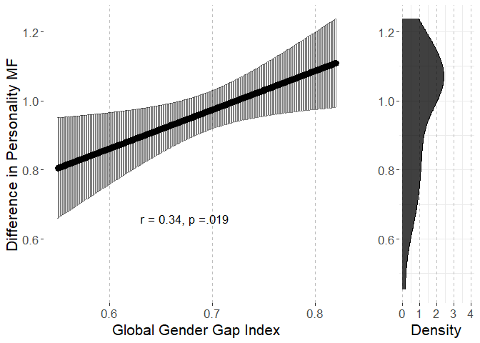

# Preparations

## Load packages


```r
library(multid)
library(lmerTest)
library(rio)
library(dplyr)
library(tibble)
library(ggpubr)
library(ggplot2)
library(MetBrewer)
library(emmeans)
library(finalfit)
source("../../custom_functions.R")
```

## Import data


```r
dat <- import("../data/ipip_processed.rda")
correlates <- import("../data/correlates.xlsx")
```

## Save variable names of the multivariate set to a vector


```r
per.facets<-
  names(dat)[which(names(dat)=="A.trust"):
              which(names(dat)=="O.liberalism")]
```

## Standardize country-level predictors


```r
# save raw values for plotting
correlates$GenderGapIndex.raw<-correlates$GenderGapIndex
# standardize
correlates$GenderGapIndex<-
  scale(correlates$GenderGapIndex, center = T, scale=T)
```

# Analysis

## Obtaining regularized D sex differences and difference score components


```r
set.seed(84363)
Diff_scores<-
  D_regularized(data=dat,
                mv.vars = per.facets,
                group.var = "SEX",
                group.values = c("Male","Female"),
                rename.output = T,out = T,pcc = T,
                auc = T,pred.prob = T,
                size = round(min(table(dat$COUNTRY,
                                       dat$SEX))/2,0),
                fold = T,fold.var = "COUNTRY")

round(Diff_scores$D,2)
```

```
##              n.Male n.Female m.Male m.Female sd.Male sd.Female pooled.sd diff
## Afghanistan     750      812   0.47    -0.72    1.06      0.98      1.02 1.19
## Albania         570      794   0.48    -0.67    1.05      0.93      0.98 1.16
## Algeria         400      492   0.37    -0.75    1.06      0.95      1.00 1.13
## Andorra         124      170   0.30    -0.80    1.07      0.99      1.02 1.10
## Argentina       177      204   0.54    -0.52    1.20      1.06      1.12 1.06
## Australia     11526    19120   0.48    -0.61    1.03      0.96      0.99 1.09
## Austria         202      178   0.75    -0.49    0.98      0.96      0.97 1.25
## Belgium         730      478   0.49    -0.54    0.96      0.98      0.97 1.03
## Brazil          798      443   0.70    -0.40    0.97      1.03      0.99 1.10
## Canada        20348    32940   0.51    -0.69    1.08      0.98      1.02 1.19
## China          1239     1989   0.45    -0.11    0.76      0.78      0.77 0.57
## Colombia        203      191   0.29    -0.50    1.00      1.06      1.03 0.79
## Croatia         225      308   0.52    -0.46    1.18      0.87      1.01 0.98
## Denmark         774      504   0.69    -0.38    0.97      0.93      0.96 1.07
## Egypt           201      234   0.38    -0.63    1.08      0.94      1.01 1.01
## Finland        1776     1863   0.80    -0.20    1.06      0.97      1.01 1.00
## France         1063      803   0.54    -0.60    0.99      1.05      1.01 1.14
## Germany        1557     1445   0.68    -0.36    1.03      0.95      0.99 1.05
## Greece          578      779   0.29    -0.51    0.98      1.01      1.00 0.80
## Hong Kong      1078     1234   0.48    -0.25    0.86      0.86      0.86 0.72
## India          5091     2744   0.12    -0.69    0.94      0.95      0.94 0.81
## Indonesia       331      467   0.36    -0.36    0.89      0.92      0.91 0.72
## Ireland        2332     2885   0.32    -0.68    1.02      0.96      0.99 1.00
## Israel          498      423   0.59    -0.48    1.05      0.93      1.00 1.07
## Italy           483      424   0.40    -0.61    0.95      1.00      0.97 1.01
## Japan           494      568   0.44    -0.31    0.95      0.94      0.94 0.75
## Lebanon         137      159   0.25    -0.61    1.03      0.93      0.98 0.86
## Malaysia        931     1602   0.36    -0.30    0.93      0.91      0.92 0.65
## Mexico          982      851   0.32    -0.54    0.96      0.99      0.97 0.86
## Netherlands    2749     3270   0.64    -0.42    0.92      0.86      0.89 1.06
## New Zealand    2288     3060   0.57    -0.43    1.05      0.96      1.00 1.00
## Norway         1146      831   0.70    -0.45    0.99      0.98      0.98 1.15
## Pakistan        477      272   0.00    -0.70    0.89      0.91      0.90 0.70
## Philippines    2215     4321   0.13    -0.53    0.94      0.88      0.90 0.67
## Poland          306      404   0.65    -0.42    1.09      1.08      1.08 1.07
## Portugal        505      349   0.31    -0.67    0.99      0.89      0.95 0.98
## Romania         750      945   0.61    -0.29    0.88      0.86      0.87 0.90
## Russia          317      432   0.88    -0.37    1.06      0.94      0.99 1.24
## Singapore      3237     4397   0.44    -0.42    0.94      0.92      0.93 0.86
## Slovenia        111      259   0.54    -0.57    0.92      0.92      0.92 1.11
## South Africa   1084     1412   0.39    -0.69    1.07      0.96      1.01 1.08
## South Korea     935     1068   0.47    -0.13    0.81      0.83      0.82 0.60
## Spain           594      399   0.45    -0.62    1.02      0.91      0.97 1.07
## Sweden         1777     1510   0.75    -0.46    1.04      0.96      1.01 1.22
## Taiwan          335      478   0.38    -0.28    0.79      0.86      0.83 0.66
## Thailand        890     1494   0.24    -0.19    0.74      0.77      0.76 0.42
## Turkey          368      399   0.48    -0.37    0.93      0.97      0.95 0.86
## UK            19521    24128   0.49    -0.63    1.07      0.98      1.02 1.12
## Ukraine         131      191   0.41    -0.59    0.94      0.94      0.94 0.99
## USA          237746   379212   0.45    -0.73    1.05      0.96      0.99 1.18
##                 D pcc.Male pcc.Female pcc.total  auc pooled.sd.Male
## Afghanistan  1.17     0.68       0.78      0.73 0.80           1.04
## Albania      1.18     0.70       0.79      0.75 0.80           1.04
## Algeria      1.13     0.64       0.80      0.73 0.79           1.04
## Andorra      1.07     0.58       0.76      0.68 0.78           1.04
## Argentina    0.94     0.66       0.68      0.67 0.75           1.04
## Australia    1.11     0.68       0.74      0.72 0.78           1.04
## Austria      1.28     0.80       0.70      0.75 0.82           1.04
## Belgium      1.06     0.69       0.72      0.70 0.78           1.04
## Brazil       1.11     0.78       0.62      0.73 0.78           1.04
## Canada       1.17     0.68       0.77      0.74 0.80           1.04
## China        0.73     0.73       0.55      0.62 0.70           1.04
## Colombia     0.77     0.62       0.71      0.66 0.72           1.04
## Croatia      0.97     0.64       0.73      0.69 0.76           1.04
## Denmark      1.12     0.75       0.67      0.72 0.79           1.04
## Egypt        1.01     0.67       0.74      0.70 0.76           1.04
## Finland      0.99     0.79       0.60      0.69 0.77           1.04
## France       1.12     0.71       0.72      0.71 0.79           1.04
## Germany      1.06     0.75       0.66      0.71 0.78           1.04
## Greece       0.81     0.60       0.72      0.67 0.72           1.04
## Hong Kong    0.84     0.72       0.62      0.67 0.73           1.04
## India        0.86     0.55       0.77      0.63 0.73           1.04
## Indonesia    0.79     0.68       0.66      0.67 0.72           1.04
## Ireland      1.01     0.61       0.77      0.70 0.76           1.04
## Israel       1.08     0.73       0.70      0.71 0.78           1.04
## Italy        1.03     0.66       0.73      0.69 0.77           1.04
## Japan        0.80     0.67       0.62      0.64 0.72           1.04
## Lebanon      0.88     0.55       0.80      0.68 0.74           1.04
## Malaysia     0.71     0.66       0.63      0.64 0.69           1.04
## Mexico       0.88     0.63       0.74      0.68 0.74           1.04
## Netherlands  1.18     0.76       0.68      0.72 0.80           1.04
## New Zealand  1.00     0.70       0.69      0.69 0.76           1.04
## Norway       1.17     0.76       0.69      0.73 0.80           1.04
## Pakistan     0.77     0.49       0.78      0.60 0.71           1.04
## Philippines  0.74     0.55       0.73      0.67 0.70           1.04
## Poland       0.99     0.72       0.70      0.71 0.76           1.04
## Portugal     1.03     0.64       0.81      0.71 0.78           1.04
## Romania      1.03     0.76       0.65      0.70 0.77           1.04
## Russia       1.26     0.79       0.66      0.71 0.81           1.04
## Singapore    0.93     0.68       0.68      0.68 0.75           1.04
## Slovenia     1.21     0.70       0.73      0.72 0.81           1.04
## South Africa 1.08     0.64       0.77      0.72 0.78           1.04
## South Korea  0.73     0.73       0.54      0.63 0.70           1.04
## Spain        1.10     0.66       0.77      0.70 0.79           1.04
## Sweden       1.21     0.76       0.70      0.73 0.81           1.04
## Taiwan       0.80     0.68       0.62      0.64 0.71           1.04
## Thailand     0.56     0.65       0.57      0.60 0.65           1.04
## Turkey       0.90     0.69       0.64      0.66 0.74           1.04
## UK           1.10     0.68       0.75      0.72 0.78           1.04
## Ukraine      1.06     0.66       0.73      0.70 0.78           1.04
## USA          1.19     0.67       0.79      0.74 0.80           1.04
##              pooled.sd.Female pooled.sd.total d.sd.total
## Afghanistan              0.96            0.99       1.20
## Albania                  0.96            0.99       1.17
## Algeria                  0.96            0.99       1.14
## Andorra                  0.96            0.99       1.11
## Argentina                0.96            0.99       1.07
## Australia                0.96            0.99       1.10
## Austria                  0.96            0.99       1.26
## Belgium                  0.96            0.99       1.04
## Brazil                   0.96            0.99       1.11
## Canada                   0.96            0.99       1.20
## China                    0.96            0.99       0.57
## Colombia                 0.96            0.99       0.80
## Croatia                  0.96            0.99       0.99
## Denmark                  0.96            0.99       1.08
## Egypt                    0.96            0.99       1.02
## Finland                  0.96            0.99       1.01
## France                   0.96            0.99       1.15
## Germany                  0.96            0.99       1.06
## Greece                   0.96            0.99       0.81
## Hong Kong                0.96            0.99       0.73
## India                    0.96            0.99       0.82
## Indonesia                0.96            0.99       0.73
## Ireland                  0.96            0.99       1.01
## Israel                   0.96            0.99       1.08
## Italy                    0.96            0.99       1.02
## Japan                    0.96            0.99       0.76
## Lebanon                  0.96            0.99       0.87
## Malaysia                 0.96            0.99       0.66
## Mexico                   0.96            0.99       0.86
## Netherlands              0.96            0.99       1.07
## New Zealand              0.96            0.99       1.01
## Norway                   0.96            0.99       1.16
## Pakistan                 0.96            0.99       0.70
## Philippines              0.96            0.99       0.67
## Poland                   0.96            0.99       1.08
## Portugal                 0.96            0.99       0.99
## Romania                  0.96            0.99       0.90
## Russia                   0.96            0.99       1.26
## Singapore                0.96            0.99       0.87
## Slovenia                 0.96            0.99       1.12
## South Africa             0.96            0.99       1.09
## South Korea              0.96            0.99       0.60
## Spain                    0.96            0.99       1.08
## Sweden                   0.96            0.99       1.23
## Taiwan                   0.96            0.99       0.67
## Thailand                 0.96            0.99       0.43
## Turkey                   0.96            0.99       0.86
## UK                       0.96            0.99       1.13
## Ukraine                  0.96            0.99       1.00
## USA                      0.96            0.99       1.19
```

```r
# Save difference score components and differences to a data frame
D_dat<-Diff_scores$D

# Save predicted values for individuals
ML_dat<-Diff_scores$preds

# rename variables
D_dat$Country<-rownames(D_dat)
names(ML_dat)<-c("sex","Country","MF","P","cut.groups")

# calculate within country sex ratio (as proportion of men within country)
D_dat$sex.ratio<-
  D_dat$n.Male/(D_dat$n.Male+D_dat$n.Female)

# print and save the coefficient weights
coef(Diff_scores$cv.mod,s = "lambda.min")
```

```
## 31 x 1 sparse Matrix of class "dgCMatrix"
##                                s1
## (Intercept)            8.11380777
## A.trust                0.20273897
## A.morality            -0.26261063
## A.altruism            -0.05670050
## A.cooperation         -0.30227870
## A.modesty             -0.29281334
## A.sympathy            -0.11306649
## C.selfefficacy        -0.04530846
## C.orderliness          0.10346499
## C.dutifulness          0.01399268
## C.achievementstriving -0.13795415
## C.selfdiscipline      -0.07299611
## C.cautiousness         0.10685424
## E.friendliness         0.04359091
## E.gregariousness      -0.07775606
## E.assertiveness        0.06424602
## E.activitylevel       -0.13501090
## E.excitementseeking    0.08460659
## E.cheerfulness        -0.35846007
## N.anxiety             -0.24553273
## N.anger               -0.27750128
## N.depression           0.10007082
## N.selfconsciousness    0.12237505
## N.immoderation        -0.16736219
## N.vulnerability       -0.34433639
## O.imagination          0.15022717
## O.artistic            -0.42593519
## O.emotionality        -0.35444636
## O.adventurousness      .         
## O.intellect            0.38511276
## O.liberalism          -0.13209472
```

```r
export(rownames_to_column(data.frame(coef(Diff_scores$cv.mod,
            s = "lambda.min")[,1])),
       "../results/elastic_net_coefs.xlsx",
       overwrite=T)
```

## Merge correlates to the data files


```r
D_dat<-left_join(x=D_dat,
                 y=correlates,
                 by="Country")

ML_dat<-left_join(x=ML_dat,
                  y=D_dat,
                  by="Country")
```

## Preparations for the multilevel analysis


```r
# make sex variable numeric
ML_dat$Sex<-ifelse(ML_dat$sex=="Female",-0.5,0.5)

# scale MF with the total pooled SD
ML_dat$MF<-ML_dat$MF/D_dat$pooled.sd.total[1]

# exclude missing values
fdat <- ML_dat %>%
  dplyr::select("Sex","MF","Country","sex.ratio",
                "GenderGapIndex","GenderGapIndex.raw") %>%
  na.omit()
```
# Analysis

## Reliability of the difference score


```r
reliab.MF<-
  reliability_dms(data=fdat,diff_var="Sex",var = "MF",
                  diff_var_values = c(0.5,-0.5),group_var = "Country")

export(t(data.frame(reliab.MF)),
       "../results/reliab.MF.xlsx",
       overwrite=T)
reliab.MF
```

```
##              r11              r22              r12              sd1 
##        0.9737954        0.9907809        0.3619258        0.1800105 
##              sd2           sd_d12               m1               m2 
##        0.1732557        0.1996145        0.4712326       -0.4994302 
##            m_d12 reliability_dmsa 
##        0.9706628        0.9717446
```


## Multi-level model

### Fit model


```r
fit_MF<-
  ddsc_ml(data = fdat,predictor = "GenderGapIndex",
          covariates="sex.ratio",
          moderator = "Sex",moderator_values=c(0.5,-0.5),
          DV = "MF",lvl2_unit = "Country",re_cov_test = T,
          scaling_sd = "observed")
```

### Descriptive statistics


```r
export(rownames_to_column(data.frame(fit_MF$descriptives)),
       "../results/MF_ml_desc.xlsx",
       overwrite=T)
round(fit_MF$descriptives,2)
```

```
##                           M   SD means_y1 means_y1_scaled means_y2
## means_y1               0.47 0.18     1.00            1.00     0.36
## means_y1_scaled        2.67 1.02     1.00            1.00     0.36
## means_y2              -0.50 0.17     0.36            0.36     1.00
## means_y2_scaled       -2.83 0.98     0.36            0.36     1.00
## GenderGapIndex         0.00 1.00     0.51            0.51     0.15
## GenderGapIndex_scaled  0.00 1.00     0.51            0.51     0.15
## diff_score             0.97 0.20     0.59            0.59    -0.54
## diff_score_scaled      5.49 1.13     0.59            0.59    -0.54
##                       means_y2_scaled GenderGapIndex GenderGapIndex_scaled
## means_y1                         0.36           0.51                  0.51
## means_y1_scaled                  0.36           0.51                  0.51
## means_y2                         1.00           0.15                  0.15
## means_y2_scaled                  1.00           0.15                  0.15
## GenderGapIndex                   0.15           1.00                  1.00
## GenderGapIndex_scaled            0.15           1.00                  1.00
## diff_score                      -0.54           0.33                  0.33
## diff_score_scaled               -0.54           0.33                  0.33
##                       diff_score diff_score_scaled
## means_y1                    0.59              0.59
## means_y1_scaled             0.59              0.59
## means_y2                   -0.54             -0.54
## means_y2_scaled            -0.54             -0.54
## GenderGapIndex              0.33              0.33
## GenderGapIndex_scaled       0.33              0.33
## diff_score                  1.00              1.00
## diff_score_scaled           1.00              1.00
```

```r
round(fit_MF$SDs,2)
```

```
##         SD_y1         SD_y2     SD_pooled SD_diff_score            VR 
##          0.18          0.17          0.18          0.20          1.08
```

### Variance heterogeneity test


```r
export(t(data.frame(fit_MF$re_cov_test)),
       "../results/MF_ml_var_test.xlsx",
       overwrite=T)
round(fit_MF$re_cov_test,3)
```

```
## RE_cov RE_cor  Chisq     Df      p 
##  0.001  0.035  0.052  1.000  0.820
```

### Component correlation


```r
export(rownames_to_column(data.frame(fit_MF$ddsc_sem_fit$variance_test)),
       "../results/MF_ml_comp_cor.xlsx",
       overwrite=T)
round(fit_MF$ddsc_sem_fit$variance_test,3)
```

```
##             est    se     z pvalue ci.lower ci.upper
## cov_y1y2  0.354 0.147 2.406  0.016    0.066    0.643
## var_y1    1.017 0.203 5.000  0.000    0.619    1.416
## var_y2    0.943 0.189 5.000  0.000    0.573    1.312
## var_diff  0.075 0.259 0.290  0.772   -0.432    0.582
## var_ratio 1.079 0.285 3.793  0.000    0.522    1.637
## cor_y1y2  0.362 0.123 2.945  0.003    0.121    0.603
```

### Deconstructing results


```r
export(rownames_to_column(data.frame(fit_MF$results)),
       "../results/MF_ml_results.xlsx",
       overwrite=T)
round(fit_MF$results,3)
```

```
##                            estimate    SE     df t.ratio p.value ci.lower
## r_xy1y2                       0.337 0.138 48.270   2.437   0.019    0.059
## w_11                          0.092 0.022 45.282   4.118   0.000    0.047
## w_21                          0.025 0.025 47.539   0.988   0.328   -0.026
## r_xy1                         0.512 0.124 45.282   4.118   0.000    0.262
## r_xy2                         0.144 0.146 47.539   0.988   0.328   -0.149
## b_11                          0.522 0.127 45.282   4.118   0.000    0.267
## b_21                          0.142 0.143 47.539   0.988   0.328   -0.147
## main_effect                   0.059 0.020 46.744   3.003   0.004    0.019
## moderator_effect              0.967 0.028 49.590  35.172   0.000    0.912
## interaction                   0.067 0.028 48.270   2.437   0.019    0.012
## q_b11_b21                     0.436    NA     NA      NA      NA       NA
## q_rxy1_rxy2                   0.420    NA     NA      NA      NA       NA
## cross_over_point            -14.397    NA     NA      NA      NA       NA
## interaction_vs_main           0.009 0.036 48.323   0.240   0.811   -0.063
## interaction_vs_main_bscale    0.049 0.203 48.323   0.240   0.811   -0.358
## interaction_vs_main_rscale    0.040 0.207 48.293   0.192   0.849   -0.376
## dadas                        -0.050 0.051 47.539  -0.988   0.836   -0.152
## dadas_bscale                 -0.283 0.287 47.539  -0.988   0.836   -0.859
## dadas_rscale                 -0.289 0.292 47.539  -0.988   0.836   -0.876
## abs_diff                      0.067 0.028 48.270   2.437   0.009    0.012
## abs_sum                       0.117 0.039 46.744   3.003   0.002    0.039
## abs_diff_bscale               0.380 0.156 48.270   2.437   0.009    0.067
## abs_sum_bscale                0.663 0.221 46.744   3.003   0.002    0.219
## abs_diff_rscale               0.368 0.157 48.363   2.347   0.012    0.053
## abs_sum_rscale                0.656 0.221 46.762   2.964   0.002    0.211
##                            ci.upper
## r_xy1y2                       0.614
## w_11                          0.137
## w_21                          0.076
## r_xy1                         0.763
## r_xy2                         0.438
## b_11                          0.777
## b_21                          0.430
## main_effect                   0.098
## moderator_effect              1.023
## interaction                   0.123
## q_b11_b21                        NA
## q_rxy1_rxy2                      NA
## cross_over_point                 NA
## interaction_vs_main           0.081
## interaction_vs_main_bscale    0.456
## interaction_vs_main_rscale    0.455
## dadas                         0.052
## dadas_bscale                  0.293
## dadas_rscale                  0.299
## abs_diff                      0.123
## abs_sum                       0.196
## abs_diff_bscale               0.694
## abs_sum_bscale                1.108
## abs_diff_rscale               0.683
## abs_sum_rscale                1.102
```

### Multi-level model output


```r
# cross-level interaction model
summary(fit_MF$model)
```

```
## Linear mixed model fit by REML. t-tests use Satterthwaite's method [
## lmerModLmerTest]
## Formula: model_formula
##    Data: data
## Control: lme4::lmerControl(optimizer = "bobyqa")
## 
## REML criterion at convergence: 2375680
## 
## Scaled residuals: 
##     Min      1Q  Median      3Q     Max 
## -4.8322 -0.6576 -0.0149  0.6324  5.7251 
## 
## Random effects:
##  Groups   Name        Variance Std.Dev. Corr 
##  Country  (Intercept) 0.01780  0.1334        
##           Sex         0.03403  0.1845   -0.14
##  Residual             1.00000  1.0000        
## Number of obs: 837015, groups:  Country, 50
## 
## Fixed effects:
##                    Estimate Std. Error       df t value Pr(>|t|)    
## (Intercept)        -0.02029    0.11283 47.15821  -0.180  0.85807    
## Sex                 0.96732    0.02750 49.58966  35.172  < 2e-16 ***
## GenderGapIndex      0.05859    0.01951 46.74421   3.003  0.00429 ** 
## sex.ratio           0.01377    0.23496 47.03816   0.059  0.95350    
## Sex:GenderGapIndex  0.06719    0.02757 48.26956   2.437  0.01853 *  
## ---
## Signif. codes:  0 '***' 0.001 '**' 0.01 '*' 0.05 '.' 0.1 ' ' 1
## 
## Correlation of Fixed Effects:
##             (Intr) Sex    GndrGI sex.rt
## Sex         -0.010                     
## GendrGpIndx -0.043 -0.001              
## sex.ratio   -0.985 -0.011  0.042       
## Sx:GndrGpIn -0.003 -0.025 -0.129  0.003
```

```r
# reduced model without the predictor
summary(fit_MF$reduced_model)
```

```
## Linear mixed model fit by REML. t-tests use Satterthwaite's method [
## lmerModLmerTest]
## Formula: MF ~ Sex + sex.ratio + (Sex | Country)
##    Data: data
## Control: lme4::lmerControl(optimizer = "bobyqa")
## 
## REML criterion at convergence: 2375684
## 
## Scaled residuals: 
##     Min      1Q  Median      3Q     Max 
## -4.8322 -0.6576 -0.0150  0.6324  5.7251 
## 
## Random effects:
##  Groups   Name        Variance Std.Dev. Corr
##  Country  (Intercept) 0.02091  0.1446       
##           Sex         0.03805  0.1951   0.03
##  Residual             1.00000  1.0000       
## Number of obs: 837015, groups:  Country, 50
## 
## Fixed effects:
##             Estimate Std. Error       df t value Pr(>|t|)    
## (Intercept)  0.02200    0.12259 48.10292   0.179    0.858    
## Sex          0.96917    0.02893 50.61313  33.500   <2e-16 ***
## sex.ratio   -0.07399    0.25543 48.07653  -0.290    0.773    
## ---
## Signif. codes:  0 '***' 0.001 '**' 0.01 '*' 0.05 '.' 0.1 ' ' 1
## 
## Correlation of Fixed Effects:
##           (Intr) Sex   
## Sex        0.016       
## sex.ratio -0.985 -0.010
```

## Country-level path model

### Fit the model

The model is already stored within the multi-level model object. 


```r
fit_MF_sem<-fit_MF$ddsc_sem_fit
```

### Results


```r
export(rownames_to_column(data.frame(fit_MF_sem$results)),
       "../results/MF_sem_results.xlsx",
       overwrite=T)
round(fit_MF_sem$results,3)
```

```
##                                     est    se       z pvalue ci.lower ci.upper
## r_xy1_y2                          0.332 0.133   2.486  0.013    0.070    0.593
## r_xy1                             0.511 0.122   4.206  0.000    0.273    0.749
## r_xy2                             0.149 0.140   1.066  0.287   -0.125    0.423
## b_11                              0.521 0.124   4.206  0.000    0.278    0.764
## b_21                              0.146 0.137   1.066  0.287   -0.123    0.415
## b_10                              2.667 0.123  21.756  0.000    2.427    2.908
## b_20                             -2.827 0.136 -20.823  0.000   -3.093   -2.561
## res_cov_y1_y2                     0.280 0.124   2.253  0.024    0.036    0.523
## diff_b10_b20                      5.494 0.149  36.817  0.000    5.202    5.787
## diff_b11_b21                      0.375 0.151   2.486  0.013    0.079    0.670
## diff_rxy1_rxy2                    0.362 0.151   2.393  0.017    0.066    0.659
## q_b11_b21                         0.430 0.180   2.387  0.017    0.077    0.784
## q_rxy1_rxy2                       0.414 0.178   2.326  0.020    0.065    0.763
## cross_over_point                -14.663 5.913  -2.480  0.013  -26.252   -3.075
## sum_b11_b21                       0.667 0.213   3.125  0.002    0.249    1.085
## main_effect                       0.334 0.107   3.125  0.002    0.124    0.543
## interaction_vs_main_effect        0.041 0.194   0.213  0.832   -0.339    0.421
## diff_abs_b11_abs_b21              0.375 0.151   2.486  0.013    0.079    0.670
## abs_diff_b11_b21                  0.375 0.151   2.486  0.006    0.079    0.670
## abs_sum_b11_b21                   0.667 0.213   3.125  0.001    0.249    1.085
## dadas                            -0.292 0.274  -1.066  0.857   -0.830    0.245
## q_r_equivalence                   0.414 0.178   2.326  0.990       NA       NA
## q_b_equivalence                   0.430 0.180   2.387  0.991       NA       NA
## cross_over_point_equivalence     14.663 5.913   2.480  0.993       NA       NA
## cross_over_point_minimal_effect  14.663 5.913   2.480  0.007       NA       NA
```


# Plotting the results


```r
# refit reduced and full models with GGGI in original scale

ml_MF_red<-fit_MF$reduced_model
  
# refit the model with raw variable
ml_MF<-
  lmer(MF~Sex+
         sex.ratio+
         GenderGapIndex.raw+
         Sex:GenderGapIndex.raw+
         (Sex|Country),data=ML_dat,
       control = lmerControl(optimizer="bobyqa",
                             optCtrl=list(maxfun=2e6)))


# point predictions as function of GGGI for components

p<-
  emmip(
    ml_MF, 
    Sex ~ GenderGapIndex.raw,
    at=list(Sex = c(-0.5,0.5),
            GenderGapIndex.raw=
              seq(from=round(range(ML_dat$GenderGapIndex.raw)[1],2),
                  to=round(range(ML_dat$GenderGapIndex.raw)[2],2),
                  by=0.001)),
    plotit=F,CIs=T,lmerTest.limit = 1e6,disable.pbkrtest=T)

p$sex<-p$tvar
levels(p$sex)<-c("Women","Men")

# obtain min and max for aligned plots
min.y.comp<-min(p$LCL)
max.y.comp<-max(p$UCL)

# Men and Women mean distributions

p3<-coefficients(ml_MF_red)$Country
p3<-cbind(rbind(p3,p3),weight=rep(c(-0.5,0.5),each=nrow(p3)))
p3$xvar<-p3$`(Intercept)`+p3$sex.ratio*0.5+p3$Sex*p3$weight
p3$sex<-as.factor(p3$weight)
levels(p3$sex)<-c("Women","Men")

# obtain min and max for aligned plots
min.y.mean.distr<-min(p3$xvar)
max.y.mean.distr<-max(p3$xvar)


# obtain the coefs for the sex-effect (difference) as function of GGGI

p2<-data.frame(
  emtrends(ml_MF,var="Sex",
           specs="GenderGapIndex.raw",
           at=list(#Sex = c(-0.5,0.5),
             GenderGapIndex.raw=
               seq(from=round(range(ML_dat$GenderGapIndex.raw)[1],2),
                   to=round(range(ML_dat$GenderGapIndex.raw)[2],2),
                   by=0.001)),
           lmerTest.limit = 1e6,disable.pbkrtest=T))

p2$yvar<-p2$Sex.trend
p2$xvar<-p2$GenderGapIndex.raw
p2$LCL<-p2$lower.CL
p2$UCL<-p2$upper.CL

# obtain min and max for aligned plots
min.y.diff<-min(p2$LCL)
max.y.diff<-max(p2$UCL)

# difference score distribution

p4<-coefficients(ml_MF_red)$Country
p4$xvar=(+1)*p4$Sex

# obtain mix and max for aligned plots

min.y.diff.distr<-min(p4$xvar)
max.y.diff.distr<-max(p4$xvar)

# define mins and maxs

min.y.pred<-
  ifelse(min.y.comp<min.y.mean.distr,min.y.comp,min.y.mean.distr)

max.y.pred<-
  ifelse(max.y.comp>max.y.mean.distr,max.y.comp,max.y.mean.distr)

min.y.narrow<-
  ifelse(min.y.diff<min.y.diff.distr,min.y.diff,min.y.diff.distr)

max.y.narrow<-
  ifelse(max.y.diff>max.y.diff.distr,max.y.diff,max.y.diff.distr)


# Figures 

# p1

# scaled simple effects to the plot

pvals<-p_coding(c(fit_MF$results["b_21","p.value"],
                    fit_MF$results["b_11","p.value"]))

ests<-
  round_tidy(c(fit_MF$results["b_21","estimate"],
               fit_MF$results["b_11","estimate"]),2)

coef1<-paste0("b21 = ",ests[1],", p ",
               ifelse(fit_MF$results["b_21","p.value"]<.001,
                      "","="),pvals[1])
coef2<-paste0("b11 = ",ests[2],", p ",
               ifelse(fit_MF$results["b_11","p.value"]<.001,
                      "","="),pvals[2])

coef_q<-round_tidy(fit_MF$results["q_b11_b21","estimate"],2)
coef_q<-paste0("q_b = ",coef_q,", p ",
               ifelse(fit_MF$results["interaction","p.value"]<.001,"","="),
               p_coding(fit_MF$results["interaction","p.value"]))

coefs<-data.frame(sex=c("Women","Men"),
                  coef=c(coef1,coef2))

p1.MF<-ggplot(p,aes(y=yvar,x=xvar,color=sex))+
  geom_point(size=3)+
  geom_errorbar(aes(ymin=LCL, ymax=UCL),alpha=0.5)+
  xlab("Global Gender Gap Index")+
  #ylim=c(2.3,3.9)+
  ylim(c(min.y.pred,max.y.pred))+
  ylab("Personality MF Mean-Level")+
  scale_color_manual(values=met.brewer("Archambault")[c(6,2)])+
  theme(legend.position = "top",
        legend.title=element_blank(),
        text=element_text(size=16,  family="sans"),
        panel.background = element_rect(fill = "white",
                                        #colour = "black",
                                        #size = 0.5, linetype = "solid"
        ),
        panel.grid.major.x = element_line(linewidth = 0.5, linetype = 2,
                                          colour = "gray"))+
  geom_text(data = coefs,show.legend=F,
            aes(label=coef,x=0.63,
                y=c(0.1
                    ,0.0),size=14,hjust="left"))+
  geom_text(inherit.aes=F,aes(x=0.63,y=-0.1,
                              label=coef_q,size=14,hjust="left"),
            show.legend=F)
p1.MF
```

<!-- -->

```r
# prediction plot for difference score


pvals2<-p_coding(fit_MF$results["r_xy1y2","p.value"])

ests2<-
  round_tidy(fit_MF$results["r_xy1y2","estimate"],2)

coefs2<-paste0("r = ",ests2,
               ", p ",
               ifelse(fit_MF$results["r_xy1y2","p.value"]<.001,"","="),
               pvals2)


p2.MF<-ggplot(p2,aes(y=yvar,x=xvar))+
  geom_point(size=3)+
  geom_errorbar(aes(ymin=LCL, ymax=UCL),alpha=0.5)+
  xlab("Global Gender Gap Index")+
  ylim(c(min.y.narrow,max.y.narrow))+
  ylab("Difference in Personality MF")+
  #scale_color_manual(values=met.brewer("Archambault")[c(6,2)])+
  theme(legend.position = "right",
        legend.title=element_blank(),
        text=element_text(size=16,  family="sans"),
        panel.background = element_rect(fill = "white",
                                        #colour = "black",
                                        #size = 0.5, linetype = "solid"
        ),
        panel.grid.major.x = element_line(size = 0.5, linetype = 2,
                                          colour = "gray"))+
  #geom_text(coef2,aes(x=0.63,y=min(p2$LCL)))
  geom_text(data = data.frame(coefs2),show.legend=F,
            aes(label=coefs2,x=0.63,hjust="left",
                y=c(round(min(p2$LCL),2)),size=14))
p2.MF
```

<!-- -->

```r
# mean-level distributions

p3.MF<-
  ggplot(p3, aes(x=xvar, fill=sex)) + 
  geom_density(alpha=.75) + 
  scale_fill_manual(values=met.brewer("Archambault")[c(6,2)])+
  #scale_fill_manual(values=c("turquoise3","orangered2","black")) + 
  xlab("")+
  ylab("Density")+
  ylim(c(0,4))+
  xlim(c(min.y.pred,max.y.pred))+
  theme_bw()+
  theme(legend.position = "top",
        legend.title=element_blank(),
        text=element_text(size=16,  family="sans"),
        panel.border = element_blank(),
        panel.background = element_rect(fill = "white",
                                        #colour = "black",
                                        #size = 0.5, linetype = "solid"
        ),
        panel.grid.major.x = element_line(size = 0.5, linetype = 2,
                                          colour = "gray"))+
  coord_flip()
p3.MF
```

<!-- -->

```r
# distribution for mean differences

p4.MF<-
  ggplot(p4, aes(x=xvar,fill="black")) + 
  geom_density(alpha=.75) + 
  scale_fill_manual(values="black")+
  #scale_fill_manual(values=c("turquoise3","orangered2","black")) + 
  xlab("")+
  ylab("Density")+
  ylim(c(0,4))+
  xlim(c(min.y.narrow,max.y.narrow))+
  theme_bw()+
  theme(legend.position = "none",
        legend.title=element_blank(),
        text=element_text(size=16,  family="sans"),
        panel.border = element_blank(),
        panel.background = element_rect(fill = "white",
                                        #colour = "black",
                                        #size = 0.5, linetype = "solid"
        ),
        panel.grid.major.x = element_line(size = 0.5, linetype = 2,
                                          colour = "gray"))+
  coord_flip()
p4.MF
```

<!-- -->

```r
# combine component-specific predictions

p13.MF<-
  ggarrange(p1.MF, p3.MF,common.legend = T,
            ncol=2, nrow=1,widths=c(4,1.4)
  )

p13.MF
```

<!-- -->

```r
# combine difference score predictions

p24.MF<-
  ggarrange(p2.MF, p4.MF,
            ncol=2, nrow=1,widths=c(4,1.4)
  )

p24.MF
```

<!-- -->

```r
pall.MF<-
  ggarrange(p13.MF,p24.MF,align = "hv",
            ncol=1,nrow=2,heights=c(2,1))
pall.MF
```

<!-- -->

```r
png(filename = 
      "../results/pall.MF.png",
    units = "cm",
    width = 21.0,height=29.7*(4/5),res = 600)
pall.MF
dev.off()
```

```
## png 
##   2
```

# Session information


```r
s<-sessionInfo()
print(s,locale=F)
```

```
## R version 4.3.2 (2023-10-31 ucrt)
## Platform: x86_64-w64-mingw32/x64 (64-bit)
## Running under: Windows 10 x64 (build 19045)
## 
## Matrix products: default
## 
## 
## attached base packages:
## [1] stats     graphics  grDevices utils     datasets  methods   base     
## 
## other attached packages:
##  [1] finalfit_1.0.6    emmeans_1.10.0    MetBrewer_0.2.0   ggpubr_0.6.0     
##  [5] ggplot2_3.4.4     tibble_3.2.1      dplyr_1.1.4       rio_0.5.29       
##  [9] lmerTest_3.1-3    lme4_1.1-35.1     Matrix_1.6-5      multid_1.0.0.9000
## [13] knitr_1.44        rmarkdown_2.25   
## 
## loaded via a namespace (and not attached):
##  [1] mnormt_2.1.1        pROC_1.18.5         gridExtra_2.3      
##  [4] sandwich_3.0-2      readxl_1.4.2        rlang_1.1.3        
##  [7] magrittr_2.0.3      multcomp_1.4-25     compiler_4.3.2     
## [10] vctrs_0.6.5         quadprog_1.5-8      pkgconfig_2.0.3    
## [13] shape_1.4.6         crayon_1.5.2        fastmap_1.1.1      
## [16] backports_1.4.1     labeling_0.4.3      pbivnorm_0.6.0     
## [19] utf8_1.2.4          tzdb_0.4.0          haven_2.5.2        
## [22] nloptr_2.0.3        purrr_1.0.2         xfun_0.39          
## [25] glmnet_4.1-8        jomo_2.7-6          cachem_1.0.8       
## [28] jsonlite_1.8.8      pan_1.9             broom_1.0.5        
## [31] parallel_4.3.2      lavaan_0.6-17       R6_2.5.1           
## [34] bslib_0.5.1         stringi_1.8.3       car_3.1-2          
## [37] boot_1.3-28.1       rpart_4.1.21        jquerylib_0.1.4    
## [40] cellranger_1.1.0    numDeriv_2016.8-1.1 estimability_1.4.1 
## [43] Rcpp_1.0.12         iterators_1.0.14    zoo_1.8-12         
## [46] readr_2.1.4         splines_4.3.2       nnet_7.3-19        
## [49] tidyselect_1.2.0    rstudioapi_0.15.0   abind_1.4-5        
## [52] yaml_2.3.7          codetools_0.2-19    curl_5.0.2         
## [55] plyr_1.8.9          lattice_0.21-9      withr_3.0.0        
## [58] coda_0.19-4         evaluate_0.23       foreign_0.8-85     
## [61] survival_3.5-7      zip_2.3.0           pillar_1.9.0       
## [64] carData_3.0-5       mice_3.16.0         foreach_1.5.2      
## [67] stats4_4.3.2        generics_0.1.3      hms_1.1.3          
## [70] munsell_0.5.0       scales_1.3.0        minqa_1.2.6        
## [73] xtable_1.8-4        glue_1.7.0          tools_4.3.2        
## [76] data.table_1.14.8   openxlsx_4.2.5.2    ggsignif_0.6.4     
## [79] forcats_1.0.0       mvtnorm_1.2-4       cowplot_1.1.3      
## [82] grid_4.3.2          tidyr_1.3.1         colorspace_2.1-0   
## [85] nlme_3.1-163        cli_3.6.2           fansi_1.0.6        
## [88] gtable_0.3.4        rstatix_0.7.2       sass_0.4.7         
## [91] digest_0.6.34       TH.data_1.1-2       farver_2.1.1       
## [94] htmltools_0.5.5     lifecycle_1.0.4     mitml_0.4-5        
## [97] MASS_7.3-60
```

