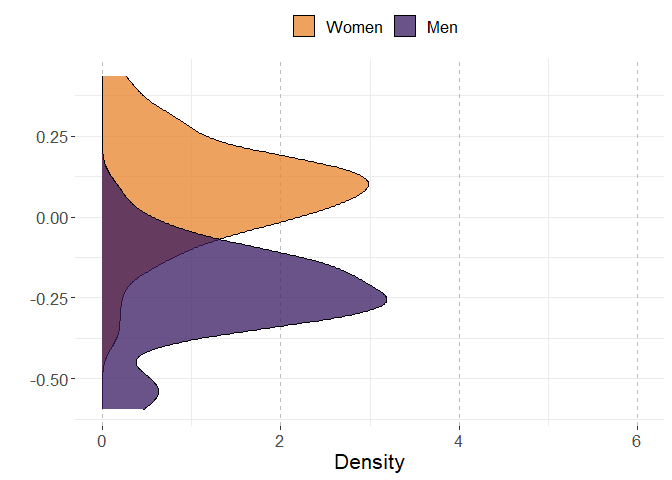
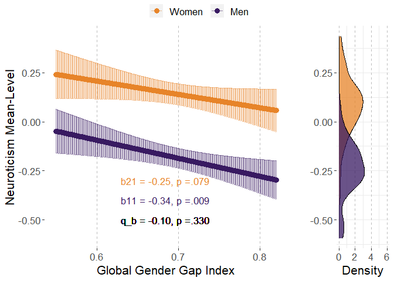

# Preparations

## Load packages


```r
library(multid)
library(lmerTest)
library(rio)
library(dplyr)
library(tibble)
library(ggpubr)
library(ggplot2)
library(MetBrewer)
library(emmeans)
library(finalfit)
source("../../custom_functions.R")
```

## Import data


```r
dat <- import("../data/ipip_processed.rda")
correlates <- import("../data/correlates.xlsx")
```


## Save variable names of the multivariate set to a vector


```r
per.facets<-
  names(dat)[which(names(dat)=="A.trust"):
              which(names(dat)=="O.liberalism")]
```


## Calculate trait means


```r
N.facets<-
  per.facets[grepl("N.",per.facets)]

dat$N<-rowMeans(dat[,N.facets],na.rm=T)

# standardize

dat$N.z<-(dat$N-mean(dat$N,na.rm=T))/sd(dat$N,na.rm=T)
```

## Standardize country-level predictors


```r
# save raw values for plotting
correlates$GenderGapIndex.raw<-correlates$GenderGapIndex
# standardize
correlates$GenderGapIndex<-
  scale(correlates$GenderGapIndex, center = T, scale=T)
```


## Merge correlates to the data files


```r
fdat<-left_join(x=dat,
                 y=correlates,
                 by=c("COUNTRY"="Country"))

fdat$sex.ratio<-fdat$nMale/(fdat$nMale+fdat$nFemale)

fdat$sex.c<-ifelse(fdat$SEX=="Female",-0.5,
                   ifelse(fdat$SEX=="Male",0.5,NA))

# exclude missing values
fdat <- fdat %>%
  dplyr::select("sex.c","N","N.z","COUNTRY","sex.ratio",
                "GenderGapIndex","GenderGapIndex.raw") %>%
  na.omit()
```


# Analysis

## Reliability of the difference score


```r
reliab.N.z<-
  reliability_dms(data=fdat,diff_var="sex.c",var = "N.z",
                  diff_var_values = c(0.5,-0.5),group_var = "COUNTRY")

export(t(data.frame(reliab.N.z)),
       "../results/reliab.N.z.xlsx",
       overwrite=T)
reliab.N.z
```

```
##              r11              r22              r12              sd1 
##        0.9823099        0.9854613        0.7925099        0.1607458 
##              sd2           sd_d12               m1               m2 
##        0.1599097        0.1032845       -0.2232042        0.1000911 
##            m_d12 reliability_dmsa 
##       -0.3232953        0.9223008
```


## Multi-level model

### Fit model


```r
fit_N.z<-
  ddsc_ml(data = fdat,predictor = "GenderGapIndex",
          covariates="sex.ratio",
          moderator = "sex.c",moderator_values=c(0.5,-0.5),
          DV = "N.z",lvl2_unit = "COUNTRY",re_cov_test = T,
          scaling_sd = "observed")
```

```
## NOTE: Results may be misleading due to involvement in interactions
```

```
## refitting model(s) with ML (instead of REML)
```

### Descriptive statistics


```r
export(rownames_to_column(data.frame(fit_N.z$descriptives)),
       "../results/N.z_ml_desc.xlsx",
       overwrite=T)
round(fit_N.z$descriptives,2)
```

```
##                           M   SD means_y1 means_y1_scaled means_y2
## means_y1              -0.22 0.16     1.00            1.00     0.79
## means_y1_scaled       -1.39 1.00     1.00            1.00     0.79
## means_y2               0.10 0.16     0.79            0.79     1.00
## means_y2_scaled        0.62 1.00     0.79            0.79     1.00
## GenderGapIndex         0.00 1.00    -0.32           -0.32    -0.25
## GenderGapIndex_scaled  0.00 1.00    -0.32           -0.32    -0.25
## diff_score            -0.32 0.10     0.33            0.33    -0.31
## diff_score_scaled     -2.02 0.64     0.33            0.33    -0.31
##                       means_y2_scaled GenderGapIndex GenderGapIndex_scaled
## means_y1                         0.79          -0.32                 -0.32
## means_y1_scaled                  0.79          -0.32                 -0.32
## means_y2                         1.00          -0.25                 -0.25
## means_y2_scaled                  1.00          -0.25                 -0.25
## GenderGapIndex                  -0.25           1.00                  1.00
## GenderGapIndex_scaled           -0.25           1.00                  1.00
## diff_score                      -0.31          -0.11                 -0.11
## diff_score_scaled               -0.31          -0.11                 -0.11
##                       diff_score diff_score_scaled
## means_y1                    0.33              0.33
## means_y1_scaled             0.33              0.33
## means_y2                   -0.31             -0.31
## means_y2_scaled            -0.31             -0.31
## GenderGapIndex             -0.11             -0.11
## GenderGapIndex_scaled      -0.11             -0.11
## diff_score                  1.00              1.00
## diff_score_scaled           1.00              1.00
```

```r
round(fit_N.z$SDs,2)
```

```
##         SD_y1         SD_y2     SD_pooled SD_diff_score            VR 
##          0.16          0.16          0.16          0.10          1.01
```

### Variance heterogeneity test


```r
export(t(data.frame(fit_N.z$re_cov_test)),
       "../results/N.z_ml_var_test.xlsx",
       overwrite=T)
round(fit_N.z$re_cov_test,3)
```

```
## RE_cov RE_cor  Chisq     Df      p 
## -0.002 -0.123  0.538  1.000  0.463
```

### Component correlation


```r
export(rownames_to_column(data.frame(fit_N.z$ddsc_sem_fit$variance_test)),
       "../results/N.z_ml_comp_cor.xlsx",
       overwrite=T)
round(fit_N.z$ddsc_sem_fit$variance_test,3)
```

```
##             est    se      z pvalue ci.lower ci.upper
## cov_y1y2  0.777 0.177  4.392  0.000    0.430    1.123
## var_y1    0.985 0.197  5.000  0.000    0.599    1.371
## var_y2    0.975 0.195  5.000  0.000    0.593    1.357
## var_diff  0.010 0.169  0.060  0.952   -0.321    0.342
## var_ratio 1.010 0.174  5.797  0.000    0.669    1.352
## cor_y1y2  0.793 0.053 15.067  0.000    0.689    0.896
```

### Deconstructing results


```r
export(rownames_to_column(data.frame(fit_N.z$results)),
       "../results/N.z_ml_results.xlsx",
       overwrite=T)
round(fit_N.z$results,3)
```

```
##                            estimate    SE     df t.ratio p.value
## r_xy1y2                      -0.139 0.141 44.444  -0.985   0.330
## w_11                         -0.055 0.020 47.142  -2.722   0.009
## w_21                         -0.041 0.023 45.999  -1.797   0.079
## r_xy1                        -0.342 0.126 47.142  -2.722   0.009
## r_xy2                        -0.254 0.141 45.999  -1.797   0.079
## b_11                         -0.343 0.126 47.142  -2.722   0.009
## b_21                         -0.253 0.141 45.999  -1.797   0.079
## main_effect                  -0.048 0.020 47.029  -2.372   0.022
## moderator_effect             -0.324 0.015 46.109 -22.151   0.000
## interaction                  -0.014 0.015 44.444  -0.985   0.330
## q_b11_b21                    -0.098    NA     NA      NA      NA
## q_rxy1_rxy2                  -0.097    NA     NA      NA      NA
## cross_over_point            -22.554    NA     NA      NA      NA
## interaction_vs_main          -0.033 0.027 45.580  -1.244   0.220
## interaction_vs_main_bscale   -0.208 0.167 45.580  -1.244   0.220
## interaction_vs_main_rscale   -0.210 0.168 45.581  -1.247   0.219
## dadas                        -0.081 0.045 45.999  -1.797   0.961
## dadas_bscale                 -0.506 0.282 45.999  -1.797   0.961
## dadas_rscale                 -0.507 0.282 45.999  -1.797   0.961
## abs_diff                      0.014 0.015 44.444   0.985   0.165
## abs_sum                       0.095 0.040 47.029   2.372   0.011
## abs_diff_bscale               0.090 0.091 44.444   0.985   0.165
## abs_sum_bscale                0.595 0.251 47.029   2.372   0.011
## abs_diff_rscale               0.088 0.091 44.473   0.967   0.170
## abs_sum_rscale                0.595 0.251 47.027   2.370   0.011
```

### Multi-level model output


```r
# cross-level interaction model
summary(fit_N.z$model)
```

```
## Linear mixed model fit by REML. t-tests use Satterthwaite's method [
## lmerModLmerTest]
## Formula: model_formula
##    Data: data
## Control: lme4::lmerControl(optimizer = "bobyqa")
## 
## REML criterion at convergence: 2371233
## 
## Scaled residuals: 
##     Min      1Q  Median      3Q     Max 
## -3.1700 -0.7166 -0.0388  0.6755  3.6363 
## 
## Random effects:
##  Groups   Name        Variance Std.Dev. Corr 
##  COUNTRY  (Intercept) 0.019173 0.13847       
##           sex.c       0.008198 0.09054  -0.20
##  Residual             0.958536 0.97905       
## Number of obs: 848115, groups:  COUNTRY, 50
## 
## Fixed effects:
##                      Estimate Std. Error       df t value Pr(>|t|)    
## (Intercept)           0.33036    0.13574 46.90153   2.434  0.01881 *  
## sex.c                -0.32390    0.01462 46.10872 -22.151  < 2e-16 ***
## GenderGapIndex       -0.04774    0.02013 47.02919  -2.372  0.02186 *  
## sex.ratio            -0.82235    0.28124 46.85260  -2.924  0.00531 ** 
## sex.c:GenderGapIndex -0.01436    0.01458 44.44410  -0.985  0.33004    
## ---
## Signif. codes:  0 '***' 0.001 '**' 0.01 '*' 0.05 '.' 0.1 ' ' 1
## 
## Correlation of Fixed Effects:
##             (Intr) sex.c  GndrGI sex.rt
## sex.c       -0.020                     
## GendrGpIndx -0.061 -0.001              
## sex.ratio   -0.989 -0.005  0.060       
## sx.c:GndrGI -0.005 -0.058 -0.175  0.005
```

```r
# reduced model without the predictor
summary(fit_N.z$reduced_model)
```

```
## Linear mixed model fit by REML. t-tests use Satterthwaite's method [
## lmerModLmerTest]
## Formula: N.z ~ sex.c + sex.ratio + (sex.c | COUNTRY)
##    Data: data
## Control: lme4::lmerControl(optimizer = "bobyqa")
## 
## REML criterion at convergence: 2371227
## 
## Scaled residuals: 
##     Min      1Q  Median      3Q     Max 
## -3.1699 -0.7166 -0.0395  0.6755  3.6346 
## 
## Random effects:
##  Groups   Name        Variance Std.Dev. Corr 
##  COUNTRY  (Intercept) 0.020907 0.14459       
##           sex.c       0.008314 0.09118  -0.12
##  Residual             0.958536 0.97905       
## Number of obs: 848115, groups:  COUNTRY, 50
## 
## Fixed effects:
##             Estimate Std. Error       df t value Pr(>|t|)    
## (Intercept)  0.28902    0.14266 47.17667   2.026   0.0485 *  
## sex.c       -0.32500    0.01468 47.44834 -22.133   <2e-16 ***
## sex.ratio   -0.73652    0.29568 47.23112  -2.491   0.0163 *  
## ---
## Signif. codes:  0 '***' 0.001 '**' 0.01 '*' 0.05 '.' 0.1 ' ' 1
## 
## Correlation of Fixed Effects:
##           (Intr) sex.c 
## sex.c     -0.010       
## sex.ratio -0.989 -0.006
```

## COUNTRY-level path model

### Fit the model

The model is already stored within the multi-level model object. 


```r
fit_N.z_sem<-fit_N.z$ddsc_sem_fit
```

### Results


```r
export(rownames_to_column(data.frame(fit_N.z_sem$results)),
       "../results/N.z_sem_results.xlsx",
       overwrite=T)
round(fit_N.z_sem$results,3)
```

```
##                                     est     se       z pvalue ci.lower ci.upper
## r_xy1_y2                         -0.109  0.141  -0.778  0.437   -0.385    0.166
## r_xy1                            -0.318  0.134  -2.369  0.018   -0.581   -0.055
## r_xy2                            -0.249  0.137  -1.816  0.069   -0.517    0.020
## b_11                             -0.319  0.134  -2.369  0.018   -0.582   -0.055
## b_21                             -0.248  0.137  -1.816  0.069   -0.516    0.020
## b_10                             -1.392  0.133 -10.460  0.000   -1.653   -1.131
## b_20                              0.624  0.135   4.616  0.000    0.359    0.889
## res_cov_y1_y2                     0.699  0.161   4.338  0.000    0.383    1.015
## diff_b10_b20                     -2.016  0.090 -22.493  0.000   -2.192   -1.841
## diff_b11_b21                     -0.070  0.091  -0.778  0.437   -0.248    0.107
## diff_rxy1_rxy2                   -0.069  0.091  -0.761  0.447   -0.246    0.109
## q_b11_b21                        -0.077  0.099  -0.776  0.438   -0.270    0.117
## q_rxy1_rxy2                      -0.075  0.099  -0.760  0.447   -0.268    0.118
## cross_over_point                -28.636 36.849  -0.777  0.437 -100.859   43.587
## sum_b11_b21                      -0.567  0.255  -2.218  0.027   -1.067   -0.066
## main_effect                      -0.283  0.128  -2.218  0.027   -0.534   -0.033
## interaction_vs_main_effect       -0.213  0.158  -1.344  0.179   -0.523    0.098
## diff_abs_b11_abs_b21              0.070  0.091   0.778  0.437   -0.107    0.248
## abs_diff_b11_b21                  0.070  0.091   0.778  0.218   -0.107    0.248
## abs_sum_b11_b21                   0.567  0.255   2.218  0.013    0.066    1.067
## dadas                            -0.496  0.273  -1.816  0.965   -1.032    0.039
## q_r_equivalence                   0.075  0.099   0.760  0.776       NA       NA
## q_b_equivalence                   0.077  0.099   0.776  0.781       NA       NA
## cross_over_point_equivalence     28.636 36.849   0.777  0.781       NA       NA
## cross_over_point_minimal_effect  28.636 36.849   0.777  0.219       NA       NA
```


# Plotting the results


```r
# refit reduced and full models with GGGI in original scale

ml_N.z_red<-fit_N.z$reduced_model
  
# refit the model with raw variable
ml_N.z<-
  lmer(N.z~sex.c+
         sex.ratio+
         GenderGapIndex.raw+
         sex.c:GenderGapIndex.raw+
         (sex.c|COUNTRY),data=fdat,
       control = lmerControl(optimizer="bobyqa",
                             optCtrl=list(maxfun=2e6)))


# point predictions as function of GGGI for components

p<-
  emmip(
    ml_N.z, 
    sex.c ~ GenderGapIndex.raw,
    at=list(sex.c = c(-0.5,0.5),
            GenderGapIndex.raw=
              seq(from=round(range(fdat$GenderGapIndex.raw)[1],2),
                  to=round(range(fdat$GenderGapIndex.raw)[2],2),
                  by=0.001)),
    plotit=F,CIs=T,lmerTest.limit = 1e6,disable.pbkrtest=T)

p$sex<-p$tvar
levels(p$sex)<-c("Women","Men")

# obtain min and max for aligned plots
min.y.comp<-min(p$LCL)
max.y.comp<-max(p$UCL)

# Men and Women mean distributions

p3<-coefficients(ml_N.z_red)$COUNTRY
p3<-cbind(rbind(p3,p3),weight=rep(c(-0.5,0.5),each=nrow(p3)))
p3$xvar<-p3$`(Intercept)`+p3$sex.ratio*0.5+p3$sex.c*p3$weight
p3$sex<-as.factor(p3$weight)
levels(p3$sex)<-c("Women","Men")

# obtain min and max for aligned plots
min.y.mean.distr<-min(p3$xvar)
max.y.mean.distr<-max(p3$xvar)


# obtain the coefs for the sex-effect (difference) as function of GGGI

p2<-data.frame(
  emtrends(ml_N.z,var="+1*sex.c",
           specs="GenderGapIndex.raw",
           at=list(#sex.c = c(-0.5,0.5),
             GenderGapIndex.raw=
               seq(from=round(range(fdat$GenderGapIndex.raw)[1],2),
                   to=round(range(fdat$GenderGapIndex.raw)[2],2),
                   by=0.001)),
           lmerTest.limit = 1e6,disable.pbkrtest=T))

p2$yvar<-p2$X.1.sex.c.trend
p2$xvar<-p2$GenderGapIndex.raw
p2$LCL<-p2$lower.CL
p2$UCL<-p2$upper.CL

# obtain min and max for aligned plots
min.y.diff<-min(p2$LCL)
max.y.diff<-max(p2$UCL)

# difference score distribution

p4<-coefficients(ml_N.z_red)$COUNTRY
p4$xvar=(+1)*p4$sex.c

# obtain mix and max for aligned plots

min.y.diff.distr<-min(p4$xvar)
max.y.diff.distr<-max(p4$xvar)

# define mins and maxs

min.y.pred<-
  ifelse(min.y.comp<min.y.mean.distr,min.y.comp,min.y.mean.distr)

max.y.pred<-
  ifelse(max.y.comp>max.y.mean.distr,max.y.comp,max.y.mean.distr)

min.y.narrow<-
  ifelse(min.y.diff<min.y.diff.distr,min.y.diff,min.y.diff.distr)

max.y.narrow<-
  ifelse(max.y.diff>max.y.diff.distr,max.y.diff,max.y.diff.distr)


# Figures 

# p1

# scaled simple effects to the plot


pvals<-p_coding(c(fit_N.z$results["b_21","p.value"],
                    fit_N.z$results["b_11","p.value"]))

ests<-
  round_tidy(c(fit_N.z$results["b_21","estimate"],
               fit_N.z$results["b_11","estimate"]),2)

coef1<-paste0("b21 = ",ests[1],", p ",
               ifelse(fit_N.z$results["b_21","p.value"]<.001,
                      "","="),pvals[1])
coef2<-paste0("b11 = ",ests[2],", p ",
               ifelse(fit_N.z$results["b_11","p.value"]<.001,
                      "","="),pvals[2])

coef_q<-round_tidy(fit_N.z$results["q_b11_b21","estimate"],2)
coef_q<-paste0("q_b = ",coef_q,", p ",
               ifelse(fit_N.z$results["interaction","p.value"]<.001,"","="),
               p_coding(fit_N.z$results["interaction","p.value"]))

coefs<-data.frame(sex=c("Women","Men"),
                  coef=c(coef1,coef2))

p1.N.z<-ggplot(p,aes(y=yvar,x=xvar,color=sex))+
  geom_point(size=3)+
  geom_errorbar(aes(ymin=LCL, ymax=UCL),alpha=0.5)+
  xlab("Global Gender Gap Index")+
  #ylim=c(2.3,3.9)+
  ylim(c(min.y.pred,max.y.pred))+
  ylab("Neuroticism Mean-Level")+
  scale_color_manual(values=met.brewer("Archambault")[c(6,2)])+
  theme(legend.position = "top",
        legend.title=element_blank(),
        text=element_text(size=16,  family="sans"),
        panel.background = element_rect(fill = "white",
                                        #colour = "black",
                                        #size = 0.5, linetype = "solid"
        ),
        panel.grid.major.x = element_line(linewidth = 0.5, linetype = 2,
                                          colour = "gray"))+
  geom_text(data = coefs,show.legend=F,
            aes(label=coef,x=0.63,
                y=c(-0.3
                    ,-0.4),size=14,hjust="left"))+
  geom_text(inherit.aes=F,aes(x=0.63,y=-0.5,
                              label=coef_q,size=14,hjust="left"),
            show.legend=F)
p1.N.z
```

<!-- -->

```r
# prediction plot for difference score


pvals2<-p_coding(fit_N.z$results["r_xy1y2","p.value"])

ests2<-
  round_tidy(fit_N.z$results["r_xy1y2","estimate"],2)

coefs2<-paste0("r = ",ests2,
               ", p ",
               ifelse(fit_N.z$results["r_xy1y2","p.value"]<.001,"","="),
               pvals2)


p2.N.z<-ggplot(p2,aes(y=yvar,x=xvar))+
  geom_point(size=3)+
  geom_errorbar(aes(ymin=LCL, ymax=UCL),alpha=0.5)+
  xlab("Global Gender Gap Index")+
  ylim(c(min.y.narrow,max.y.narrow))+
  ylab("Difference in Neuroticism")+
  #scale_color_manual(values=met.brewer("Archambault")[c(6,2)])+
  theme(legend.position = "right",
        legend.title=element_blank(),
        text=element_text(size=16,  family="sans"),
        panel.background = element_rect(fill = "white",
                                        #colour = "black",
                                        #size = 0.5, linetype = "solid"
        ),
        panel.grid.major.x = element_line(size = 0.5, linetype = 2,
                                          colour = "gray"))+
  #geom_text(coef2,aes(x=0.63,y=min(p2$LCL)))
  geom_text(data = data.frame(coefs2),show.legend=F,
            aes(label=coefs2,x=0.63,hjust="left",
                y=c(round(min(p2$LCL),2)),size=14))
p2.N.z
```

<!-- -->

```r
# mean-level distributions

p3.N.z<-
  ggplot(p3, aes(x=xvar, fill=sex)) + 
  geom_density(alpha=.75) + 
  scale_fill_manual(values=met.brewer("Archambault")[c(6,2)])+
  #scale_fill_manual(values=c("turquoise3","orangered2","black")) + 
  xlab("")+
  ylab("Density")+
  ylim(c(0,6))+
  xlim(c(min.y.pred,max.y.pred))+
  theme_bw()+
  theme(legend.position = "top",
        legend.title=element_blank(),
        text=element_text(size=16,  family="sans"),
        panel.border = element_blank(),
        panel.background = element_rect(fill = "white",
                                        #colour = "black",
                                        #size = 0.5, linetype = "solid"
        ),
        panel.grid.major.x = element_line(size = 0.5, linetype = 2,
                                          colour = "gray"))+
  coord_flip()
p3.N.z
```

<!-- -->

```r
# distribution for mean differences

p4.N.z<-
  ggplot(p4, aes(x=xvar,fill="black")) + 
  geom_density(alpha=.75) + 
  scale_fill_manual(values="black")+
  #scale_fill_manual(values=c("turquoise3","orangered2","black")) + 
  xlab("")+
  ylab("Density")+
  ylim(c(0,6))+
  xlim(c(min.y.narrow,max.y.narrow))+
  theme_bw()+
  theme(legend.position = "none",
        legend.title=element_blank(),
        text=element_text(size=16,  family="sans"),
        panel.border = element_blank(),
        panel.background = element_rect(fill = "white",
                                        #colour = "black",
                                        #size = 0.5, linetype = "solid"
        ),
        panel.grid.major.x = element_line(size = 0.5, linetype = 2,
                                          colour = "gray"))+
  coord_flip()
p4.N.z
```

<!-- -->

```r
# combine component-specific predictions

p13.N.z<-
  ggarrange(p1.N.z, p3.N.z,common.legend = T,
            ncol=2, nrow=1,widths=c(4,1.4)
  )

p13.N.z
```

<!-- -->

```r
# combine difference score predictions

p24.N.z<-
  ggarrange(p2.N.z, p4.N.z,
            ncol=2, nrow=1,widths=c(4,1.4)
  )

p24.N.z
```

<!-- -->

```r
pall.N.z<-
  ggarrange(p13.N.z,p24.N.z,align = "hv",
            ncol=1,nrow=2,heights=c(2,1))
pall.N.z
```

<!-- -->

```r
png(filename = 
      "../results/pall.N.z.png",
    units = "cm",
    width = 21.0,height=29.7*(4/5),res = 600)
pall.N.z
dev.off()
```

```
## png 
##   2
```

# Session information


```r
s<-sessionInfo()
print(s,locale=F)
```

```
## R version 4.3.0 (2023-04-21 ucrt)
## Platform: x86_64-w64-mingw32/x64 (64-bit)
## Running under: Windows 10 x64 (build 19045)
## 
## Matrix products: default
## 
## 
## attached base packages:
## [1] stats     graphics  grDevices utils     datasets  methods   base     
## 
## other attached packages:
##  [1] finalfit_1.0.6    emmeans_1.8.6     MetBrewer_0.2.0   ggpubr_0.6.0     
##  [5] ggplot2_3.4.2     tibble_3.2.1      dplyr_1.1.2       rio_0.5.29       
##  [9] lmerTest_3.1-3    lme4_1.1-33       Matrix_1.5-4      multid_0.8.0.9000
## [13] knitr_1.42        rmarkdown_2.21   
## 
## loaded via a namespace (and not attached):
##  [1] tidyselect_1.2.0    farver_2.1.1        fastmap_1.1.1      
##  [4] pROC_1.18.2         digest_0.6.31       estimability_1.4.1 
##  [7] lifecycle_1.0.3     survival_3.5-5      magrittr_2.0.3     
## [10] compiler_4.3.0      rlang_1.1.1         sass_0.4.6         
## [13] tools_4.3.0         utf8_1.2.3          yaml_2.3.7         
## [16] data.table_1.14.8   ggsignif_0.6.4      labeling_0.4.2     
## [19] mnormt_2.1.1        curl_5.0.0          plyr_1.8.8         
## [22] abind_1.4-5         withr_2.5.0         foreign_0.8-84     
## [25] purrr_1.0.1         numDeriv_2016.8-1.1 stats4_4.3.0       
## [28] grid_4.3.0          fansi_1.0.4         lavaan_0.6-15      
## [31] xtable_1.8-4        colorspace_2.1-0    mice_3.15.0        
## [34] scales_1.2.1        iterators_1.0.14    MASS_7.3-58.4      
## [37] cli_3.6.1           mvtnorm_1.1-3       crayon_1.5.2       
## [40] generics_0.1.3      rstudioapi_0.14     readxl_1.4.2       
## [43] minqa_1.2.5         cachem_1.0.8        splines_4.3.0      
## [46] parallel_4.3.0      cellranger_1.1.0    vctrs_0.6.2        
## [49] boot_1.3-28.1       glmnet_4.1-7        jsonlite_1.8.4     
## [52] carData_3.0-5       car_3.1-2           hms_1.1.3          
## [55] rstatix_0.7.2       foreach_1.5.2       tidyr_1.3.0        
## [58] jquerylib_0.1.4     glue_1.6.2          nloptr_2.0.3       
## [61] codetools_0.2-19    cowplot_1.1.1       stringi_1.7.12     
## [64] gtable_0.3.3        shape_1.4.6         quadprog_1.5-8     
## [67] munsell_0.5.0       pillar_1.9.0        htmltools_0.5.5    
## [70] R6_2.5.1            pbivnorm_0.6.0      evaluate_0.21      
## [73] lattice_0.21-8      highr_0.10          haven_2.5.2        
## [76] backports_1.4.1     openxlsx_4.2.5.2    broom_1.0.4        
## [79] bslib_0.4.2         Rcpp_1.0.10         zip_2.3.0          
## [82] gridExtra_2.3       nlme_3.1-162        xfun_0.39          
## [85] forcats_1.0.0       pkgconfig_2.0.3
```

