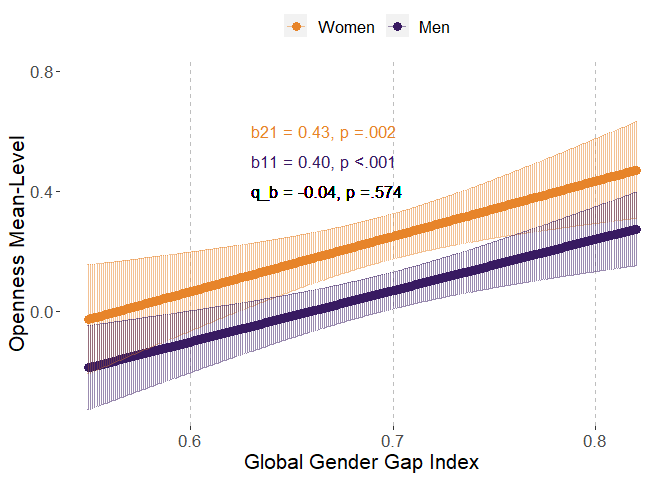
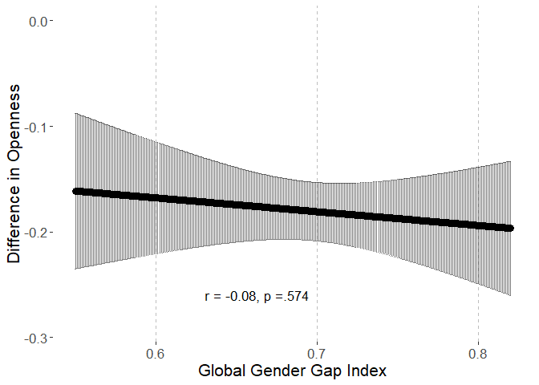
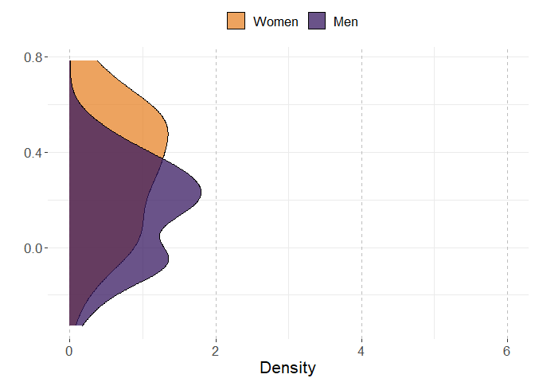
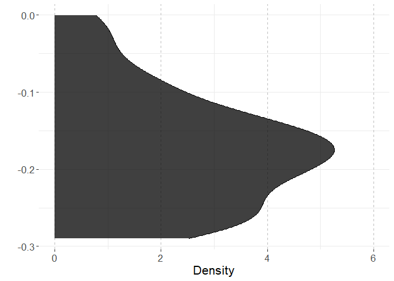
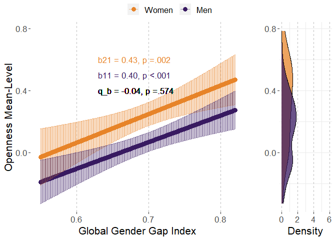
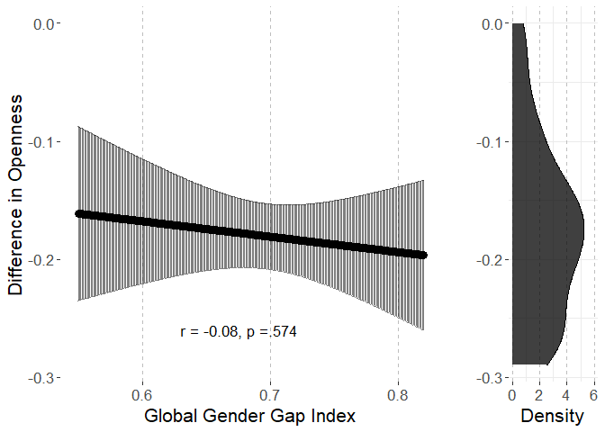
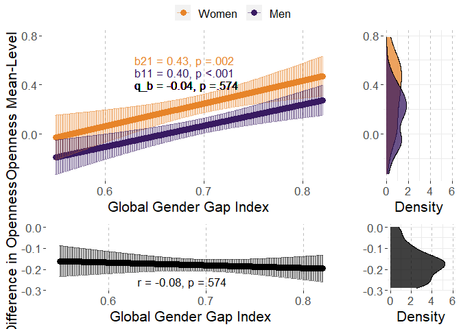

# Preparations

## Load packages


```r
library(multid)
library(lmerTest)
library(rio)
library(dplyr)
library(tibble)
library(ggpubr)
library(ggplot2)
library(MetBrewer)
library(emmeans)
library(finalfit)
source("../../custom_functions.R")
```

## Import data


```r
dat <- import("../data/ipip_processed.rda")
correlates <- import("../data/correlates.xlsx")
```


## Save variable names of the multivariate set to a vector


```r
per.facets<-
  names(dat)[which(names(dat)=="A.trust"):
              which(names(dat)=="O.liberalism")]
```


## Calculate trait means


```r
O.facets<-
  per.facets[grepl("O.",per.facets)]

dat$O<-rowMeans(dat[,O.facets],na.rm=T)

# standardize

dat$O.z<-(dat$O-mean(dat$O,na.rm=T))/sd(dat$O,na.rm=T)
```

## Standardize country-level predictors


```r
# save raw values for plotting
correlates$GenderGapIndex.raw<-correlates$GenderGapIndex
# standardize
correlates$GenderGapIndex<-
  scale(correlates$GenderGapIndex, center = T, scale=T)
```


## Merge correlates to the data files


```r
fdat<-left_join(x=dat,
                 y=correlates,
                 by=c("COUNTRY"="Country"))

fdat$sex.ratio<-fdat$nMale/(fdat$nMale+fdat$nFemale)

fdat$sex.c<-ifelse(fdat$SEX=="Female",-0.5,
                   ifelse(fdat$SEX=="Male",0.5,NA))

# exclude missing values
fdat <- fdat %>%
  dplyr::select("sex.c","O","O.z","COUNTRY","sex.ratio",
                "GenderGapIndex","GenderGapIndex.raw") %>%
  na.omit()
```


# Analysis

## Reliability of the difference score


```r
reliab.O.z<-
  reliability_dms(data=fdat,diff_var="sex.c",var = "O.z",
                  diff_var_values = c(0.5,-0.5),group_var = "COUNTRY")

export(t(data.frame(reliab.O.z)),
       "../results/reliab.O.z.xlsx",
       overwrite=T)
reliab.O.z
```

```
##              r11              r22              r12              sd1 
##       0.99333418       0.99529260       0.95089150       0.22828447 
##              sd2           sd_d12               m1               m2 
##       0.28701543       0.09942142       0.12011642       0.30148501 
##            m_d12 reliability_dmsa 
##      -0.18136860       0.92562516
```


## Multi-level model

### Fit model


```r
fit_O.z<-
  ddsc_ml(data = fdat,predictor = "GenderGapIndex",
          covariates="sex.ratio",
          moderator = "sex.c",moderator_values=c(0.5,-0.5),
          DV = "O.z",lvl2_unit = "COUNTRY",re_cov_test = T,
          scaling_sd = "observed")
```

### Descriptive statistics


```r
export(rownames_to_column(data.frame(fit_O.z$descriptives)),
       "../results/O.z_ml_desc.xlsx",
       overwrite=T)
round(fit_O.z$descriptives,2)
```

```
##                           M   SD means_y1 means_y1_scaled means_y2
## means_y1               0.12 0.23     1.00            1.00     0.95
## means_y1_scaled        0.46 0.88     1.00            1.00     0.95
## means_y2               0.30 0.29     0.95            0.95     1.00
## means_y2_scaled        1.16 1.11     0.95            0.95     1.00
## GenderGapIndex         0.00 1.00     0.43            0.43     0.36
## GenderGapIndex_scaled  0.00 1.00     0.43            0.43     0.36
## diff_score            -0.18 0.10    -0.45           -0.45    -0.70
## diff_score_scaled     -0.70 0.38    -0.45           -0.45    -0.70
##                       means_y2_scaled GenderGapIndex GenderGapIndex_scaled
## means_y1                         0.95           0.43                  0.43
## means_y1_scaled                  0.95           0.43                  0.43
## means_y2                         1.00           0.36                  0.36
## means_y2_scaled                  1.00           0.36                  0.36
## GenderGapIndex                   0.36           1.00                  1.00
## GenderGapIndex_scaled            0.36           1.00                  1.00
## diff_score                      -0.70          -0.06                 -0.06
## diff_score_scaled               -0.70          -0.06                 -0.06
##                       diff_score diff_score_scaled
## means_y1                   -0.45             -0.45
## means_y1_scaled            -0.45             -0.45
## means_y2                   -0.70             -0.70
## means_y2_scaled            -0.70             -0.70
## GenderGapIndex             -0.06             -0.06
## GenderGapIndex_scaled      -0.06             -0.06
## diff_score                  1.00              1.00
## diff_score_scaled           1.00              1.00
```

```r
round(fit_O.z$SDs,2)
```

```
##         SD_y1         SD_y2     SD_pooled SD_diff_score            VR 
##          0.23          0.29          0.26          0.10          0.63
```

### Variance heterogeneity test


```r
export(t(data.frame(fit_O.z$re_cov_test)),
       "../results/O.z_ml_var_test.xlsx",
       overwrite=T)
round(fit_O.z$re_cov_test,3)
```

```
## RE_cov RE_cor  Chisq     Df      p 
## -0.013 -0.670 17.236  1.000  0.000
```

### Component correlation


```r
export(rownames_to_column(data.frame(fit_O.z$ddsc_sem_fit$variance_test)),
       "../results/O.z_ml_comp_cor.xlsx",
       overwrite=T)
round(fit_O.z$ddsc_sem_fit$variance_test,3)
```

```
##              est    se      z pvalue ci.lower ci.upper
## cov_y1y2   0.908 0.186  4.873      0    0.543    1.273
## var_y1     0.759 0.152  5.000      0    0.462    1.057
## var_y2     1.201 0.240  5.000      0    0.730    1.671
## var_diff  -0.441 0.122 -3.629      0   -0.679   -0.203
## var_ratio  0.633 0.055 11.422      0    0.524    0.741
## cor_y1y2   0.951 0.014 70.182      0    0.924    0.977
```

### Deconstructing results


```r
export(rownames_to_column(data.frame(fit_O.z$results)),
       "../results/O.z_ml_results.xlsx",
       overwrite=T)
round(fit_O.z$results,3)
```

```
##                            estimate    SE     df t.ratio p.value ci.lower
## r_xy1y2                      -0.078 0.138 43.934  -0.566   0.574   -0.357
## w_11                          0.102 0.026 43.765   4.010   0.000    0.051
## w_21                          0.110 0.034 44.046   3.263   0.002    0.042
## r_xy1                         0.448 0.112 43.765   4.010   0.000    0.223
## r_xy2                         0.384 0.118 44.046   3.263   0.002    0.147
## b_11                          0.397 0.099 43.765   4.010   0.000    0.198
## b_21                          0.427 0.131 44.046   3.263   0.002    0.163
## main_effect                   0.106 0.029 43.838   3.648   0.001    0.048
## moderator_effect             -0.180 0.014 45.096 -13.074   0.000   -0.208
## interaction                  -0.008 0.014 43.934  -0.566   0.574   -0.035
## q_b11_b21                    -0.036    NA     NA      NA      NA       NA
## q_rxy1_rxy2                   0.078    NA     NA      NA      NA       NA
## cross_over_point            -23.110    NA     NA      NA      NA       NA
## interaction_vs_main          -0.098 0.023 43.438  -4.201   0.000   -0.146
## interaction_vs_main_bscale   -0.382 0.091 43.438  -4.201   0.000   -0.565
## interaction_vs_main_rscale   -0.481 0.115 43.612  -4.176   0.000   -0.712
## dadas                        -0.205 0.051 43.765  -4.010   1.000   -0.308
## dadas_bscale                 -0.794 0.198 43.765  -4.010   1.000   -1.194
## dadas_rscale                 -0.896 0.224 43.765  -4.010   1.000   -1.347
## abs_diff                      0.008 0.014 43.934   0.566   0.287   -0.020
## abs_sum                       0.212 0.058 43.838   3.648   0.000    0.095
## abs_diff_bscale               0.030 0.053 43.934   0.566   0.287   -0.077
## abs_sum_bscale                0.824 0.226 43.838   3.648   0.000    0.369
## abs_diff_rscale              -0.065 0.043 39.842  -1.488   0.928   -0.152
## abs_sum_rscale                0.832 0.225 43.824   3.692   0.000    0.378
##                            ci.upper
## r_xy1y2                       0.200
## w_11                          0.154
## w_21                          0.178
## r_xy1                         0.674
## r_xy2                         0.621
## b_11                          0.597
## b_21                          0.691
## main_effect                   0.165
## moderator_effect             -0.152
## interaction                   0.020
## q_b11_b21                        NA
## q_rxy1_rxy2                      NA
## cross_over_point                 NA
## interaction_vs_main          -0.051
## interaction_vs_main_bscale   -0.199
## interaction_vs_main_rscale   -0.249
## dadas                        -0.102
## dadas_bscale                 -0.395
## dadas_rscale                 -0.446
## abs_diff                      0.035
## abs_sum                       0.330
## abs_diff_bscale               0.138
## abs_sum_bscale                1.280
## abs_diff_rscale               0.023
## abs_sum_rscale                1.286
```

### Multi-level model output


```r
# cross-level interaction model
summary(fit_O.z$model)
```

```
## Linear mixed model fit by REML. t-tests use Satterthwaite's method [
## lmerModLmerTest]
## Formula: model_formula
##    Data: data
## Control: lme4::lmerControl(optimizer = "bobyqa")
## 
## REML criterion at convergence: 2384868
## 
## Scaled residuals: 
##     Min      1Q  Median      3Q     Max 
## -5.2255 -0.6714 -0.0060  0.7154  3.0940 
## 
## Random effects:
##  Groups   Name        Variance Std.Dev. Corr 
##  COUNTRY  (Intercept) 0.040826 0.20206       
##           sex.c       0.007146 0.08454  -0.70
##  Residual             0.974061 0.98695       
## Number of obs: 848115, groups:  COUNTRY, 50
## 
## Fixed effects:
##                       Estimate Std. Error        df t value Pr(>|t|)    
## (Intercept)          -0.345575   0.157613 41.684032  -2.193 0.033974 *  
## sex.c                -0.179968   0.013765 45.095513 -13.074  < 2e-16 ***
## GenderGapIndex        0.106215   0.029117 43.838274   3.648 0.000699 ***
## sex.ratio             1.162329   0.324352 40.367671   3.584 0.000903 ***
## sex.c:GenderGapIndex -0.007787   0.013749 43.934241  -0.566 0.574008    
## ---
## Signif. codes:  0 '***' 0.001 '**' 0.01 '*' 0.05 '.' 0.1 ' ' 1
## 
## Correlation of Fixed Effects:
##             (Intr) sex.c  GndrGI sex.rt
## sex.c       -0.128                     
## GendrGpIndx -0.048  0.001              
## sex.ratio   -0.983  0.018  0.048       
## sx.c:GndrGI -0.020 -0.065 -0.609  0.020
```

```r
# reduced model without the predictor
summary(fit_O.z$reduced_model)
```

```
## Linear mixed model fit by REML. t-tests use Satterthwaite's method [
## lmerModLmerTest]
## Formula: O.z ~ sex.c + sex.ratio + (sex.c | COUNTRY)
##    Data: data
## Control: lme4::lmerControl(optimizer = "bobyqa")
## 
## REML criterion at convergence: 2384871
## 
## Scaled residuals: 
##     Min      1Q  Median      3Q     Max 
## -5.2232 -0.6714 -0.0060  0.7154  3.0940 
## 
## Random effects:
##  Groups   Name        Variance Std.Dev. Corr 
##  COUNTRY  (Intercept) 0.052843 0.22988       
##           sex.c       0.006796 0.08244  -0.67
##  Residual             0.974061 0.98695       
## Number of obs: 848115, groups:  COUNTRY, 50
## 
## Fixed effects:
##             Estimate Std. Error       df t value Pr(>|t|)    
## (Intercept) -0.26051    0.18311 43.83727  -1.423   0.1619    
## sex.c       -0.17728    0.01347 45.24383 -13.166   <2e-16 ***
## sex.ratio    0.98562    0.37715 42.61390   2.613   0.0123 *  
## ---
## Signif. codes:  0 '***' 0.001 '**' 0.01 '*' 0.05 '.' 0.1 ' ' 1
## 
## Correlation of Fixed Effects:
##           (Intr) sex.c 
## sex.c     -0.126       
## sex.ratio -0.984  0.023
```

## COUNTRY-level path model

### Fit the model

The model is already stored within the multi-level model object. 


```r
fit_O.z_sem<-fit_O.z$ddsc_sem_fit
```

### Results


```r
export(rownames_to_column(data.frame(fit_O.z_sem$results)),
       "../results/O.z_sem_results.xlsx",
       overwrite=T)
round(fit_O.z_sem$results,3)
```

```
##                                     est     se       z pvalue ci.lower ci.upper
## r_xy1_y2                         -0.060  0.141  -0.425  0.671   -0.337    0.217
## r_xy1                             0.430  0.128   3.369  0.001    0.180    0.680
## r_xy2                             0.363  0.132   2.754  0.006    0.105    0.621
## b_11                              0.379  0.112   3.369  0.001    0.158    0.599
## b_21                              0.402  0.146   2.754  0.006    0.116    0.688
## b_10                              0.463  0.111   4.163  0.000    0.245    0.681
## b_20                              1.163  0.144   8.052  0.000    0.880    1.446
## res_cov_y1_y2                     0.759  0.156   4.856  0.000    0.453    1.065
## diff_b10_b20                     -0.699  0.054 -13.054  0.000   -0.804   -0.594
## diff_b11_b21                     -0.023  0.054  -0.425  0.671   -0.129    0.083
## diff_rxy1_rxy2                    0.067  0.043   1.553  0.120   -0.018    0.152
## q_b11_b21                        -0.027  0.066  -0.412  0.681   -0.156    0.102
## q_rxy1_rxy2                       0.080  0.051   1.552  0.121   -0.021    0.181
## cross_over_point                -30.424 71.667  -0.425  0.671 -170.888  110.040
## sum_b11_b21                       0.780  0.255   3.063  0.002    0.281    1.280
## main_effect                       0.390  0.127   3.063  0.002    0.141    0.640
## interaction_vs_main_effect       -0.367  0.103  -3.582  0.000   -0.568   -0.166
## diff_abs_b11_abs_b21             -0.023  0.054  -0.425  0.671   -0.129    0.083
## abs_diff_b11_b21                  0.023  0.054   0.425  0.336   -0.083    0.129
## abs_sum_b11_b21                   0.780  0.255   3.063  0.001    0.281    1.280
## dadas                            -0.757  0.225  -3.369  1.000   -1.198   -0.317
## q_r_equivalence                   0.080  0.051   1.552  0.940       NA       NA
## q_b_equivalence                   0.027  0.066   0.412  0.660       NA       NA
## cross_over_point_equivalence     30.424 71.667   0.425  0.664       NA       NA
## cross_over_point_minimal_effect  30.424 71.667   0.425  0.336       NA       NA
```


# Plotting the results


```r
# refit reduced and full models with GGGI in original scale

ml_O.z_red<-fit_O.z$reduced_model
  
# refit the model with raw variable
ml_O.z<-
  lmer(O.z~sex.c+
         sex.ratio+
         GenderGapIndex.raw+
         sex.c:GenderGapIndex.raw+
         (sex.c|COUNTRY),data=fdat,
       control = lmerControl(optimizer="bobyqa",
                             optCtrl=list(maxfun=2e6)))


# point predictions as function of GGGI for components

p<-
  emmip(
    ml_O.z, 
    sex.c ~ GenderGapIndex.raw,
    at=list(sex.c = c(-0.5,0.5),
            GenderGapIndex.raw=
              seq(from=round(range(fdat$GenderGapIndex.raw)[1],2),
                  to=round(range(fdat$GenderGapIndex.raw)[2],2),
                  by=0.001)),
    plotit=F,CIs=T,lmerTest.limit = 1e6,disable.pbkrtest=T)

p$sex<-p$tvar
levels(p$sex)<-c("Women","Men")

# obtain min and max for aligned plots
min.y.comp<-min(p$LCL)
max.y.comp<-max(p$UCL)

# Men and Women mean distributions

p3<-coefficients(ml_O.z_red)$COUNTRY
p3<-cbind(rbind(p3,p3),weight=rep(c(-0.5,0.5),each=nrow(p3)))
p3$xvar<-p3$`(Intercept)`+p3$sex.ratio*0.5+p3$sex.c*p3$weight
p3$sex<-as.factor(p3$weight)
levels(p3$sex)<-c("Women","Men")

# obtain min and max for aligned plots
min.y.mean.distr<-min(p3$xvar)
max.y.mean.distr<-max(p3$xvar)


# obtain the coefs for the sex-effect (difference) as function of GGGI

p2<-data.frame(
  emtrends(ml_O.z,var="+1*sex.c",
           specs="GenderGapIndex.raw",
           at=list(#sex.c = c(-0.5,0.5),
             GenderGapIndex.raw=
               seq(from=round(range(fdat$GenderGapIndex.raw)[1],2),
                   to=round(range(fdat$GenderGapIndex.raw)[2],2),
                   by=0.001)),
           lmerTest.limit = 1e6,disable.pbkrtest=T))

p2$yvar<-p2$X.1.sex.c.trend
p2$xvar<-p2$GenderGapIndex.raw
p2$LCL<-p2$lower.CL
p2$UCL<-p2$upper.CL

# obtain min and max for aligned plots
min.y.diff<-min(p2$LCL)
max.y.diff<-max(p2$UCL)

# difference score distribution

p4<-coefficients(ml_O.z_red)$COUNTRY
p4$xvar=(+1)*p4$sex.c

# obtain mix and max for aligned plots

min.y.diff.distr<-min(p4$xvar)
max.y.diff.distr<-max(p4$xvar)

# define mins and maxs

min.y.pred<-
  ifelse(min.y.comp<min.y.mean.distr,min.y.comp,min.y.mean.distr)

max.y.pred<-
  ifelse(max.y.comp>max.y.mean.distr,max.y.comp,max.y.mean.distr)

min.y.narrow<-
  ifelse(min.y.diff<min.y.diff.distr,min.y.diff,min.y.diff.distr)

max.y.narrow<-
  ifelse(max.y.diff>max.y.diff.distr,max.y.diff,max.y.diff.distr)


# Figures 

# p1

# scaled simple effects to the plot


pvals<-p_coding(c(fit_O.z$results["b_21","p.value"],
                    fit_O.z$results["b_11","p.value"]))

ests<-
  round_tidy(c(fit_O.z$results["b_21","estimate"],
               fit_O.z$results["b_11","estimate"]),2)

coef1<-paste0("b21 = ",ests[1],", p ",
               ifelse(fit_O.z$results["b_21","p.value"]<.001,
                      "","="),pvals[1])
coef2<-paste0("b11 = ",ests[2],", p ",
               ifelse(fit_O.z$results["b_11","p.value"]<.001,
                      "","="),pvals[2])

coef_q<-round_tidy(fit_O.z$results["q_b11_b21","estimate"],2)
coef_q<-paste0("q_b = ",coef_q,", p ",
               ifelse(fit_O.z$results["interaction","p.value"]<.001,"","="),
               p_coding(fit_O.z$results["interaction","p.value"]))

coefs<-data.frame(sex=c("Women","Men"),
                  coef=c(coef1,coef2))

p1.O.z<-ggplot(p,aes(y=yvar,x=xvar,color=sex))+
  geom_point(size=3)+
  geom_errorbar(aes(ymin=LCL, ymax=UCL),alpha=0.5)+
  xlab("Global Gender Gap Index")+
  #ylim=c(2.3,3.9)+
  ylim(c(min.y.pred,max.y.pred))+
  ylab("Openness Mean-Level")+
  scale_color_manual(values=met.brewer("Archambault")[c(6,2)])+
  theme(legend.position = "top",
        legend.title=element_blank(),
        text=element_text(size=16,  family="sans"),
        panel.background = element_rect(fill = "white",
                                        #colour = "black",
                                        #size = 0.5, linetype = "solid"
        ),
        panel.grid.major.x = element_line(linewidth = 0.5, linetype = 2,
                                          colour = "gray"))+
  geom_text(data = coefs,show.legend=F,
            aes(label=coef,x=0.63,
                y=c(0.6
                    ,0.5),size=14,hjust="left"))+
  geom_text(inherit.aes=F,aes(x=0.63,y=0.4,
                              label=coef_q,size=14,hjust="left"),
            show.legend=F)
p1.O.z
```

<!-- -->

```r
# prediction plot for difference score


pvals2<-p_coding(fit_O.z$results["r_xy1y2","p.value"])

ests2<-
  round_tidy(fit_O.z$results["r_xy1y2","estimate"],2)

coefs2<-paste0("r = ",ests2,
               ", p ",
               ifelse(fit_O.z$results["r_xy1y2","p.value"]<.001,"","="),
               pvals2)


p2.O.z<-ggplot(p2,aes(y=yvar,x=xvar))+
  geom_point(size=3)+
  geom_errorbar(aes(ymin=LCL, ymax=UCL),alpha=0.5)+
  xlab("Global Gender Gap Index")+
  ylim(c(min.y.narrow,max.y.narrow))+
  ylab("Difference in Openness")+
  #scale_color_manual(values=met.brewer("Archambault")[c(6,2)])+
  theme(legend.position = "right",
        legend.title=element_blank(),
        text=element_text(size=16,  family="sans"),
        panel.background = element_rect(fill = "white",
                                        #colour = "black",
                                        #size = 0.5, linetype = "solid"
        ),
        panel.grid.major.x = element_line(size = 0.5, linetype = 2,
                                          colour = "gray"))+
  #geom_text(coef2,aes(x=0.63,y=min(p2$LCL)))
  geom_text(data = data.frame(coefs2),show.legend=F,
            aes(label=coefs2,x=0.63,hjust="left",
                y=c(round(min(p2$LCL),2)),size=14))
p2.O.z
```

<!-- -->

```r
# mean-level distributions

p3.O.z<-
  ggplot(p3, aes(x=xvar, fill=sex)) + 
  geom_density(alpha=.75) + 
  scale_fill_manual(values=met.brewer("Archambault")[c(6,2)])+
  #scale_fill_manual(values=c("turquoise3","orangered2","black")) + 
  xlab("")+
  ylab("Density")+
  ylim(c(0,6))+
  xlim(c(min.y.pred,max.y.pred))+
  theme_bw()+
  theme(legend.position = "top",
        legend.title=element_blank(),
        text=element_text(size=16,  family="sans"),
        panel.border = element_blank(),
        panel.background = element_rect(fill = "white",
                                        #colour = "black",
                                        #size = 0.5, linetype = "solid"
        ),
        panel.grid.major.x = element_line(size = 0.5, linetype = 2,
                                          colour = "gray"))+
  coord_flip()
p3.O.z
```

<!-- -->

```r
# distribution for mean differences

p4.O.z<-
  ggplot(p4, aes(x=xvar,fill="black")) + 
  geom_density(alpha=.75) + 
  scale_fill_manual(values="black")+
  #scale_fill_manual(values=c("turquoise3","orangered2","black")) + 
  xlab("")+
  ylab("Density")+
  ylim(c(0,6))+
  xlim(c(min.y.narrow,max.y.narrow))+
  theme_bw()+
  theme(legend.position = "none",
        legend.title=element_blank(),
        text=element_text(size=16,  family="sans"),
        panel.border = element_blank(),
        panel.background = element_rect(fill = "white",
                                        #colour = "black",
                                        #size = 0.5, linetype = "solid"
        ),
        panel.grid.major.x = element_line(size = 0.5, linetype = 2,
                                          colour = "gray"))+
  coord_flip()
p4.O.z
```

<!-- -->

```r
# combine component-specific predictions

p13.O.z<-
  ggarrange(p1.O.z, p3.O.z,common.legend = T,
            ncol=2, nrow=1,widths=c(4,1.4)
  )

p13.O.z
```

<!-- -->

```r
# combine difference score predictions

p24.O.z<-
  ggarrange(p2.O.z, p4.O.z,
            ncol=2, nrow=1,widths=c(4,1.4)
  )

p24.O.z
```

<!-- -->

```r
pall.O.z<-
  ggarrange(p13.O.z,p24.O.z,align = "hv",
            ncol=1,nrow=2,heights=c(2,1))
pall.O.z
```

<!-- -->

```r
png(filename = 
      "../results/pall.O.z.png",
    units = "cm",
    width = 21.0,height=29.7*(4/5),res = 600)
pall.O.z
dev.off()
```

```
## png 
##   2
```

# Session information


```r
s<-sessionInfo()
print(s,locale=F)
```

```
## R version 4.3.2 (2023-10-31 ucrt)
## Platform: x86_64-w64-mingw32/x64 (64-bit)
## Running under: Windows 10 x64 (build 19045)
## 
## Matrix products: default
## 
## 
## attached base packages:
## [1] stats     graphics  grDevices utils     datasets  methods   base     
## 
## other attached packages:
##  [1] finalfit_1.0.6    emmeans_1.10.0    MetBrewer_0.2.0   ggpubr_0.6.0     
##  [5] ggplot2_3.4.4     tibble_3.2.1      dplyr_1.1.4       rio_0.5.29       
##  [9] lmerTest_3.1-3    lme4_1.1-35.1     Matrix_1.6-5      multid_1.0.0.9000
## [13] knitr_1.44        rmarkdown_2.25   
## 
## loaded via a namespace (and not attached):
##  [1] mnormt_2.1.1        pROC_1.18.5         gridExtra_2.3      
##  [4] sandwich_3.0-2      readxl_1.4.2        rlang_1.1.3        
##  [7] magrittr_2.0.3      multcomp_1.4-25     compiler_4.3.2     
## [10] vctrs_0.6.5         quadprog_1.5-8      pkgconfig_2.0.3    
## [13] shape_1.4.6         crayon_1.5.2        fastmap_1.1.1      
## [16] backports_1.4.1     labeling_0.4.3      pbivnorm_0.6.0     
## [19] utf8_1.2.4          tzdb_0.4.0          haven_2.5.2        
## [22] nloptr_2.0.3        purrr_1.0.2         xfun_0.39          
## [25] glmnet_4.1-8        jomo_2.7-6          cachem_1.0.8       
## [28] jsonlite_1.8.8      pan_1.9             broom_1.0.5        
## [31] parallel_4.3.2      lavaan_0.6-17       R6_2.5.1           
## [34] bslib_0.5.1         stringi_1.8.3       car_3.1-2          
## [37] boot_1.3-28.1       rpart_4.1.21        jquerylib_0.1.4    
## [40] cellranger_1.1.0    numDeriv_2016.8-1.1 estimability_1.4.1 
## [43] Rcpp_1.0.12         iterators_1.0.14    zoo_1.8-12         
## [46] readr_2.1.4         splines_4.3.2       nnet_7.3-19        
## [49] tidyselect_1.2.0    rstudioapi_0.15.0   abind_1.4-5        
## [52] yaml_2.3.7          codetools_0.2-19    curl_5.0.2         
## [55] plyr_1.8.9          lattice_0.21-9      withr_3.0.0        
## [58] coda_0.19-4         evaluate_0.23       foreign_0.8-85     
## [61] survival_3.5-7      zip_2.3.0           pillar_1.9.0       
## [64] carData_3.0-5       mice_3.16.0         foreach_1.5.2      
## [67] stats4_4.3.2        generics_0.1.3      hms_1.1.3          
## [70] munsell_0.5.0       scales_1.3.0        minqa_1.2.6        
## [73] xtable_1.8-4        glue_1.7.0          tools_4.3.2        
## [76] data.table_1.14.8   openxlsx_4.2.5.2    ggsignif_0.6.4     
## [79] forcats_1.0.0       mvtnorm_1.2-4       cowplot_1.1.3      
## [82] grid_4.3.2          tidyr_1.3.1         colorspace_2.1-0   
## [85] nlme_3.1-163        cli_3.6.2           fansi_1.0.6        
## [88] gtable_0.3.4        rstatix_0.7.2       sass_0.4.7         
## [91] digest_0.6.34       TH.data_1.1-2       farver_2.1.1       
## [94] htmltools_0.5.5     lifecycle_1.0.4     mitml_0.4-5        
## [97] MASS_7.3-60
```

